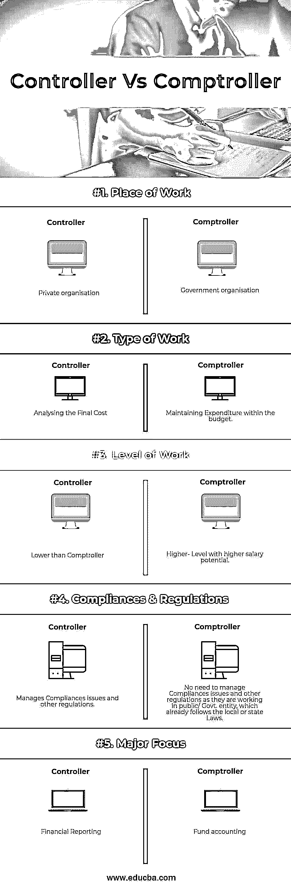

# 主计长与主计长

> 原文：<https://www.educba.com/controller-vs-comptroller/>

## 主计长和主计长的区别

财务总监，你将在一个企业中拥有最高的财务地位。他们的主要职责是准备财务账目，并根据定期的相关分析做出业务决策。财务总监在内部报告[内部审计财务报告](https://www.educba.com/internal-audit-vs-external-audit/)，并确认公司遵守了合规性。审计员必须处理成本，并保证预算内的支出仅限于分析最终成本。他们必须审查初级会计师的工作，并确保产出符合设定的标准。他们还必须根据要求，通过比较实际数字和预测数字来调整与预算的差异。

### 控制器

管理一个组织的所有财务账户的人。他们通常受雇于私人机构。他们监督和管理财务事项，确保财务报告的准确性。分析数据并向公司的高级经理提供分析结果。此外，财务总监还负责管理与金融和货币问题相关的法规遵从性问题，包括联邦、州和地方法律。他们依法确保企业的盈利能力。

<small>网页开发、编程语言、软件测试&其他</small>

### 监查官

“头衔”主计长的来历很有意思。在 15 世纪早期，它是由法国的“控制者”一词产生的，意思是专门负责财务分类账的人。在拼写错误后，Countreroller 的头衔变成了“Comptroller ”,并用作相同的名称。他们是最高级别的财务人员，负责总体成本，并专门检查分类账。他们通常受雇于地方或州一级的政府部门。他们监督政府机构提供服务的总成本。

### 主计长和主计长之间的面对面比较(信息图表)

以下是主计长与主计长的五大对比:

### 主计长和主计长的主要区别

控制器和审计员都是市场上的热门选择；让我们讨论一下主计长和审计员之间的一些主要区别:

*   审计员通常受雇于地方或州一级的政府部门，而主计长则受雇于非盈利或私人组织。
*   审计员必须跟上预算编制的步伐；他们必须做差异分析，我们根据预计的数字或落后于整个业务运营，而控制者检查财务报告，主要关注业务的底线。
*   总的来说，财务总监在金融业的级别较高，薪水也比财务总监高。
*   审计员主要管理组织的内部成本和利润，而控制员主要关注与公司最后阶段相关的成本和利润，即在提供最终产品或服务之后。
*   控制者大多专注于财务报告；他们将产品或服务产生的收入和费用作为一个整体进行比较，即企业是否盈利。然而，审计员侧重于总体成本管理和资金核算，定期比较实际数字和预测数字，如果有任何差异就采取行动。
*   财务总监必须负责管理合规性问题，包括联邦、州以及地方有关金融和货币问题的法律，而审计员作为政府专业人员工作，他们的工作仅符合政府制定的法规和合规性。
*   对主计长这一角色的需求低于主计长，这主要是因为有这样的机会。审计员主要在公共部门工作，没有经常性的空缺，但对审计员的需求很高，因为现在所有私营公司都主要关注财务报告。
*   主计长可以就削减成本和降低企业总成本的行动做出决定，而审计员可以就包括资金分配在内的资金会计做出决定。他们处理成本，并且必须将这些支出维持在预算之内。

### 主计长与主计长对照表

下面是主计长和主计长之间的最重要的比较:

| **比较的基础** | **控制器** | **主计长** |
| **工作地点** | 私人组织 | 政府组织 |
| **工种** | 分析最终成本 | 将开支控制在预算之内。 |
| **工作级别** | 低于主计长 | 级别越高，薪资潜力越大 |
| **符合&法规** | 管理合规性问题和其他法规 | 无需管理合规问题和其他法规，因为他们在公共/政府部门工作。实体，已经遵守当地或州法律。 |
| **主要焦点** | 财务报表 | 基金会计 |

### 结论

看完以上信息，现在你可以搞清楚这两者的区别了；然而，这两个角色之间只有一线之差。您可以选择自己想要的配置文件。主计长和审计员都需要同等水平的教育，并且需要对会计和商业原则有全面的理解。财务总监和审计员的角色是财务领域最高级别的角色。

主计长和审计员都是管理层的员工，他们将管理员工的工资、会计、协助审计、管理会计交易流程、制定公司政策。他们既是主计长又是审计员，可以充当公司的财务主管。虽然这两个术语彼此相似，甚至它们之间的关系也不是那么多样化，但唯一的变化是这两个术语在主计长和主计长中的工作方式。主计长负责企业的所有会计业务。

很难进入审计员的角色，主要是因为空缺职位较少；全国范围内的职位非常少。有时审计长的任命是基于投票。然而，由于私有实体数量的增加，对控制器的需求急剧增加。

### 推荐文章

这是主计长和审计员的指南。在这里，我们还将讨论信息图和比较表的主要区别。你也可以看看下面的文章来了解更多-

1.  [Drupal vs Joomla](https://www.educba.com/drupal-vs-joomla/)
2.  [Laravel vs Codeigniter](https://www.educba.com/laravel-vs-codeigniter/)
3.  [Node.js vs PHP 性能](https://www.educba.com/node-js-vs-php-performance/)
4.  [Linux vs FreeBSD](https://www.educba.com/linux-vs-freebsd/)

