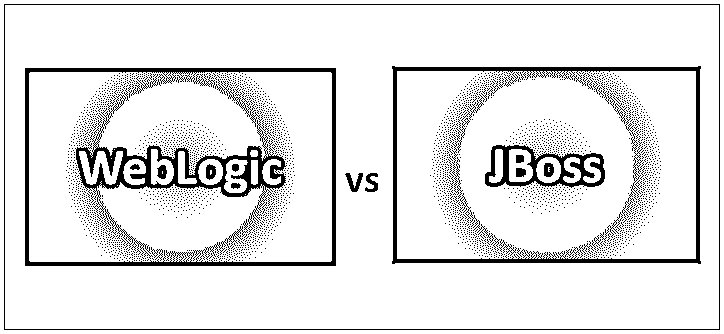
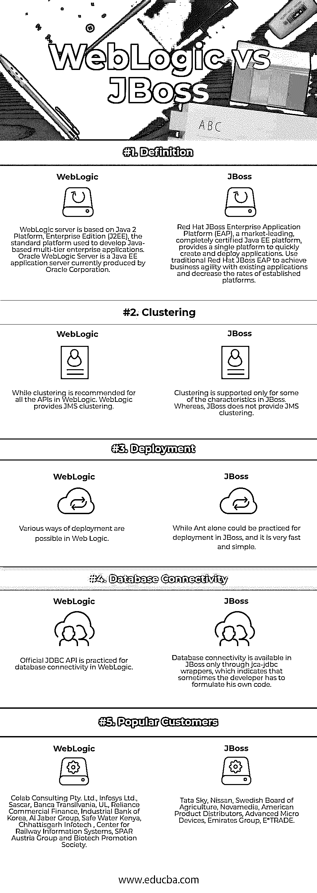

# WebLogic vs JBoss

> 原文：<https://www.educba.com/weblogic-vs-jboss/>

## WebLogic 和 JBoss 的区别

WebLogic 是一种服务器软件应用程序，运行在后端数据库、相关应用程序和基于浏览器的瘦客户端之间的中间层上。WebLogic 是一个领先的电子商务在线事务处理(OLTP)平台，旨在连接分布式计算环境中的用户，并促进大型机应用程序与分布式公司数据和应用程序的集成。JBoss 是 Red Hat 的一部分，为 WildFly 开源应用服务器程序(以前称为 JBoss AS)和相关的中间件服务提供帮助。JBoss 是 IBM WebSphere 和 SAP Net Weaver 商业产品的开源选择。Red Hat JBoss 产品可以通过包括技术支持和长期维护的订阅原型来访问。

### 什么是 WebLogic？

WebLogic server 基于 Java 2 Platform，Enterprise Edition (J2EE)，这是用于开发基于 Java 的多层企业应用程序的标准平台。J2EE 平台技术是由 BEA Systems 和不同的供应商与主要开发商 Sun Microsystems 合作开发的。因为 J2EE 应用程序是标准化的模块，所以 WebLogic 可以自动执行几个系统级的任务，否则这些任务可能需要编程时间。WebLogic server 的主要特征包括使任何客户端上的任何传统应用程序都可以与服务器应用程序互操作的连接器、企业 Java Bean (EJB)组件、资源池以及使应用程序高度可伸缩的连接共享。

<small>网页开发、编程语言、软件测试&其他</small>

具有用户界面的管理控制台可以更有效地执行管理任务，并且安全套接字层(SSL)等特性支持数据传输加密和身份验证，此外，授权机制也使应用程序和交易变得安全。Oracle WebLogic Server 是 Oracle 公司目前生产的 Java EE 应用服务器。甲骨文在 2008 年收购 BEA Systems 时获得了 WebLogic Server。Oracle WebLogic Server 是 Oracle 融合中间件产品组合的一部分，并支持 Oracle、DB2、 [Microsoft SQL Server](https://www.educba.com/sql-server-interview-questions/) 、MySQL Enterprise 和不同的 JDBC 兼容数据库。

### JBoss 是什么？

JBoss Enterprise Application Platform(或 JBoss EAP)是一个基于订阅/开源的基于 Java EE 的应用服务器运行时平台，用于开发、部署和托管高度事务性的 Java 应用程序和服务。JBoss 企业应用程序平台是 JBoss 企业中间件软件组合的一部分。因为它是基于 Java 的，JBoss 应用服务器可以跨平台运行；它可以在任何支持 Java 的操作系统上使用。

JBoss 开发了 JBoss 企业应用平台，现在是 Red Hat 的一个部门。JBoss EAP 为 JBoss EAP 实例提供了两种操作模式:独立服务器或管理域。独立服务器操作模式表示将 JBoss EAP 作为单独的服务器实例进行操作。受管域操作模式支持从特定控制点管理多个 JBoss EAP 实例。此外，JBoss EAP 包括 API 加开发框架，用于快速开发安全加可伸缩的 Java EE 应用程序。

### WebLogic 和 JBoss 的直接比较(信息图表)

下面是 WebLogic 和 JBoss 之间的 5 大区别

### WebLogic 和 JBoss 的主要区别

正如你所看到的，WebLogic 和 JBoss 有很大的不同。让我们来看看最大的区别——

*   JBoss 应用服务器是一个免费的开源产品。而 Oracle 开发 WebLogic 应用服务器。
*   JBoss 服务器的最新版本支持 Java EE 6 Web Profile。而最新发布的 WebLogic server 只支持 Java EE 5。
*   JBoss 中的配置和管理要容易得多，但是没有提供 UI。此外，WebLogic 是一种昂贵的产品；它具有 JBoss 中没有提供的各种特性。例如，WebLogic 的基于 web 的管理员控制台可以用于配置 JMS、数据源和安全设置等。
*   由于涉及到 Self Console 7001，因此可以根据 WebLogic 中的规范来更改控制台要求，但是由于 JBoss 依赖于 Tomcat 服务器，所以这在 JBoss 中是不允许的。
*   在 Web Logic 中有多种部署方式，而在 JBoss 中可以单独使用 Ant 进行部署，而且非常快速简单。

### WebLogic 与 JBoss 对照表

下面是 WebLogic 和 JBoss 之间最重要的比较

| **比较的基础** | **WebLogic** | **JBoss** |
| **定义** | WebLogic server 基于 Java 2 Platform，Enterprise Edition (J2EE)，这是用于开发基于 Java 的多层企业应用程序的标准平台。Oracle WebLogic Server 是 Oracle 公司目前生产的 Java EE 应用服务器。 | red Hat JBoss Enterprise Application Platform(EAP)是一个市场领先的、经过完全认证的 Java EE 平台，它提供了一个单一平台来快速创建和部署应用程序。使用传统的 Red Hat JBoss EAP 实现现有应用程序的业务敏捷性，并降低现有平台的速率。 |
| **聚类** | 而 WebLogic 中的所有 API 都推荐使用集群。WebLogic 提供 JMS 集群。 |  只有 JBoss 中的一些特性支持集群。而 JBoss 不提供 JMS 集群。 |
| **部署** | 在 Web 逻辑中有多种部署方式。 | 而 Ant 可以单独在 JBoss 中进行部署，而且非常快速简单。 |
| **数据库连接** | 官方的 JDBC API 用于 WebLogic 中的数据库连接。 | 在 JBoss 中，数据库连接只能通过 jca-JDBC 包装器来实现，这意味着有时候开发人员必须自己编写代码。 |
| **热门客户** | Colab 咨询有限公司。有限公司、Infosys 有限公司、Sascar、UL Banca Transilvania、Reliance Commercial Finance、韩国工业银行、Al Jaber Group、Safe Water Kenya、Chhattisgarh Infotech、铁路信息系统中心、SPAR Austria Group 和生物技术促进协会 | 塔塔天空、日产、瑞典农业委员会、Novamedia、美国产品经销商、先进微设备、阿联酋集团、E*TRADE |

### 结论

应用服务器作为企业应用程序的开发、部署以及集成的平台，在现代企业计算中扮演着重要的角色。应用服务器促进了常见的功能，例如连接、安全以及集成。这使得开发人员可以只关注业务逻辑。两种现代的基于 Java EE 的应用服务器是 WebLogic 和 JBoss 应用服务器。通常，WebLogic 在大型企业中使用，而中小型企业更喜欢 JBoss。

### 推荐文章

这是 WebLogic 和 JBoss 之间最大区别的指南。在这里，我们还将讨论信息图和比较表的主要区别。您也可以看看以下文章，了解更多信息–

1.  [Weblogic 和 Tomcat](https://www.educba.com/weblogic-vs-tomcat/)
2.  [Java 和 Java EE](https://www.educba.com/java-vs-java-ee/)
3.  [Python 和 Java 性能](https://www.educba.com/java-performance-vs-python/)
4.  [Java 的顶级应用](https://www.educba.com/applications-of-java/)

