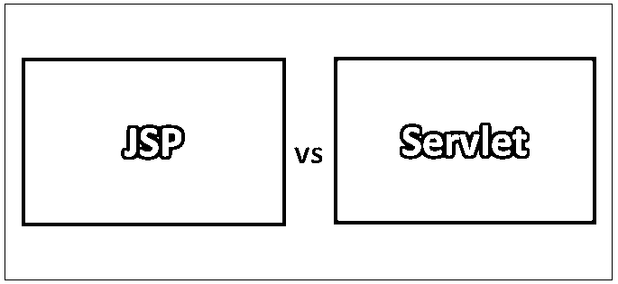
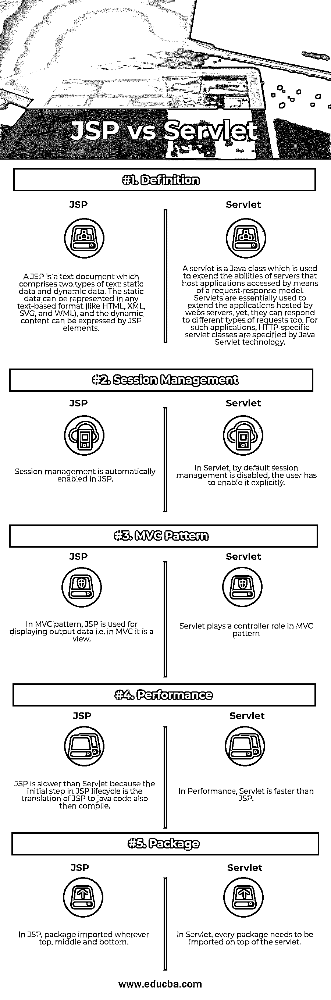

# JSP 与 Servlet

> 原文：<https://www.educba.com/jsp-vs-servlet/>

## JSP 和 Servlet 的区别

Java Server Pages (JSP)是一种服务器端编程技术，它允许创建一种动态的、独立于平台的方法来开发基于 Web 的应用程序。JSP 可以访问整个 Java APIs 家族，包括 JDBC API，以访问企业数据库。JavaServer Pages (JSP)是一种创建支持动态内容的网页的技术。这有助于程序员通过使用特定的 JSP 标签将 java 代码嵌入到 HTML 页面中，这些标签大多以开头。Servlets 实现了一种基于组件的、独立于平台的方法，用于开发基于 Web 的应用程序，而没有 CGI 程序的性能限制。Servlets 可以访问完整的 Java APIs 系列，包括 JDBC API，以访问企业数据库。[servlet 是独立于平台的](https://www.educba.com/what-is-servlet/)，因为它们是在 Java.Java 起草的，服务器上的安全管理器实现了一组限制来保留服务器上的资源。

### JSP 是什么？

JavaServer Pages 组件是一种 Java servlet，用于为 Java web 应用程序提供用户界面。Web 开发人员将 JSP 创建为文本文件，其中加入了 [HTML 或 XHTML](https://www.educba.com/html-vs-xhtml/) 代码、XML 元素以及嵌入的 JSP 动作和命令。使用 JSP，您可以通过网页表单收集来自用户的输入，呈现来自数据库或不同来源的记录，以及动态构建网页。JSP 标签可以用于各种目的，例如从数据库中检索数据或注册用户偏好，访问 [JavaBeans](https://www.educba.com/what-is-javabeans/) 组件，在页面之间传递控制，以及在请求、页面之间共享信息等。JavaServer 页面通常与使用通用网关接口(CGI)执行的程序具有相同的用途。

<small>网页开发、编程语言、软件测试&其他</small>

但是与 CGI 相比，JSP 提供了许多好处。首先，性能显著提高，因为 JSP 允许在 HTML 页面中嵌入动态元素，而不是拥有单独的 CGI 文件。其次，JSP 在被服务器处理之前就已经编译好了，不像 CGI/Perl 每次请求页面时都需要服务器加载一个解释器和目标脚本。此外，JavaServer Pages 是在 Java Servlets API 之上创建的，所以像 servlet 一样，JSP 也可以访问所有有影响力的企业 Java APIs，包括 etc.JSP、JDBC、JNDI、EJB、JAXP。Pages 可以与管理业务逻辑的 servlet 结合使用，这是 Java servlet 模板引擎支持的模型。最后，JSP 是 Java EE 的基础部分，Java EE 是企业级应用程序的完整平台。这意味着 JSP 可以在最简单的应用程序到最复杂和最苛刻的应用程序中发挥作用。

### 什么是 Servlet？

Java Servlets 是在 Web 或应用程序服务器上运行的程序，在来自 Web 浏览器或不同的 HTTP 客户端以及 HTTP 服务器上的数据库或应用程序的请求中充当中间层。使用 servlet，您可以通过网页表单收集用户的输入，显示来自数据库或不同来源的记录，以及开发网页。dynamically.Java servlet 通常与使用通用网关接口(CGI)执行的程序具有相同的用途。

但是 Servlets 提供了与 CGI 相关的各种好处。它们的性能明显更好；Servlets 在 Web 服务器的地址空间内执行。没有必要开发一个单独的过程来管理每个客户端请求。所以 servlets 仍然是可信的。servlet 可以使用 Java 类库的全部功能。它可以通过你已经观察过的套接字和 RMI 机制与 applets、数据库或不同的软件进行交互。

### JSP 和 Servlet 之间的直接比较(信息图表)

下面是 JSP 和 Servlet 之间的 5 大区别

### JSP 和 Servlet 之间的主要区别

两者都是市场上的热门选择；让我们讨论一些主要的区别:

*   Servlet 中的修改是一项耗时的任务，因为它涉及到重新加载、重新编译和重新启动服务器。虽然 JSP 修改很快，但只需要单击刷新按钮。
*   在 servlet 中，我们必须在一个 Servlet 文件中执行所有事情，比如业务逻辑和表示逻辑。而在 JSP 中，业务逻辑通过使用 JavaBeans 与表示逻辑隔离开来。
*   Servlet 可以接受每个协议请求，并且可以覆盖 service()方法。而 JSP 只接收 HTTP 请求，不可能覆盖它的 service()方法。
*   Servlet 是 java 代码；此外，为 servlet 编写代码比 JSP 困难，因为它是 Java 中的 HTML。而 JSP 是基于 HTML 的代码，JSP 很容易编码，因为它是 HTML 中的 java。
*   servlet 在 Web 服务器(如 Tomcat)内部执行，而 JSP 程序在执行前被编译成 Java servlet。一旦它被编译成 servlet，它的生命周期将与 servlet 相似。然而，JSP 在生命周期中有自己的 API。

### JSP 与 Servlet 对照表

下面是 JSP 和 Servlet 之间最重要的比较

| **比较的基础** | **JSP** | **Servlet** |
| **定义** | JSP 是一个文本文档，包含两种类型的文本:静态数据和动态数据。静态数据可以用任何基于文本的格式表示(比如 HTML、XML、SVG 和 WML)，动态内容可以用 JSP 元素表示。 | servlet 是一个 Java 类，用于扩展服务器的功能，这些服务器承载通过请求-响应模型访问的应用程序。Servlets 本质上用于扩展 web 服务器托管的应用程序，但是它们也可以响应不同类型的请求。对于这样的应用程序，特定于 HTTP 的 servlet 类是由 Java Servlet 技术指定的。 |
| **会话管理** | JSP 中会自动启用会话管理。 | 在 Servlet 中，默认情况下，会话管理是禁用的；用户必须显式启用它。 |
| **MVC 模式** | 在 [MVC 模式](https://www.educba.com/mvc-interview-questions/)中，JSP 用于显示输出数据，即在 MVC 中，它是一个视图。 | Servlet 在 MVC 模式中扮演控制器的角色 |
| **性能** | JSP 比 Servlet 慢，因为 JSP 生命周期的第一步是将 JSP 翻译成 java 代码，然后进行编译。 | 在性能上，Servlet 比 JSP 快。 |
| **包** | 在 JSP 中，包被导入到顶部、中部和底部。 | 在 servlet 中，每个包都需要在 Servlet 之上导入。 |

### 结论

总之，Servlets 主要是完全用 Java 开发的服务器端程序。JSP 本质上是一个构建在 Servlets 之上的接口。JSP 的好处是它负责 UI 部分，减少了开发人员设计屏幕的工作量。JSP 对 UI 程序员很有帮助，因为它用一些基本的 Java 编码嵌入了 HTML，服务器端的处理逻辑可以由 Servlets 负责。JSP 具有定制标签的特性，这使我们能够构建可重用的组件，与 servlets 相比更加灵活。JSP 对于会话跟踪和 cookie 管理非常有用，并且由于单线程处理每个请求，因此效率非常高。

### 推荐文章

这是 JSP 和 Servlet 之间最大区别的指南。在这里，我们还讨论了 JSP 和 Servlet 的关键区别，包括信息图和比较表。你也可以看看下面的文章来了解更多。

1.  [JSP vs PHP](https://www.educba.com/jsp-vs-php/)
2.  [Java EE vs Spring](https://www.educba.com/java-ee-vs-spring/)
3.  [PHP](https://www.educba.com/java-vs-php/)T2】vs Java
4.  [Java vs JavaScript](https://www.educba.com/java-vs-javascript/)

