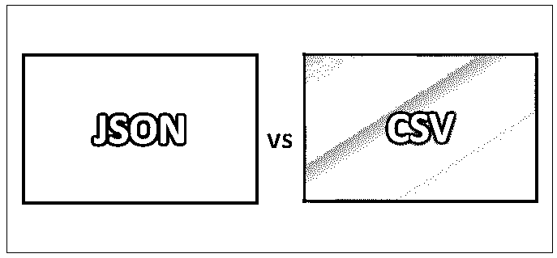
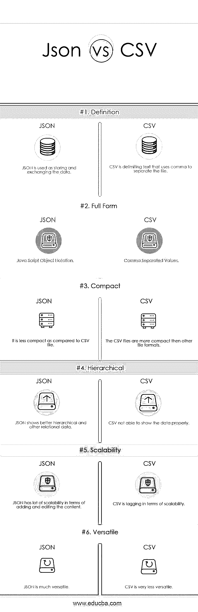

# JSON vs CSV

> 原文：<https://www.educba.com/json-vs-csv/>

## JSON 和 CSV 的区别

JSON 缩写为 JavaScript 对象符号。它被用作存储和交换数据的语法。这是一种独立于语言的格式。JSON 是文本，可以将任何 JavaScript 对象转换成 JSON，并将 JSON 发送给服务器。从服务器接收的 JSON 也可以转换成 javascript 对象。它被称为轻量级数据交换格式。它是自我描述的，很容易理解。CSV 缩写为逗号分隔值。它是使用逗号分隔文件的定界文本。表格数据以逗号分隔的纯文本数据形式保存在 CSV 文件中。CSV 格式广泛用于表示记录集或记录序列，其中每个记录都有相同的字段列表。

**让我们更详细地研究一下 JSON 与 CSV:**

<small>网页开发、编程语言、软件测试&其他</small>

这个的文件扩展名是。json，互联网媒体类型是 application/JSON。文本是 JSON 的代码类型。它是由道格拉斯·克罗克福特开发的。它最初发布于 2001 年。它被称为 JavaScript 和 ECMA 脚本的子集。JSON 的结构基于表示数据的名称/值对。花括号包含对象和每个名称，后跟冒号，逗号分隔成对。用来保存数组和值的方括号。所有编程语言都支持 JSON，比如 Java、Net (C#)、PHP、Perl、Python、Ruby 等等。

CSV 格式被认为是所有文件格式中最紧凑的格式。CSV 格式大约是 JSON 和另一种格式文件的一半大小。它有助于减少带宽，并且下面的大小会非常少。它的文件扩展名是。csv，其互联网媒体类型为 text/CSV。它支持多平台。它是一种常见的数据交换格式，主要由商业和科学应用程序支持。

CSV 文件不要求特定的字符编码、字节顺序。所有记录应该有相同数量的字段，并且它们应该有相同的顺序。记录在行结束符处结束。字段中的数据被解释为字符序列，而不是字节序列。如果不遵循纯文本约定，则 CSV 文件不再包含足够的信息来正确解释它。相邻字段之间必须用一个逗号隔开。这些格式在分隔符的选择上有所不同。行结束符可以作为数据嵌入到字段中，因此必须将软件识别为带引号的行分隔符，以便正确组合整个记录。

### JSON 和 CSV 的面对面比较(信息图表)

以下是 JSON 与 CSV 的 6 大区别:

### JSON 和 CSV 的主要区别

两者都是市场上的热门选择；让我们讨论一些主要的区别:

1.  在 JSON 中，每个对象可以有不同的字段，字段顺序在 JSON 中并不重要。在 CSV 文件中，所有记录都应该有相同的字段，并且它们的顺序应该相同。
2.  JSON 对象是一组无序的名称/值对。CSV 文件可能包含异类记录。
3.  在 JSON 中，没有头。每个对象都包含字段名称。在 CSV 中，如果所有数据都相同，所有数据记录都具有相同的布局，那么第一条记录将是包含字段名称的标题。
4.  JSON 可以包含嵌套结构。在 JSON 中，值可以是几种类型，包括数组或对象。JSON 主要用于像重复部分一样创建和维护日志记录的地方。CSV 不基于嵌套结构。它严格基于二维和表格格式。在 CSV 中，为了处理不断重复的日志部分，方法被用作垂直分隔。
5.  JSON 主要使用 JavaScript 数据类型。CSV 没有任何数据类型。它需要外部元数据来标识数据类型。
6.  JSON 比 CSV 更冗长。CSV 比 JSON 更简洁。

### JSON 与 CSV 对照表

下面是 JSON 和 CSV 之间最重要的比较

| **基本对比** | **JSON** | **CSV** |
| **定义** | JSON 用于存储和交换数据。 | CSV 是使用逗号分隔文件的分隔文本。 |
| **全格式** | JavaScript 对象符号。 | 逗号分隔的值。 |
| **紧凑** | 与 CSV 文件相比，它不太紧凑。 | CSV 文件比其他文件格式更紧凑。 |
| **分等级** | JSON 显示了更好的层次结构和其他关系数据 | CSV 无法正确显示数据。 |
| **可扩展性** | JSON 在添加和编辑内容方面有很大的可伸缩性 | CSV 在可扩展性方面落后 |
| **多才多艺** | JSON 是非常通用的。 | CSV 的通用性很差。 |

### 性能比较

JSON 被认为在处理大量数据时以及在文件或应用程序的可伸缩性方面比 CSV 更好。CSV 非常擅长处理小文件和少量数据。但是在加载大量数据并将其转换为其他格式(如 excel)时，excel 不遵循 CSV 标准，即使文件中的所有内容都已正确定义。CSV 不支持数据层次结构。在 JSON 中，在其中工作要容易得多，并且主要用于编程语言，但是当文件中需要或维护大量数据时，JSON 文件就变成了 CSV 文件的两倍。JSON 也有 API，可以自动将 JSON 转换成原生结构。默认情况下，新的 API 支持 JSON 格式。

### 结论

在这篇 JSON vs CSV 文章中，我们已经看到 JSON vs CSV 文件都用于以不同的形式和格式存储数据。JSON 被认为是目前最好的数据交换格式。它重量轻，结构紧凑，功能多样。CSV 主要用于需要发送大量数据的情况，并且存在带宽问题。CSV 不能用于数据复杂和非结构化的情况；那么只有 JSON 是处理复杂数据的更好选择。就像每种技术或语言一样，格式和文本各有利弊。格式的选择可以基于文件或数据的可伸缩性来完成。如果数据必须随时间增长，并且需要牺牲带宽，那么 CSV 是更好的选择。JSON 可以很贵，但是会比 CSV 用的时间长。

### 推荐文章

这是 JSON 和 CSV 之间最大区别的指南。在这里，我们还将讨论信息图和比较表的主要区别。你也可以看看下面的文章来了解更多。

1.  [YAML vs JSON](https://www.educba.com/yaml-vs-json/)
2.  [JSON vs BSON](https://www.educba.com/json-vs-bson/)
3.  [XML](https://www.educba.com/json-vs-xml/)T2】vs JSON
4.  [Python Pickle vs JSON](https://www.educba.com/python-pickle-vs-json/)

