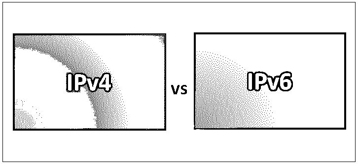
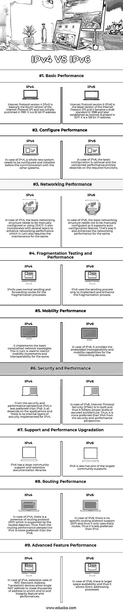

# IPv4 与 IPv6

> 原文：<https://www.educba.com/ipv4-vs-ipv6/>

## IPv4 与 IPv6 的区别

互联网协议版本有 IPv4 和 IPv6。IPv4 是在 1983 年引入的，现在仍作为 IP 广泛用于多个系统。它有助于使用地址识别网络中的系统。使用 32 位地址，它存储几个地址。尽管如此，它仍然是主要的互联网协议，控制着大部分的互联网流量。IPv6 于 1994 年开发，被称为下一代。IPv6 有 128 位地址空间。IPv4 使用句点作为分隔符，而 IPv6 使用冒号作为分隔符。在 IPv4 中，其他系统需要配置，而 IPv6 不需要配置。

### IPv4

[IPv4](https://www.educba.com/what-is-ipv4/) 是正在互联网上部署的标准互联方法的重要核心协议之一。这基本上是一种无连接协议，主要用于分组交换网络。它使用 32 位 IPv4 版本，因此 IP 地址的最大数量是 2 的 32 次方。它主要被格式化为四个 8 位字段。下面是 IPv4 的一些重要特征:

<small>网页开发、编程语言、软件测试&其他</small>

1.  它增强了对视频库文件和会议的支持
2.  它基本上是无连接协议的一个实现
3.  它用于在不同设备上创建虚拟通信层。

### IPv6

[IPv6](https://www.educba.com/what-is-ipv6/) 在 1998 年已经成为草案标准，后来在 2017 年被确立为互联网标准。主要表示为八组四个十六进制数字，每组之间用冒号分隔。它还增强和实现了分层地址分配方法，这增加了路由能力和路由表的限制。下面是 IPv6 的一些重要特征:

1.  它支持存储无限数量的 IP 地址，并且成为相邻节点之间交互的有利选择。
2.  它提供了对全状态和无状态配置的广泛支持。
3.  它增强了分层寻址基础架构。

### IPv4 和 IPv6 的面对面比较(信息图表)

以下是 IPv4 和 IPv6 的 9 大区别:

### IPv4 和 IPv6 的主要区别

IPv4 和 IPv6 都是市场上的热门选择；让我们讨论一下 IPv4 和 IPv6 之间的一些主要区别:

1.  互联网协议第 4 版(IPv4)基本上是互联网协议(IP)的第四个版本，最初于 1981 年发布。互联网协议第 6 版(IPv6)是互联网协议(IP)的最新版本，它在 1998 年成为标准草案，后来在 2017 年被确立为互联网标准。
2.  从端到端连接的角度来看，IPv6 提供了比 IPv4 更好的结果。
3.  IPv4 是 32 位 IP 地址，而 IPv6 是 128 位 IP 地址。
4.  IPv4 提供五类 IP 地址(A 类到 E 类)，而 IPv6 提供无限数量的 IP 地址。
5.  IPv4 支持虚拟长度子网掩码(VLSM)，而 IPv6 不支持 VLSM。
6.  IPv4 为系统管理提供对 SNMP 协议的支持，而在 IPv6 的情况下，不支持 VLSM。
7.  IPv6 提供了比 IPv4 更好的多播和任播能力。

### IPv4 和 IPv6 对照表

下面是 IPv4 和 IPv6 之间最顶层的比较。

| **比较的基础** | **IPv4** | **IPv6** |
| **基本性能** | 互联网协议第 4 版(IPv4)基本上是互联网协议(IP)的第四个版本，最初于 1981 年发布。它是一个 32 位的 IP 地址。 | 互联网协议第 6 版(IPv6)是互联网协议(IP)的最新版本，它在 1998 年成为标准草案，后来在 2017 年被确立为互联网标准。它是一个 128 位的 IP 地址。 |
| **配置性能** | 对于 IPv4，在与其他系统通信之前，需要配置和安装一个全新的系统。 | 在 IPv6 的情况下，基本配置是可选的，相关的性能完全取决于所需的功能。 |
| **网络性能** | 在 IPv4 的情况下，基本网络结构需要手动配置或使用 DHCP。它还结合了几个层来增强网络性能，这反过来也需要维护。 | 在 IPv6 的情况下，基本网络结构不需要手动配置，因为它支持自动配置功能。这也是它增强网络性能的方式。 |
| **碎片测试和性能** | IPv4b 使用正常的发送和转发路由进行分段处理。 | IPv6 仅使用发送过程来实现和增强分段过程。 |
| **移动性能** | 它实现了基本的受限网络拓扑。这反过来又被用来限制移动性和互操作性。 | 就 IPv6 而言，它为[网络设备](https://www.educba.com/networking-devices/)提供了嵌入式互操作性和移动能力。 |
| **安全性和性能** | 从安全性和性能的角度来看，IPv4 不如 IPv6 受欢迎。这完全取决于应用程序，并且没有为 IPv4 实现内部安全层。 | 在 IPv6 的情况下，互联网协议安全(IPSec)是内置的，因此它遵循适当级别的安全架构。因此，从安全性和性能角度来看，它比 IPv4 更受青睐。 |
| **支持和性能升级** | IPv4 拥有大量的社区支持和丰富的文档库。 | IPv6 也拥有最大的社区支持。 |
| **路由性能** | 在 IPv4 的情况下，存在路由守护程序支持的路由协议(RIP)。因此，从路由性能的角度来看，IPv4 比 IPv6 更受青睐。 | 在 IPv6 的情况下，没有特定的路由协议支持(RIP ),因此它只使用静态路由。因此，它不如 IPv4 首选。 |
| **高级功能性能** | 在 IPv4 的情况下，NAT(网络地址转换)设备的广泛使用允许单个 NAT 地址屏蔽数千个地址，以丰富端到端完整性特征和性能。 | 在 IPv6 的情况下，有更大的可用空间，因此它允许直接寻址过程。 |

### 结论

在这篇关于 IPv4 和 IPv6 的文章中，我们看到了 IPv4 和 IPv6 在网络和通信行业都很重要。在对 IPv4 和 IPv6 进行了一系列因素的比较后，可以得出这样的结论:两者各有利弊。因此，在选择它们中的任何一个之前，应该正确地学习和分析 IPv4 和 IPv6 [网络协议](https://www.educba.com/types-of-networking-protocols/)的基本特征。因此，基于项目需求的类型、工作时间和其他讨论的方面，应该选择这两者中的任何一个来达到期望的目标。

### 推荐文章

这是 IPv4 和 IPv6 之间最大区别的指南。在这里，我们讨论了 IPv4 与 IPv6 的直接比较、关键差异以及信息图和比较表。您也可以看看以下文章，了解更多信息–

1.  [Weblogic vs Tomcat](https://www.educba.com/weblogic-vs-tomcat/)
2.  [JSON vs CSV](https://www.educba.com/json-vs-csv/)
3.  [Bugzilla vs JIRA](https://www.educba.com/jira-vs-bugzilla/)
4.  [CCNA 对森特](https://www.educba.com/ccna-vs-ccent/)

