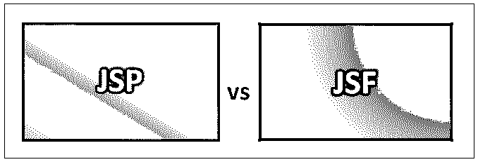
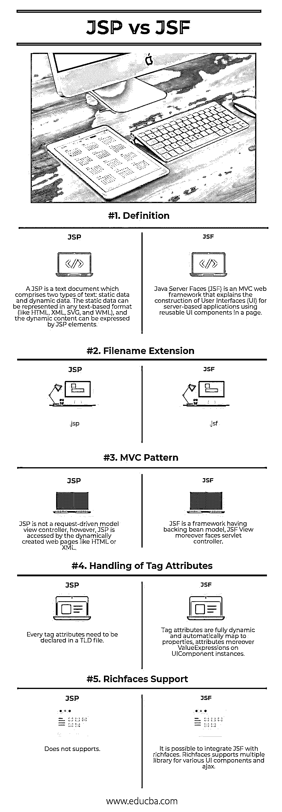

# JSP 与 JSF

> 原文：<https://www.educba.com/jsp-vs-jsf/>

## JSP 和 JSF 的区别

Java 服务器页面(JSP)是一种创建支持动态内容的网页的技术。这有助于程序员通过使用特定的 JSP 标签将 java 代码嵌入到 HTML 页面中，这些标签大多以开头。Java Server Pages (JSP)是一种服务器端编程技术，它允许创建一种动态的、独立于平台的方法来开发基于 Web 的应用程序。Java Server Faces (JSF)是一个基于 Java 的 web 应用程序框架，旨在简化基于 web 的用户界面的开发集成。JavaServer Faces 是一种模式化的显示技术，它通过 Java 社区过程在一个规范中被形式化。Java Server Faces (JSF)是一个 MVC web 框架，它使用页面上可重用的用户界面组件来解释基于服务器的应用程序的用户界面(UI)的构造。

### JSP 是什么？

Java Server Pages 组件是一种 Java servlet，用于为 Java web 应用程序提供用户界面。JSP 可以访问整个 Java APIs 家族，包括 JDBC API，以访问企业数据库。Web 开发人员将 JSP 创建为文本文件，其中加入了 [HTML 或 XHTML](https://www.educba.com/html-vs-xhtml/) 代码、XML 元素以及嵌入的 JSP 动作和命令。使用 JSP，您可以通过网页表单收集来自用户的输入，呈现来自数据库或不同来源的记录，以及动态构建网页。JSP 标签可以用于各种目的，例如从数据库中检索数据或注册用户偏好，访问 [JavaBeans](https://www.educba.com/what-is-javabeans/) 组件，在页面之间传递控制，以及在请求、页面之间共享信息等。Java 服务器页面通常与使用通用网关接口(CGI)执行的程序具有相同的用途。

<small>网页开发、编程语言、软件测试&其他</small>

但是与 CGI 相比，JSP 提供了许多好处。首先，性能显著提高，因为 JSP 允许在 HTML 页面中嵌入动态元素，而不是拥有单独的 CGI 文件。其次，JSP 在被服务器处理之前就已经编译好了，不像 CGI/Perl 每次请求页面时都需要服务器加载一个解释器和目标脚本。此外，Java 服务器页面是在 Java Servlets API 之上创建的，所以像 servlet 一样，JSP 也可以访问所有有影响力的企业 Java APIs，包括 JDBC、JNDI、EJB、JAXP 等。JSP 页面可以与管理业务逻辑的 servlet(Java servlet 模板引擎支持的模型)结合使用。最后，JSP 是 Java EE 的基础部分，Java EE 是企业级应用程序的完整平台。这意味着 JSP 可以在最简单的应用程序到最复杂和最苛刻的应用程序中发挥作用。

### 什么是 JSF？

JSF 实现了一个工具，将 UI 小部件与数据源和服务器端事件处理程序连接起来。JSF 规范描述了一组标准的 UI 组件，并为开发组件提供了应用程序编程接口(API)。

JSF 允许重用和扩展当前的标准 UI 组件。JSF 减少了构建和维护应用程序的工作量，这些应用程序将在 Java 应用服务器上运行，并将应用程序 UI 呈现给目标客户。JSF 通过提供可重用的 UI 组件、在 UI 组件之间进行简单的数据传输、跨各种服务器请求管理 UI 状态、支持自定义组件的实现以及将客户端事件连接到服务器端应用程序代码来促进 Web 应用程序的开发。JSF 提供了多种呈现功能，允许 JSF UI 组件根据客户端类型进行不同的呈现。

### JSP **和 JSF** 的正面比较(信息图)

下面是 JSP 和 JSF 的 5 大区别:

### JSP 和 JSF 之间的主要区别

两者都是市场上的热门选择；让我们讨论一些主要的区别:

*   JSF 是一个基于网络的应用程序，用于简化基于网络的用户界面的开发集成。而 JSP 是一种基于 Java 的技术，分别用来支持软件开发者创建动态网页。
*   JSP 必须用 Java 字节码编译才能正常工作。而 JSF 包含各种核心特性，包括但不限于托管 Beans、基于模板的组件系统和两个基于 XML 的标记库。
*   JSP 不是请求驱动的模型视图控制器；然而，JSP 是由动态创建的网页(如 HTML 或 XML)访问的。相比之下，JSF 是一个具有后台 bean 模型的框架；此外，JSF 视图还面对一个 servlet 控制器。
*   JSF 支持验证加转换。但是，JSP 没有。
*   把 JSF 和富人结合起来是可能的。Richfaces 支持各种 UI 组件和 ajax 的多个库。但是，JSP 没有。

### JSP 与 JSF 比较表

下面是 JSP 和 JSF 之间最重要的比较:

| **比较的基础** | ****T3】**JSP****** | **JSF** |
| **定义** | JSP 是一个文本文档，包含两种类型的文本:静态数据和动态数据。静态数据可以用任何基于文本的格式表示(比如 HTML、XML、SVG 和 WML)，动态内容可以用 JSP 元素表示。 | Java Server Faces (JSF)是一个 MVC web 框架，它使用页面上可重用的用户界面组件来解释基于服务器的应用程序的用户界面(UI)的构造。 |
| **文件扩展名** | .jsp |  

.jsf

 |
| **MVC 模式** | JSP 不是请求驱动的模型视图控制器；然而，JSP 是由动态创建的网页(如 HTML 或 XML)访问的 | JSF 是一个有后台 bean 模型的框架，JSF 视图而且面向 servlet 控制器 |
| **标签属性的处理** | 每个标签属性都需要在 TLD 文件中声明。 | Tag attributes are fully dynamic and automatically map to properties, attributes moreover ValueExpressions on.UIComponent 实例 |
| **Richfaces 支持** | 不支持 | 把 JSF 和富人结合起来是可能的。Richfaces 支持各种 UI 组件和 ajax 的多个库。 |

### 结论

最后，JSF(原始面孔，冰面，开放的面孔，丰富的面孔，战斧，等等。)提供了大量丰富的组件和扩展来用 JSP 实现。当涉及到大量的 JS 和 HTML 绑定时，JSF 就派上用场了。此外，JSF 允许开发简化基于 web 的 Java 应用程序编码的工具。

### 推荐文章

这是 JSP 与 JSF 的对比指南。在这里，我们还通过信息图和比较表来考虑 JSP 与 JSF 的关键区别。您可以进一步查看即将到来的 JSP 与 JSF 部分，以深入了解——

1.  [JSP vs PHP](https://www.educba.com/jsp-vs-php/)
2.  [弹簧 vs 支柱](https://www.educba.com/spring-vs-struts/)
3.  [Java vs Node JS](https://www.educba.com/java-vs-node-js/)
4.  [PHP vs C#](https://www.educba.com/php-vs-c-sharp/)

