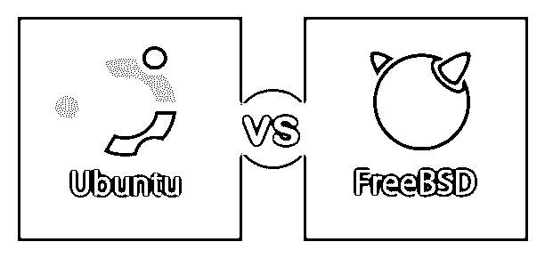
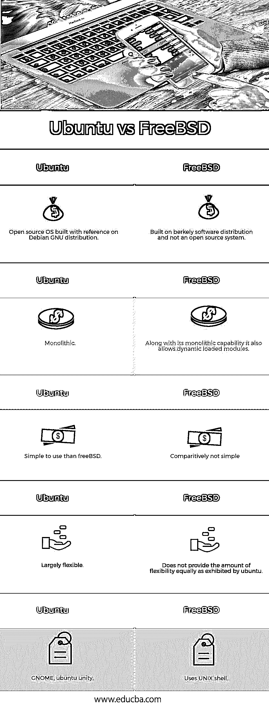

# Ubuntu vs FreeBSD

> 原文：<https://www.educba.com/ubuntu-vs-freebsd/>

## Ubuntu 和 FreeBSD 的区别

**Ubuntu**

Ubuntu 基金是“对他人的人性和作为一个有能力的软件”, Ubuntu 的所有层都是基于这个原则构建的。 [Ubuntu 连锁店，用于个人家庭使用](https://www.educba.com/uses-of-ubuntu/)，商业和教育。Ubuntu 是基于 Debian OS 的 T2。英国发现了一个操作系统，主要运行在 T4 的一种 Linux 服务器上。智能手机、电脑和网络电脑等服务大量使用 ubuntu。Ubuntu 主要是基于开源软件系统的原理设计的。

<small>网页开发、编程语言、软件测试&其他</small>

**Ubuntu 的主要版本有:**

1.  Ubuntu 桌面
2.  Ubuntu 服务器
3.  Ubuntu 核心

**主要特征**

*   就外观和用户体验而言，系统体验良好。
*   轻松深入地使用
*   桌面组织
*   Ubuntu 的桌面版本支持 chrome、firefox 等知名的 windows 桌面软件。
*   极快的功能和增强的定制产品
*   供选择的语言分类数的分布
*   在基于社区的系统上运行的操作系统

**FreeBSD**

它随着 Berkey 软件发行而扩展。以软件的可靠性和速度为主要目标的发行版。此外，软件的坚固性和能力也是关键。356BSD 的中间快照是这个项目背后的创新目标；这也可以为 patchkit 机制中的大量分类问题提供标准修复。

**FreeBSD 模型的关键要素**

*   SVN 知识库的可用性
*   招募委托人
*   核心自由 BSD 团队

【FreeBSD 开发的开源项目如下:

*   **BSD 路由器—**作为基于企业的路由器的主要替代元件，这些路由器可能运行在 PC 硬件上。
*   **FreeNAS–**一个定制的 FreeBSD，旨在用作网络。提供一个 web 界面来简化 UFS 和 ZFS 的管理；这个接口主要建立在 [python 编程设置](https://www.educba.com/what-is-python/)之上。它还增加了对 AFP、FTP、NFS、SMB/ CIFS 和 iSCSI 的支持。FreeBSD rails 还额外包含一个基于插件的系统。
*   这个版本的 FreeBSD 主要是为桌面构建的，是一个 Gnome 桌面环境包。
*   **MFS BSD—**该版本提供了一个完整的内存执行 [FreeBSD 系统](https://www.educba.com/what-is-freebsd/)镜像工具包
*   **nas 4 free—**这里发布了一个以 [PHP 为核心的 web 界面](https://www.educba.com/php-string-functions/)。
*   **OPN sense–**一个安全相关的防火墙和平台，它支持路由和设计，易于使用和构建。与其他昂贵的防火墙一样，所有相关功能也与 OPNSense 软件相关联。它带来了一系列富有特色的贸易援助，回报是可验证的来源，这些来源是开源的。
*   该平台的另一个版本主要是为桌面相关用户构建的，该版本在更大程度上提供了图形工具。
*   **pf sense–**另一个广泛支持 IPv6 的防火墙版本。

**关键用户**

1.  与 Apache 基金会相关的公共网络的所有基础设施都建立在 FreeBSD 设置之上。它涉及超过一百万个提交[跨越全球的 SVN 库](https://www.educba.com/svn-interview-questions/)。
2.  FreeBSD 将运行在 juniper 网络系统上的设备放在一起。构建产品和市场供应商之间的连接是使用这些 juniper 系统建立的。
3.  令人惊讶的是，FreeBSD 在电影供应商网飞·莱恩斯那里占有重要地位。网飞是北美电子流量最大的来源，占展出总量的 32%以上。网飞在其系统构建中使用的名为 Open Connect 的应用程序完全是使用 FreeBSD 系统标记的。
4.  互联网网页注册。net 和。com 在全球都很常见。这些根注册表由互联网传奇 verisign 运营。在这些基础设施中使用 FreeBSD 类型的网络操作系统，以便在这些系统的所有部分中绕过单点故障。
5.  在 ZFS 系统的帮助下，voxer 可以在移动环境中轻松控制语音信息系统。为了克服文档感知和处理活跃的社区，voxer 从 Solaris 到 FreeBSD 做了一个可喜的转变。

### Ubuntu 和 FreeBSD 的正面比较(信息图)

以下是 Ubuntu 和 FreeBSD 的 5 大区别:

### Ubuntu 和 FreeBSD 的主要区别

让我们讨论一下 Ubuntu 和 FreeBSD 之间的一些主要区别:

*   FreeBSD 拥有一个通用的操作系统，在服务器上比 Ubuntu 系统更加可靠和灵活。
*   如果我们涉及调整和重组操作系统而不发布源代码，FreeBSD 是首选。例如 OS X，所有代码都可以使用 FreeBSD 代码许可证来保护，但是对于 Ubuntu 和 GPL 相关软件，如果我们做出任何更改，都需要共享资源代码。
*   Ubuntu 和 FreeBSD 实际上都是稳定的、组织良好的和可靠的操作系统。
*   FreeBSD [不像 ubuntu 一样使用 Linux 发行版](https://www.educba.com/introduction-to-linux/)。
*   内核和用户空间与 FreeBSD 设置结合在一起

### Ubuntu 和 FreeBSD 对照表

下面是 Ubuntu 和 FreeBSD 的对比表。

| **Ubuntu** | **FreeBSD** |
| 参考 Debian GNU 发行版构建的开源操作系统 | 建立在 Berkeley 软件发行版上，而不是一个开源系统 |
| 整体的 | 除了它的单片功能，它还允许动态加载模块。 |
| 比 FreeBSD 简单易用 | 相对不简单 |
| 非常灵活 | 它不能像 ubuntu 一样提供足够的灵活性。 |
| GNOME，ubuntu 统一 | 使用 [UNIX shell](https://www.educba.com/what-is-unix-shell/) |

### 推荐文章

这是 Ubuntu vs FreeBSD 的指南。在这里，我们将看看他们的头对头比较，一个关键的差异，信息图表，和一个比较表。您也可以看看以下文章，了解更多信息–

1.  [Ubuntu vs OpenSUSE](https://www.educba.com/ubuntu-vs-opensuse/)
2.  [CentOS vs Ubuntu](https://www.educba.com/centos-vs-ubuntu/)
3.  [Ubuntu 替代品](https://www.educba.com/ubuntu-alternatives/)
4.  [Linux vs Android](https://www.educba.com/linux-vs-android/)

