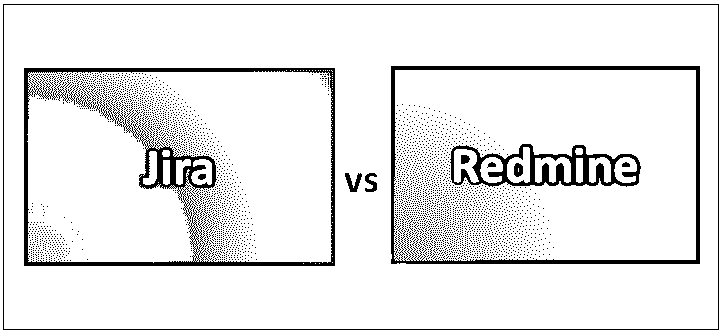
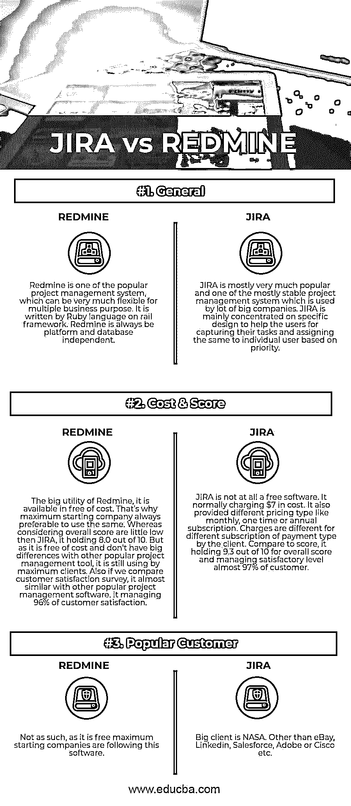

# 吉拉 vs 雷明

> 原文：<https://www.educba.com/jira-vs-redmine/>

## 吉拉和 Redmine 的区别

吉拉 vs Redmine 主要用于适当的项目管理软件。假设一家公司主要销售和制造一种特定的产品，而这家特定的公司愿意了解这种更复杂的特定产品的市场战略。这类软件把这种比较做得很聪明；甚至它还会根据当前的市场概况、其他竞争公司的营销流程，尤其是客户反馈，提供有关即将到来的改进的重要信息。这对于任何公司来说都是一个很大的帮助，可以非常聪明地了解他们在本年度的成功和失败，并获得改善通知，这可以帮助他们规划他们特定产品的未来。JIRA 的总分是 9.3 分，而雷德明是 8.0 分。此外，就客户满意度的整体水平而言，JIRA 再次领先 Redmine 根据目前的信息，Redmine 的客户满意度为 96%，而 JIRA 的满意度为 99%。

在这两种软件中，吉拉 vs Redmine 最受欢迎，它已经被各种公司基于他们的期望或产品未来规划所使用。但是，吉拉与 Redmine 在具体特征上有许多不同之处，如主要用于支持软件的设备、软件如何或在何种程度上支持其客户、成本范围、遵循的条款和条件等。根据当前的市场情况和客户反馈，人们给两个软件定义一个总体分数。与总分相比，JIRA 总是比雷德明好。

<small>网页开发、编程语言、软件测试&其他</small>

### **吉拉和 Redmine** 的正面比较(资料图)

以下是吉拉和红矿的三大区别

### 吉拉和红矿的主要区别

两者都是市场上的热门选择；让我们讨论一些主要的区别:

1.  Redmine 是一款开源项目管理软件，任何公司都可以根据其业务需求轻松配置和使用。它拥有许多插件，实际上帮助所有的业务人员管理他们的项目管理系统。JIRA 是任何时候最流行的处理项目管理系统的软件。JIRA 的主要功能之一是提供捕获任务的实用程序，将任务分配给单个用户，并对呈现给特定最终用户的任务进行优先级排序。它允许我们管理整个应用程序生命周期；它总是确保每个周期的整个开发都被明确涵盖，从概念到启动。它提供了一个非常有效的界面来维护所有团队成员之间的正确理解，并通过项目管理系统的正确跟踪来帮助他们有效地完成他们的工作。
2.  Redmine 在成本上是完全免费的，并且是开源的，因此开发者可以很容易地根据不同的业务需求进行导航和配置。而 JIRA 定义了一些成本(大约 7 美元)。他们有不同类型的支付方式，如每月、一次性或每年的补偿。每种支付方式的支付金额可能不同。
3.  Redmine 官方没有正式支持某些工具，但是由于它是一个对开发者开放的工具，它可以修改并使其受该工具支持。但是官方并不支持其中的一部分。但是 [JIRA 支持几乎所有的相关工具](https://www.educba.com/jira-alternatives/)或业务系统和应用，如 Salesforce、销售云、泽法、Zendesk、Gliffy、 [Github](https://www.educba.com/github-commands/) 、Balasmiq、Atlassian Confluence、Service Desk 等。….
4.  REDMINE 有几个特点，如它可以轻松地支持多个项目，以灵活的基于角色的方式控制相同的项目，提供图表和日历，所有文档文件新闻管理，通过邮件或订阅适当的通知，维护每个项目的细节 wiki，时间跟踪，SCM 集成等。而 JIRA 也有几个功能，如非常好的用户体验功能，支持根据业务需求以不同方式批准工作流，根据业务需求定义各种自定义字段的选项，在单个项目中正确处理 bug 和缺陷管理，最先进的搜索过滤选项，大量的报告系统，根据业务需求定义客户预期的仪表板显示，为每个客户提供高级别的安全性，非常容易地支持任何类型的 REST API，具有不同的导入实用程序，提供移动接口，随时下载实用程序可用。

### 吉拉与雷德明对比表

下面是吉拉和雷德明之间的比较:

| **基本对比** | 排雷 | **JIRA** |
| **通用** | Redmine 是流行的项目管理系统之一，它可以非常灵活地用于多种业务目的。它是在 rail 框架上用 Ruby 语言编写的。Redmine 总是独立于平台和数据库。 | JIRA 是最受欢迎和最稳定的项目管理系统之一，被许多大公司使用。JIRA 主要集中在一个特定的设计，以帮助用户捕捉他们的任务，并根据优先级将这些任务分配给单个用户。 |
| **费用&分数** | Redmine 的大效用，它是免费提供的。这就是为什么最大启动公司总是更喜欢使用相同的。然而，考虑到整体得分比 JIRA 低一点，它保持 8.0 分(满分 10 分)。但是由于它是免费的，并且与其他流行的项目管理工具没有太大的区别，它仍然被大多数客户使用。此外，如果我们比较客户满意度调查，它几乎类似于其他流行的项目管理软件。它管理着 96%的客户满意度。 | JIRA 根本不是自由软件。它通常收费 7 美元。它还提供不同的价格类型，如每月，一次性或每年订阅。对于客户支付类型不同的订阅，费用也不同。与得分相比，it 在总分中占 9.3 分(满分为 10 分)，管理着几乎 97%的客户满意度。 |
| **热门客户** | 不是这样的，因为它是免费的最大启动公司都遵循这个软件。 | 大客户是美国宇航局。除了易贝、LinkedIn、Salesforce、Adobe 或思科等。 |

### 结论

在这篇吉拉 vs Redmine 的文章中，我们看到了吉拉 vs Redmine 都是目前各种组织都可以使用的非常流行的项目管理系统工具。JIRA 肯定比 Redmine 更受欢迎，但 Redmine 是完全免费的开源软件，因此开发者可以在其上生成任何特定的代码；这就是为什么 Redmine 在不知名的小组织中很受欢迎。但是顶级组织总是倾向于使用 JIRA 来更好地处理具有大量插件机会的项目管理系统。

### 推荐文章

这是吉拉和雷德明之间最大差异的指南。在这里，我们还通过信息图和比较表讨论了吉拉和 Redmine 的主要区别。你也可以看看下面的文章来了解更多。

1.  [JIRA 面试问题](https://www.educba.com/jira-interview-questions/)
2.  [吉拉 vs 阿萨纳](https://www.educba.com/jira-vs-asana/)
3.  [詹金斯 vs 竹子](https://www.educba.com/jenkins-vs-bamboo/)
4.  [吉拉 vs ServiceNow](https://www.educba.com/jira-vs-servicenow/)

