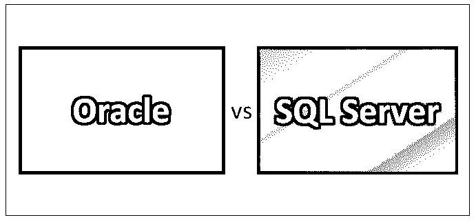
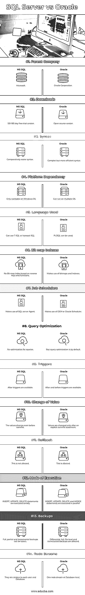

# Oracle 与 SQL Server

> 原文：<https://www.educba.com/oracle-vs-sql-server/>

## Oracle 和 SQL Server 的区别

Oracle 提供了一个供内部使用的关系数据管理系统，称为 Oracle server。该框架基于关系数据库。用户可以使用 SQL 语言来评估数据对象。我们可以根据需要对 Oracle 进行扩展，它在世界各地得到了广泛的应用。微软开发了一种 SQL 服务器，允许用户根据自己的需要编写查询并执行。任何流程，如交易、分析和商业智能，都是在企业环境中使用 SQL 处理的。SQL 提供了在线支持，并且还显示了错误警告消息。

### 神谕

用于企业网格计算的 Oracle 数据库特性有助于创建模块化服务器和存储，其中存储机制是通过创建逻辑和物理结构来实现的。只能使用客户端程序访问数据库。服务器端内存结构被称为 SGA(系统全局区)，它负责保存与 SQL 命令、数据缓冲区、日志历史和用户特定信息相关的缓存信息。扩展、为批处理和在线实时用户重新运行生产工作负载、对虚拟化技术的支持、VMWare 支持、高可用性和无中断处理使它成为一个可以使用的漂亮而优雅的数据库。

<small>网页开发、编程语言、软件测试&其他</small>

### SQL Server

[SQL Server 数据库引擎](https://www.educba.com/sql-server-interview-questions/)控制数据存储、安全性和处理。关系引擎处理查询和命令，其中的存储引擎负责管理数据库文件、页面、表、数据缓冲区、索引和事务。触发器、视图、存储过程和其他数据库对象是由数据库引擎负责的。这可用于部署、构建和管理位于本地或云上的应用程序。其中的数据通常是相互连接的，避免了冗余，从而提供了更好的数据完整性。新版本具有内置的性能调整指标、实时运营分析、数据可视化策略和混合云支持，[数据库管理员](https://www.educba.com/careers-in-database-administration/)可以使用混合云支持在本地或云上运行相同的应用程序，以降低组织成本。

### Oracle 和 SQL Server 的面对面比较(信息图表)

下面是 Oracle 与 SQL Server 的 14 大区别

### Oracle 和 SQL Server 的主要区别

Oracle vs SQL Server 都是市场上的热门选择；让我们讨论一些主要的区别:

SQL Server 和 Oracle RDBMS 中使用的语言是不同的，即使它们都使用不同形式的结构化查询语言。MS 服务器使用 transact SQL，而 Oracle 使用 PL/SQL 过程语言和结构化查询语言。主要区别在于变量、语法、过程处理以及内置函数。MS SQL Server 不提供将过程分组到包中的功能。

这两个数据库之间的另一个主要特征是事务控制能力。事务被定义为一组操作和任务，被视为一个单元。默认情况下，MS SQL 会将每个命令/任务作为一个单元提交和执行，回滚很困难。使这个过程更加有效的命令有 BEGIN TRANSACTION、COMMIT、ROLLBACK、END TRANSACTION 等。对于 Oracle，每个数据库连接都是一个新的连接，被视为一个新的事务。所有的更改都是在内存中进行的，除非不使用外部 COMMIT 命令，否则实际上什么也没有做。

两个数据库的数据库对象组织是不同的。在 MS SQL 的情况下，所有数据库对象(如视图、表和过程)都按数据库名称排序。分配给用户的登录帐户被授予访问特定对象和数据库的权限。SQL server 中的文件是私有的、非共享的磁盘类型，而在 Oracle 中，所有这些都是按照模式安排的，并在相关用户之间共享。每个模式和用户的访问都由分配给该组的角色和权限控制。

### Oracle 与 SQL Server 比较表

让我们讨论 Oracle 与 SQL Server 之间的比较如下:

| **基本对比** | **SQL 服务器** | **甲骨文** |
| **母公司** | 微软公司(全球知名的 PC 软件主要厂商) | 甲骨文公司 |
| **下载量** | 120-180 天免费试用版 | 开源版本 |
| **语法** | 相对简单的语法 | 复杂但更有效的语法 |
| **平台依赖性** | 仅适用于 Windows 操作系统 | 可以在多个操作系统上运行 |
| **使用的语言** | 可以使用 T-SQL 或 transact SQL | 可以使用 PL/SQL |
| **位图索引** | 没有基于反向键和函数的位图索引 | 利用位图和索引。 |
| **作业调度器** | 利用 SQL Server 代理 | 利用 OEM 或 Oracle 调度程序 |
| **查询优化** | 没有针对查询的优化 | 默认情况下，星型查询优化 |
| **触发器** | 触发器可用后 | After 和 before 触发器可用 |
| **值的变化** | 这些值甚至在提交之前就发生了变化 | 值仅在显式提交语句后更改 |
| **回滚** | 这是不允许的 | 这是允许的 |
| **执行方式** | INSERT、UPDATE、DELETE 语句是连续执行的 | 插入、更新、删除和合并语句是并行执行的 |
| **备份** | 可以进行完整、部分和增量备份 | 允许差异备份、完整备份、文件级备份和增量备份 |
| **重做流** | 它们对于每个用户和数据库都是唯一的 | 数据库级别的一个重做流 |

### 结论

在这篇关于 Oracle vs 和 SQL Server 的文章中，我们看到了两者都是功能强大的 RDBMS 选项，并且有许多不同之处有助于探索适合您的组织，但是它们在大多数方面几乎是相似的。选择正确的数据库对公司来说极其重要，因此在实际采用之前必须进行彻底的分析。请继续关注我们的博客，获取更多类似的文章。数据库是任何组织的主要资产，因为它们保存了组织的所有基本和重要的数据。结构化格式的数据通常存储在众所周知的 RDBMS ( [关系数据库管理系统](https://www.educba.com/rdbms-interview-questions/))中。这是一种规范化的格式，其中的值以列和行的格式存储。流行的 RDBMS 是 MS Access，MySQL，Sybase，Oracle 和 SQL server 也是广泛使用的数据库。Oracle 与 SQL server 之间也有许多相似之处和相当多的不同之处。在这篇 Oracle 与 SQL server 对比的文章中，我们将从一个更广泛、更详细的角度来看待这个问题。

### 推荐文章

这是 Oracle 和 SQL Server 之间最大区别的指南。在这里，我们还将讨论信息图和比较表的主要区别。你也可以看看下面的文章来了解更多。

1.  [MySQL vs SQLite](https://www.educba.com/mysql-vs-mysqli/)
2.  [甲骨文 vs 谷歌](https://www.educba.com/oracle-vs-google/)
3.  [MySQL vs SQL Server](https://www.educba.com/mysql-vs-sql-server/)
4.  [Oracle vs OpenJDK](https://www.educba.com/oracle-vs-openjdk/)

