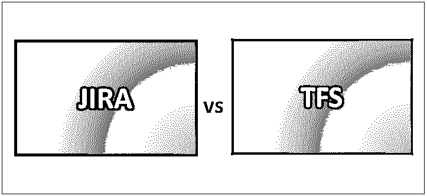
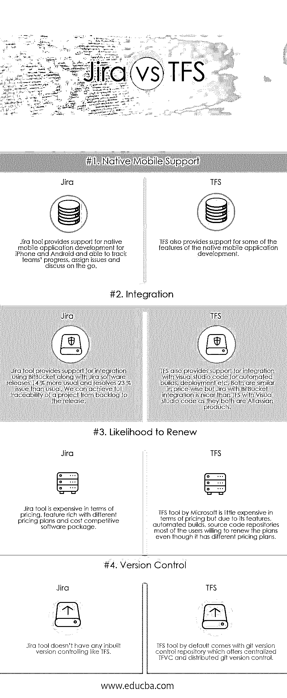

# JIRA 对 TFS

> 原文：<https://www.educba.com/jira-vs-tfs/>

## JIRA 和 TFS 的区别

使用吉拉工具，可以跟踪、分析、规划和发布不同行业的不同项目。吉拉支持任何敏捷方法，如 scrum、看板或任何其他基于定制的应用。所有敏捷工具都可以在单一工具的帮助下进行管理。TFS 控制着一个应用程序的生命周期，从需求收集，编码，测试，发布，到之后的项目维护。TFS，也称为 Team Foundation Server，帮助进行端到端的开发和测试。我们可以说 TFS 是版本控制系统、吉拉和生命周期管理系统的混合体。

### 什么是吉拉？

吉拉是由一家名为 Atlassian 的澳大利亚公司开发的问题和项目跟踪工具。对于每项任务，我们可以打开票证或问题来跟踪每个阶段的进度，并在票证的每个步骤对任务进行适当的描述。我们会发现，根据工作的复杂性，我们是在相当简单的工作流程中工作，还是在复杂的任务中工作。吉拉是跟踪项目和问题的一个很好的透明工具。有不同版本的吉拉可供不同类型的用户使用。我们可以根据我们团队的需求定制吉拉工具，无论是简单的还是复杂的。

<small>网页开发、编程语言、软件测试&其他</small>

### 什么是 TFS？

TFS 可以与像 visual studio 和 eclipse 这样的 IDE 集成。它就像是充当 DevOps 服务的内部版本的云服务。它支持用于源代码控制的 git 存储库、支持持续集成和持续部署的构建和发布服务、用于执行不同类型测试(如负载测试、手动测试、回归测试)的各种工具、用于与客户、团队等共享报告、进度和项目趋势的可定制仪表板。以及使用 scrum 和看板敏捷方法进行开发计划、跟踪、错误报告的敏捷工具。

### JIRA 和 TFS 的面对面比较(信息图)

以下是 JIRA 和 TFS 的四大区别

### JIRA 和 TFS 的主要区别

两者都是市场上的热门选择；让我们讨论一些主要的区别:

1.  **管理模式:**吉拉工具支持不同的管理模式；其中一些是应用生命周期管理、问题跟踪、软件开发管理、客户服务管理和其他模型，而 TFS 支持不同的管理模型，如问题跟踪、软件开发管理、代码库等。
2.  **报告:**吉拉工具通过跟踪项目中的每一项任务和问题，使报告变得非常容易，我们可以使用 JQL、吉拉查询语言，这使我们能够过滤问题并报告我们想要的任何问题，而 TFS 可以在任何时间点生成团队任务、问题跟踪、积压和工作项目的报告，但吉拉报告很好。
3.  **灵活性:**吉拉工具为使用不同类型的服务提供了极大的灵活性，例如吉拉核心、吉拉软件、吉拉服务台、Hip chat、BitBucket、状态页面、confluence、源代码树等。而 TFS 支持免费用户，团队服务用户使用 TFS 服务。
4.  **IDE:** 吉拉工具支持不同的 IDE，如 Eclipse、IntelliJ、Visual Studio，而 TFS 支持不同的 IDE，如 Eclipse、IntelliJ、Android Studio、Visual Studio code 等。
5.  **原生移动支持:**吉拉工具支持在一个地方使用我们的源代码开发 iPhone 和 Android 的吉拉软件的原生移动应用程序，并实时跟踪团队进度，随时随地讨论问题和分配问题 TFS 支持原生移动应用程序开发的一些功能。
6.  **定价:**吉拉工具根据用户需求提供不同类型的定价，例如功能有限的免费试用版、高级咨询/集成服务(无入门级安装费)和基于服务的附加定价，而 TFS 工具提供不同类型的定价，例如免费试用版、高级咨询/集成服务(无入门级安装费)和附加定价。
7.  TFS 是一个应用程序生命周期管理工具，而吉拉是一个简单的问题跟踪工具，TFS 的许多功能，如源代码控制，自动构建在吉拉不受支持，我们需要使用 Bamboo，BitBucket 进行源代码控制存储。
8.  **实施:**吉拉工具提供了很多功能，因此用户需要花时间为他们的项目和工作流全面实施吉拉，因为一次工作之后，我们可以通过最小的更改使用终身，而 TFS 有这么多功能，但他们实施的方式非常差，用户建议 TFS 不要在没有对更改进行试运行的情况下将每个更改都推向生产。

### JIRA 与 TFS 对比表

让我们讨论一下 JIRA 与 TFS 之间的比较如下:

| **比较的基础** | **吉拉** | **TFS** |
| **原生移动支持** | 吉拉工具为 iPhone 和 Android 的原生移动应用程序开发提供支持，并能够在旅途中跟踪团队进度、分配问题和讨论。 | TFS 还为本地移动应用程序开发的一些特性提供支持。 |
| **整合** | 吉拉工具使用 BitBucket 和吉拉软件提供集成支持，比平常多发布 14 %,比平常多解决 23 %的问题。我们可以实现一个项目从积压到发布的完全可追溯性。 | TFS 还提供了与 visual studio 代码集成的支持，用于自动构建、部署等。两者在价格上相似，但是吉拉的 BitBucket 集成比 TFS 的 Visual studio 代码要好，因为它们都是 Atlassian 的产品。 |
| **续保可能性** | 吉拉工具价格昂贵，功能丰富，有不同的定价方案和具有成本竞争力的软件包。 | 微软的 TFS 工具在定价方面有点贵，但由于其功能、自动化构建、源代码库，大多数用户愿意更新计划，即使它有不同的定价计划。 |
| **版本控制** | 吉拉工具没有像 TFS 一样的内置版本控制。 | 默认情况下，TFS 工具附带一个 git 版本控制库，它提供集中式 TFVC 和分布式 git 版本控制。 |

### 结论

最后，对吉拉和 TFS 的工具进行了比较。我希望在阅读完这篇吉拉与 TFS 的文章后，你能更好地理解这些工具。正如我们上面讨论的，每种工具都有自己的优点和缺点，但当谈到使用它时，大多数人或用户更喜欢使用吉拉，因为它有更多的插件，用于开源，易于跟踪项目管理。

### 推荐文章

这是 JIRA 和 TFS 之间最大差异的指南。在这里，我们还通过信息图和比较表讨论了 JIRA 和 TFS 的主要区别。你也可以看看下面的文章来了解更多。

1.  [吉拉 vs 阿萨纳](https://www.educba.com/jira-vs-asana/)
2.  [JIRA 面试问题](https://www.educba.com/jira-interview-questions/)
3.  [吉拉和 Github](https://www.educba.com/jira-vs-github/)
4.  [吉拉 vs ServiceNow](https://www.educba.com/jira-vs-servicenow/)

