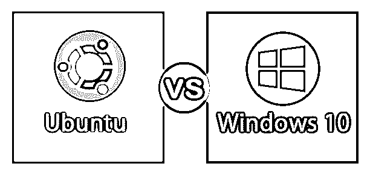

# Ubuntu vs Windows 10

> 原文：<https://www.educba.com/ubuntu-vs-windows-10/>

## Ubuntu 和 Windows 10 的区别

Ubuntu vs Windows 10 是什么？它们都是操作系统。操作系统是管理硬件和软件指令并控制计算机的软件包。

### 什么是 Ubuntu？

Ubuntu 是由 Canonical 于 2004 年 10 月开发的开源软件。这是一个非常可靠的操作系统。它的最新版本是 Ubuntu 18.10。基本上，它有三个正式版本:Ubuntu Desktop——用于个人电脑，Ubuntu Server——用于制造服务器，Ubuntu Core 用于物联网和机器人。Ubuntu 的一些关键特性如下:

<small>网页开发、编程语言、软件测试&其他</small>

*   这是一个开源的操作系统。
*   Ubuntu 有更好的用户界面。
*   从安全角度来说，Ubuntu 是非常安全的，因为它不太有用。
*   与 windows 相比，Ubuntu 的字体系列要好得多。
*   它有一个集中的软件存储库，我们可以从那里下载所有需要的软件。
*   Unix 环境对程序员来说是最好的。
*   命令行界面–它既有命令行界面，也有 GUI 界面。
*   成本——它是开源的，免费的。
*   测试你可以在 pen drive 中运行 Ubuntu 而不用安装它。

### 什么是 Windows 10？

Windows 10 是微软开发的操作系统系列。2015 年 7 月发布。它是针对个人计算而推出。窗口 10 的主要特征如下:

*   Windows 10 是 Windows 系列最新最好的更新。
*   它是游戏玩家的最佳操作系统。
*   Windows 10 的 UI 界面非常好。
*   Windows10 支持许多应用程序，键盘和鼠标吸引力在这方面非常好。
*   我们可以非常轻松地将 windows mobile 与 Windows 10 操作系统同步。
*   它有一个 Cortana，这是一个非常有用和有帮助的可视化个人助理。
*   它有一个新的浏览器名字，叫做微软 edge。
*   它有更好的抓拍辅助。

### Ubuntu 和 Windows 10 的正面比较(信息图)

下面是 Ubuntu 和 Windows 10 的 18 大区别

### Ubuntu 和 Windows 10 的主要区别

两者都是市场上的热门选择；让我们来讨论一些主要的区别。

*   Ubuntu 由 Canonical 开发，Canonical 属于 Linux 家族，而微软开发的是 Windows10。
*   Ubuntu 是开源的操作系统，而 Windows 是付费授权的操作系统。
*   与 Windows 10 相比，这是一个非常可靠的操作系统。
*   Ubuntu 的处理并不容易；你需要学习很多命令，而在 Windows 10 中，处理和学习部分非常容易。
*   它纯粹是一个用于编程目的的操作系统，而 Windows 也可以用于其他事情。
*   MS Office 在 Ubuntu 中无法正常工作，而在 Windows10 中会工作得非常出色。
*   Adobe 和 photoshoot 在 Ubuntu 中也不会正常工作，而 Windows 10 非常支持它。
*   Ubuntu 内核类型是单片的，而 Windows 10 内核类型是混合的。
*   与 Windows 10 相比，Ubuntu 要安全得多。
*   Ubuntu 用户域是 GNU，而 Windows10 用户域是 Windows Nt，Net。
*   在 Ubuntu 中，浏览速度比 Windows 10 更快。
*   在 Ubuntu 中更新非常容易，而在 Windows 10 中，每次安装 Java 时都需要更新。
*   Ubuntu 是所有开发者和测试者的首选，因为他们的几个特点，而他们不喜欢 windows。
*   在 Ubuntu 中，你的数据隐私比 Windows 10 高得多，因为任何合作公司都不拥有它。
*   Ubuntu 没有任何视觉助手，而 Windows 有 Cortana。
*   Ubuntu 有集中的应用安装，而在 Windows 10 中，这种功能是不存在的。
*   Ubuntu 我们可以通过在 pen drive 中使用而无需安装就能运行，但在 Windows 10 中，我们不能这样做。
*   Ubuntu 系统启动比 Windows10 快。
*   从游戏角度来看，Windows10 是游戏玩家的最佳选择。

### Ubuntu 与 Windows 10 对比表

以下是 Ubuntu 和 Windows 10 的一些对比

| **基础比较** | **Ubuntu** | **Windows 10** |
| **开发者** | 权威的 | 微软公司(全球知名的 PC 软件主要厂商) |
| **OS 家族** | Linux 操作系统 | windows 操作系统 |
| **源模型** | 开放源码 | 得到许可的 |
| **发布** | 2004 年 10 月 20 日 | 2015 年 7 月 15 日 |
| **内核类型** | 整体的 | 混合物 |
| **用户区** | 角马 | Windows NT，。网 |
| **默认用户界面** | GNOME，Ubuntu 统一 | Windows 外壳 |
| **成本** | 免费、开源 | 付费许可版本 |
| **病毒** | 病毒无法在这里生存。 | 病毒攻击很常见。 |
| **更新** | 更新非常容易 | 每次需要更新 Java 的时候。 |
| **编程** | 编程部分非常简单。 | 舒服但不太兼容。 |
| **娱乐** | 它不是为此而建的。 | 电影、歌曲和照片都可以轻松处理 |
| **MS 办公室工作** | 熟悉微软办公软件 | 在 Windows 中运行良好 |
| **游戏** | 你不能在这上面玩游戏。 | 所有游戏都将受此支持。 |
| **Adobe 和 Photoshop 支持** | 不太支持。 | 非常好用。 |
| **性能(RAM 和内核)** | 比 windows 更好 | 没关系 |
| **安全** | 不需要杀毒和防火墙。 | 一直需要一个。 |
| **学习** | 这不容易学 | 这很容易学。 |

### 结论

这就是 Ubuntu 和 Windows 10 的区别。两种操作系统都有其独特的优点和缺点。一般来说，开发人员和测试人员更喜欢 Ubuntu，因为它非常健壮、安全且编程速度快，而想要玩游戏且使用 MS office 和 Photoshop 的普通用户会更喜欢 Windows 10。总的来说，我们可以说 Ubuntu 和 Windows 10 操作系统都构建得很好，完全满足了客户的需求。

### 推荐文章

这是 Ubuntu 和 Windows 10 之间最大区别的指南。在这里，我们还将讨论信息图和比较表的主要区别。您也可以看看以下文章，了解更多信息——

1.  [卡莉 Linux vs Ubuntu](https://www.educba.com/kali-linux-vs-ubuntu/)
2.  [CentOS vs Ubuntu](https://www.educba.com/centos-vs-ubuntu/)
3.  [Linux vs Windows 10](https://www.educba.com/linux-vs-windows-10/)
4.  [Linux 与 Windows 性能对比](https://www.educba.com/linux-vs-windows-performance/)

