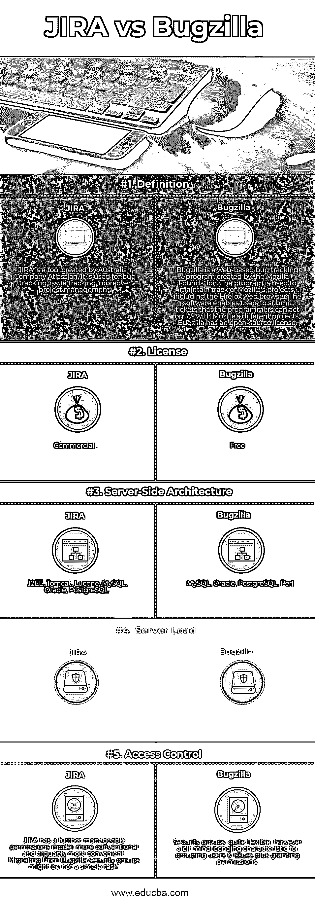

# JIRA vs 巴格西拉

> 原文：<https://www.educba.com/jira-vs-bugzilla/>

## JIRA 和 Bugzilla 的区别

JIRA 是一个项目管理工具，用于创建、维护和跟踪开发团队的活动、测试团队和支持过程，以及诸如开发任务进度、测试状态、缺陷跟踪等行动项目。另一方面，Bugzilla 是一个免费工具，仅用于缺陷跟踪和跟踪代码版本变化。JIRA 主要用在基于敏捷的项目中，因为它允许根据项目的状态对项目进行优先级排序，这在 Bugzilla 中肯定是不可行的。

### 什么是 JIRA？

产品名称吉拉是 Gojira 的缩写，Gojira 在日语中是哥斯拉的意思，是对竞争对手 Bugzilla 的暗示。据 Atlassian 称，吉拉被 122 个国家的 75，000 多个客户用于问题跟踪和项目管理。一些在任何时候都使用吉拉进行 bug 跟踪和项目管理的公司包括 Fedora Commons、Hibernate、Twitter、Skype Technologies、NASA、美国国防部和 Apache Software Foundation，该基金会同时接受吉拉和 Bugzilla。鉴于吉拉核心被设计为通用项目管理，而吉拉软件构成了基础软件，包括敏捷项目管理的特点。最后，吉拉服务台旨在供 IT 或业务服务台使用。吉拉是在 Java 下编写的，使用了控制包的 Pico 反转、Biz 实体引擎的 Apache 和 WebWork 1 技术栈。

<small>网页开发、编程语言、软件测试&其他</small>

对于远程过程调用(RPC)，吉拉支持 REST、SOAP 和 XML-RPC。吉拉与诸如 Clear Case、Concurrent Versions System (CVS)、Git、Mercurial、Perforce、Subversion 以及 Team Foundation Server 等源代码控制程序相结合。它输出几种翻译，包括英语、法语、德语、日语和西班牙语。吉拉支持联网的帮助台 API，用于在不同的问题跟踪系统之间共享客户支持票据。吉拉是一种流行的软件产品，可以许可在内部运行或作为托管应用程序开放。Atlassian 将吉拉免费提供给符合特定标准的开源项目，以及非学术、非商业、非政府、非政治、非营利和世俗的组织。对于学术和商业客户来说，在获得开发者源代码许可后，可以获得完整的源代码。

### Bugzilla 是什么？

Bugzilla 的许可遵循 Mozilla 公共许可证。由 Netscape Communications 于 1998 年作为开源软件发布，许多公司已经采用它作为自由和开源软件以及已建立的项目和产品的 bug 跟踪系统。Bugzilla 和其他软件一起被 Mozilla 基金会、Web Kit、Linux 内核、FreeBSD、GNOME、KDE、Apache、Red Hat、Eclipse 和 LibreOffice 使用。它是进一步的自托管。“不会修复”是 Bugzilla 和不同系统中问题的标签。

这意味着已确认的问题由于各种潜在原因之一而不会得到解决，包括修复成本太高、太困难或风险太大。响应“Zarro Boogs”本身就是一个错误声明，表明即使没有发现任何错误，该软件仍然可能包含尚未被识别的错误。Bugzilla 的安装方法是命令行驱动的，通过一系列步骤来检查系统需求和软件功能。

### JIRA 和 Bugzilla 的对决(资料图)

以下是 JIRA 和 Bugzilla 之间的最大差异

### JIRA 和 Bugzilla 的主要区别

两者都是业内认可的选择。让我们考虑一些显著的区别:

*   Bugzilla 只有一种链接类型:blocks/depends 和一个 Bug ID 定制字段。另一方面，JIRA 通过用户定义的语义拥有可配置的链接类型。JIRA 还需要可插拔的远程问题链接，以便将问题链接到 JIRA 以外的任何其他实体。
*   Bugzilla 允许您显示/隐藏整个自定义字段或基于任何其他字段值的特定值。相比之下，JIRA 支持仅基于项目和类型字段的条件配置。
*   标志/请求是非常独特的 Bugzilla 特性。JIRA 的标签可以作为必备的旗帜。出色的可扩展性为更精确地模仿 Bugzilla 标志特性的插件留下了空间。
*   Bugzilla 中可用的自定义字段类型有文本字段、多选、下拉、日期/时间、Bug ID。然而在 JIRA 可用的自定义字段类型太多了，无法列出，甚至额外的自定义字段类型也可能来自插件。
*   在 Bugzilla 中，用户界面多年来没有太大变化。补充了一些可用性增强，但是总体来说，没有什么优势。HTML 是由模板构成的，一些组织已经改变了这些模板，使 Bugzilla 看起来更好。JIRA 的用户界面远远好于 Bugzilla，开箱即用。已经投入了大量的精力，并且正在不断改进。

### JIRA vs Bugzilla 对比表

下面是 JIRA 和 Bugzilla 之间的比较

| **比较的基础** | ******【JIRA】****** | Bugzilla |
| **定义** | JIRA 是由澳大利亚公司 Atlassian 开发的工具。它用于错误跟踪，问题跟踪，以及项目管理。 | Bugzilla 是一个基于网络的 bug 跟踪程序，由 Mozilla 基金会创建。该程序用于跟踪 Mozilla 的项目，包括 Firefox 网络浏览器。该软件使用户能够提交程序员可以操作的票。与 Mozilla 的不同项目一样，Bugzilla 拥有开源许可。 |
| **执照** | 商业 | 自由的 |
| **服务器端架构** | J2EE，Tomcat，Lucene，MySQL，Oracle，PostgreSQL | MySQL，Oracle，PostgreSQL，Perl |
| **服务器负载** | 相当大的 | 低的 |
| **访问控制** | JIRA 有一个更容易管理的权限模型，更传统，也更方便。从 Bugzilla 安全组迁移可能不是一项简单的任务。 | 安全组:非常灵活，但是对用户和问题进行分组以及授予权限有点令人费解。 |

### 结论

简而言之，Bugzilla 为分组问题、用户和允许权限提供了灵活而复杂的特性，而 JIRA 有一个关于权限的简单模型，所以它非常传统和相关；从 Bugzilla 安全组迁移是一项具有挑战性的任务。所以，JIRA 和 Bugzilla 是非常不同的，虽然他们有一些共同的特点；JIRA 最常用于软件公司。

### 推荐文章

这是 JIRA 和 Bugzilla 之间最大差异的指南。在这里，我们还将讨论信息图和比较表的主要区别。你也可以看看下面的文章来了解更多。

1.  [杰姆特 vs 加特林](https://www.educba.com/jmeter-vs-gatling/)
2.  [吉拉 vs 阿萨纳](https://www.educba.com/jira-vs-asana/)
3.  [JavaScript vs VBScript](https://www.educba.com/javascript-vs-vbscript/)
4.  [吉拉 vs ServiceNow](https://www.educba.com/jira-vs-servicenow/)

