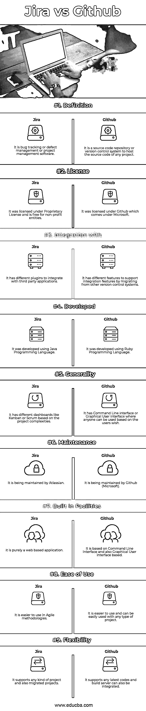

# 吉拉 vs Github

> 原文：<https://www.educba.com/jira-vs-github/>

## 吉拉和 Github 的区别

吉拉是由 Atlassian 公司开发的问题跟踪工具或产品。它被授予了专有许可证。它在敏捷项目管理过程中很有用。它主要用于敏捷项目中的 bug 跟踪。它是由 Atlassian 开发和维护的。它完全是使用 Java 编程语言开发和编写的。Github 是一个基于 web 应用程序托管的源代码库或版本控制系统。参与创建和开发 Github 的主要成员有 Tom Preston Werner、Scott 沙孔、Chris Wanstrath 和 P. J. Hyett。它完全是使用 Ruby 编程语言开发和编写的。

**让我们更详细地研究一下吉拉和 Github:**

<small>网页开发、编程语言、软件测试&其他</small>

*   吉拉这个词来源于日语的哥斯拉，而哥斯拉又来源于 Gojira。它支持不同的跨平台操作系统。它是一种项目管理软件和缺陷跟踪系统。在非营利组织或任何正在运行的开源项目的情况下，它是免费许可的。它最初发布于 2002 年。最新的稳定版本发布于 2018 年 10 月。
*   Github 成立于 2008 年。它最近在 2018 年 6 月被软件巨头微软收购。它的总部设在美国加利福尼亚州。它在自己的网站上拥有百万用户和百万数量的存储库，并成为世界上最大的源代码主机。Github 最初是一家初创企业。Github 上的项目可以使用 Git 命令行界面进行操作和更新。

### 吉拉和 Github 的正面比较(信息图)

以下是吉拉和 Github 的 9 大区别

### 吉拉和 Github 的主要区别

两者都是市场上的热门选择；让我们讨论一些主要的区别:

*   吉拉的软件拥有最新的功能，比如完全的敏捷支持、强大的搜索和报告功能，而 Github 没有这些功能，比如搜索和报告。
*   吉拉已经准备好使用节省更多时间的工作流，并允许开发人员专注于业务逻辑而不是基于流程的任务，而 Github 缺乏这种类型的即用功能。
*   吉拉有定制的仪表盘，而 Github 没有定制的仪表盘。
*   吉拉有敏捷的计划和报告工具，以及对新版本或即将发布的版本的实时跟踪，而 Github 没有这些功能，但有一个命令行界面或图形用户界面来推送代码。
*   吉拉有 REST API 特性来集成和交互不同的第三方工具和几个市场插件和附加功能，以用于整个 Atlassian 市场，而 Github 只有 REST API 特性来集成其他工具，其中代码从不同版本控制系统的迁移更容易。
*   吉拉运行在云上，或者可以设置在我们自己的服务器上，用于安全或金融应用程序，这些应用程序主要关注隐私，而 Github 运行在其企业云服务上。
*   吉拉得分较低，客户体验指数较低，而 Github 得分较高，客户体验指数较高。
*   吉拉的企业版按月付费，而 Github 的企业版按月或一次性付费或按年订阅。
*   顶级公司都在用吉拉或者思科、易贝、NASA、Salesforce、Adobe、LinkedIn 等品牌。几乎所有顶级品牌和企业都在使用 Github，如 KrauseFx、HubSpot、Kakao、MailChimp 等。
*   吉拉支持 Windows，Android，Mac，iPhone 或 iOS 设备，Linux 和基于网络的界面等。，而 Github 支持 windows、iPhone、Mac 和所有基于 web 的 Windows。
*   吉拉拥有出色的用户体验、问题集成、高级报告工具、定制仪表板、数据导入和导出功能、移动应用程序界面和按需云服务等。鉴于 Github 具有问题跟踪功能、对超过 200 种不同编程语言的支持、Github 桌面工具特性、健壮的 REST APIs 和集成的代码审查机制。

### 吉拉 vs Github 对比表

下面是吉拉和 Github 之间最上面的比较

| **基本比较** | **吉拉** | **Github** |
| **定义** | 它是 bug 跟踪或者缺陷管理，或者项目管理软件。 | 它是一个源代码存储库或版本控制系统，用于托管任何项目的源代码。 |
| **执照** | 它是根据专有许可证授权的，对非营利实体免费。 | 它在 Github 下获得许可，Github 隶属于微软。 |
| **Integration**

**同**

 | 它有不同的插件来集成第三方应用程序。 | 它具有不同的特性，通过从其他版本控制系统迁移来支持集成特性。 |
| **发达** | 它是用 Java 编程语言开发的。 | 它是用 Ruby 编程语言开发的。 |
| **通用性** | 基于项目的复杂性，它有不同的仪表板，如看板或 Scrum。 | 它有命令行界面或图形用户界面，任何人都可以根据用户的意愿使用。 |
| **维护** | 它由 Atlassian 维护 | 它由 Github(微软)维护。 |
| **内置设施** | 它纯粹是一个基于网络的应用程序。 | 它基于命令行界面，也基于图形用户界面。 |
| **易用性** | 它更容易在敏捷方法中使用。 | 它更容易使用，可以很容易地用于任何类型的项目。 |
| **灵活性** | 它支持任何类型的项目，也支持迁移的项目。 | 它支持任何最新的代码，构建服务器也可以集成。 |

### 结论

吉拉是一个错误跟踪系统或用于敏捷项目管理，而 Github 是一个源代码库，在其网站上托管项目的源代码，以有效地推送代码，并保持所有开发人员对开发项目的一致。这将允许开发大型项目的完美维护。吉拉和 Github 在项目开发和维护方面都有不同的优势和用途。

与吉拉相比，Github 更突出，因为它是版本控制系统，而吉拉是一个错误跟踪工具。Github 在维护项目源代码方面有不同的特点，而吉拉则是用于维护项目用户故事或者维护开发或维护项目的缺陷。就数字项目或任何遵循敏捷方法的最新项目而言，这两者同等重要。

### 推荐文章

这是吉拉和 Github 之间最大区别的指南。在这里，我们还将讨论信息图和比较表的主要区别。你也可以看看下面的文章来了解更多。

1.  [JIRA 面试问题](https://www.educba.com/jira-interview-questions/)
2.  [Perl vs PHP](https://www.educba.com/perl-vs-php/)
3.  [吉拉 vs ServiceNow](https://www.educba.com/jira-vs-servicenow/)

