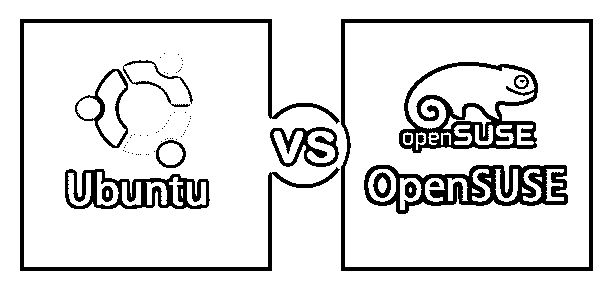
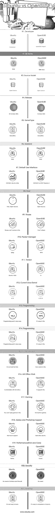

# Ubuntu vs OpenSUSE

> 原文：<https://www.educba.com/ubuntu-vs-opensuse/>

## Ubuntu 和 OpenSUSE 的区别

Ubuntu 和 OpenSUSE 是什么？它们都是操作系统。操作系统是管理硬件和软件指令并控制计算机的软件包。

### 人的本质

Ubuntu 是由 Canonical 于 2004 年 10 月开发的开源软件。这是一个非常可靠的操作系统。它的最新版本是 Ubuntu 18.10。基本上，它有三个正式版本:Ubuntu Desktop——用于个人电脑，Ubuntu Server——用于为物联网和机器人制造服务器和 Ubuntu 核心。Ubuntu 的一些关键特性如下:

<small>网页开发、编程语言、软件测试&其他</small>

*   这是一个开源的操作系统。
*   Ubuntu 拥有更好的用户界面。
*   从安全角度来说，Ubuntu 是非常安全的，因为它不太有用。
*   与 windows 相比，Ubuntu 的字体系列要好得多。
*   它有一个集中的软件存储库，我们可以从那里下载所有需要的软件。
*   Unix 环境对程序员来说是最好的。
*   命令行界面–它既有命令行界面，也有 GUI 界面。
*   成本——这是一个免费的开源软件。
*   出于测试目的，你可以在 pen drive 中运行 Ubuntu，而无需安装它。

### OpenSUSE

OpenSUSE 是由 openSUSE project line 开发的开源操作系统，它属于类 UNIX 操作系统家族。它的首次发布发生在 2005 年 10 月。它的更新方式是滚动发布。OpenSUSE 的一些主要特性如下:

*   它是一个开源的操作系统。
*   它的内核类型是单片的。
*   它属于 GNU
*   标准包管理器是 ZYpp，前端包管理器是 YaST，底层包管理器是 RPM。
*   它有一个滚动发布的更新方法。

### Ubuntu 和 OpenSUSE 的正面比较(信息图)

下面是 Ubuntu 和 OpenSUSE 的 21 大区别

### Ubuntu 和 OpenSUSE 的主要区别

两者都是市场上的热门选择；让我们讨论一些主要的区别:

*   Ubuntu 的包管理器是 dpkg，而 OpenSUSE 的包管理器是 RPM。
*   Ubuntu 当前的 Linux 内核是 15，但 OpenSUSE Linux 内核是 4.12.14。
*   Ubuntu 属于 Linux 家族，而 OpenSUSE 属于 SUSE-Linux
*   Ubuntu 默认用户界面是 GNOME，而 OpenSUSE 用户界面是 GNOME3 或 KDE 等离子 5。

### Ubuntu 与 OpenSUSE 对比表

下面是 Ubuntu 和 OpenSUSE 之间的比较

| **比较的基础** | **Ubuntu** | **OpenSUSE** |
| **开发者** | 权威的 | openSUSE 项目 |
| **OS 家族** | Linux 操作系统 | SUSE Linux |
| **源模型** | 开放源码 | 开放源码 |
| **发布** | 2004 年 10 月 20 日 | 2005 年十月 |
| **内核类型** | 整体的 | 整体的 |
| **用户区** | 角马 | 角马 |
| **默认用户界面** | GNOME，Ubuntu 统一 | GNOME 3 or KDE Plasama 5 |
| **成本** | 免费、开源 | 开放源码 |
| **病毒** | 病毒无法在这里生存。 | 不能攻击 |
| **数据包管理器** | dpkg | 每分钟转数 |
| **版本** | Ubuntu 18.04 | Fifteen |
| **当前的 Linux 内核** | Four point one five | 4.12.14 |
| **更新** | 更新非常容易 | 滚动释放 |
| **编程** | 编程部分非常简单。 | 这很简单。 |
| **娱乐** | 它不是为此而建的。 | 我可以穿着这个看。 |
| **MS 办公室工作** | 熟悉微软办公软件 | 它支持这一点 |
| **游戏** | 你不能在这上面玩游戏。 | 不是为游戏而建的 |
| **Adobe 和 Photoshop 支持** | 不太支持。 | 和 ubuntu 一样 |
| **性能(RAM 和内核)** | 较好的 | 好的 |
| **安全** | 不需要杀毒和防火墙。 | 不需要。 |
| **学习** | 这不容易学 | 在 ubuntu 的对比中很容易 |

### 结论

这都是 Ubuntu 和 OpenSUSE 的对比。如果要说普及度的话，那么 Ubuntu 在开发者和测试者对 OpenSUSE 的比较中，因为通用性而大受欢迎。

### 推荐文章

这是 Ubuntu 和 OpenSUSE 之间最大区别的指南。在这里，我们还将讨论信息图和比较表的主要区别。你也可以看看下面的文章来了解更多。

1.  [Ubuntu 和 Fedora](https://www.educba.com/ubuntu-vs-fedora/)
2.  [Redhat 和 Ubuntu](https://www.educba.com/redhat-vs-ubuntu/)
3.  [Ubuntu vs CentOS](https://www.educba.com/centos-vs-ubuntu/)
4.  [Linux vs Ubuntu](https://www.educba.com/linux-vs-ubuntu/)

