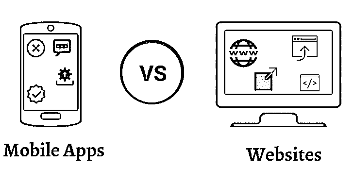
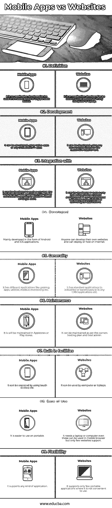

# 移动应用与网站

> 原文：<https://www.educba.com/mobile-apps-vs-website/>

## 移动应用与网站的区别

移动应用程序是设计用于在智能手机或移动电话等移动设备上运行的应用程序。网站是在诸如膝上型电脑或个人电脑等计算机设备上运行的 web 应用程序。移动应用程序是使用本地跨平台框架开发的，以使它们能够兼容所有类型的设备。移动应用程序的开发方式使得它们可以很容易地操作或调整到便携式设备的较小屏幕上。移动应用程序更容易使用，现在，它们已经获得了很大的普及，正在被许多用户使用，它具有便携性，可以随时使用。移动应用可以根据设备和屏幕大小轻松扩展，例如手机、不同屏幕大小的智能手机、平板电脑和不同屏幕大小的手机。移动应用程序基本上来自不同的风格，例如来自不同的生产商，如谷歌的 Android 或苹果或黑莓的 iOS 或其他一些跨平台应用程序。在这里，我们讨论了移动应用程序与网站。

网站是网络应用程序，可以使用任何笔记本电脑或个人电脑从任何[网络浏览器](https://www.educba.com/what-is-browser/)直接打开，甚至可以在兼容的移动浏览器中打开，并且更容易将屏幕或应用程序的大小缩放到显示器中。为基于网络的用户开发的应用程序更像是移动应用程序，因为它提供了各种各样的选项，并且适用于不同的操作。

<small>网页开发、编程语言、软件测试&其他</small>

### 移动应用和网站之间的直接比较(信息图表)

以下是移动应用和网站的 9 大对比:

### 移动应用和网站的主要区别

手机应用和网站都是市场上的热门选择。让我们讨论一下移动应用程序与网站之间的一些主要区别:

*   移动应用易于使用，与许多设备兼容，易于升级，易于共享或下载，而网站不像移动应用那样易于使用。
*   移动应用程序的生命周期通常较短，大多数情况下，更新将每周发布，有时甚至只发布一天，以支持几个功能或漏洞或安全性，而网站的生命周期较长，不需要根据开发计划进行任何更改或修复，只有在出现重大功能问题时才需要立即进行更改。
*   移动应用不太贵，而网站更贵。
*   移动应用程序更容易维护，而网站在维护和支持其变更发布方面有所不同。
*   移动应用可以很容易地在更短的时间内带给更多的客户，然而，对于网站来说，这并不容易。
*   移动应用程序的初始开发和部署或发布需要更长的时间和精力，并且一旦部署了第一个版本，维护起来就更容易了，而对于网站来说，在其生命周期的所有阶段都是正常的。
*   手机应用有导航功能，而网站没有这种功能。
*   最近，每个企业主都在使用移动应用程序，以接触到大多数客户，而网站也在使用，但具有正常的特性或功能，这些特性或功能主要集中在移动应用程序上，使移动应用程序[成为强制性的。](https://www.educba.com/mobile-application-testing-interview-questions/)
*   移动应用程序有助于更长时间地留住客户，并通过向客户发送推送通知来吸引客户购买其业务，而网站对这些类型的功能不太熟悉。
*   通过移动设备在线购物的人数增加了 30%，而在网站方面，几乎没有变化。

### 移动应用和网站对照表

以下是移动应用和网站之间的最高对比:

| **比较的基础** | **手机应用** | **网站** |
| **定义** | 它是一个开发用于移动设备或任何便携式设备的应用程序。 | 它是一个开发用于网络浏览器或任何计算机或笔记本电脑的应用程序。 |
| **开发** | 它可以使用本机应用程序或任何跨平台应用程序进行开发。 | 它可以根据客户的要求使用任何技术来开发。 |
| **Integration**

**同**

 | 它可以以这样的方式开发，最终的开发和集成可以基于目标用户在特定的平台上完成。 | 它可以通过使用面向服务的架构来开发，可以与许多跨平台或技术应用程序集成。 |
| **发达** | 主要以 Android 和 [iOS 应用](https://www.educba.com/install-ios/)的形式开发。 | 任何人都可以开发自己的网站，并可以在互联网上部署或托管。 |
| **通用性** | 它有不同的应用程序，如游戏应用程序、实用程序、医疗监测等。 | 它在工业或仓库或任何 CRM 应用程序中都有标准应用程序。 |
| **维护** | 它将在应用程序商店或游戏商店中维护。 | 它可以根据所有者的托管计划和主机管理员进行维护。 |
| **内置设施** | 可以通过使用触摸设备等来访问它。 | 它可以被电脑或笔记本电脑使用。 |
| **易用性** | 使用便携式更容易。 | 它需要一台笔记本电脑或电脑；即使这些都可以在手机浏览器中使用，但只有少数网站支持它。 |
| **灵活性** | 它支持任何类型的应用程序。 | 它只支持一些不方便使用的便携应用。 |

### 结论

随着智能手机用户的数量越来越多，移动应用程序现在很受欢迎，并通过移动应用程序本身提供各种功能。本地应用程序通常会根据需求开发 Android 或 iOS 或任何其他应用程序，而基于 web 的应用程序仅基于单一开发模型。移动应用有 ba 样板代码要开发，更容易开发应用。即使是基于网络的应用程序也有现成的生产级应用程序来轻松开发新网站。

手机 app 有很多应用，比如公用事业、交通、游戏等。，以满足许多客户的日常生活需求，而网站应用在可移植性方面的要求较低。在游戏和便携式应用程序方面，如即时出租车预订、销售点的 QR 支付或任何其他不容易访问网站的户外活动，他们的移动应用程序具有更大的优势。最终，最终用户的需求和目标客户的数量可以决定[是否开发移动应用](https://www.educba.com/azure-mobile-app/)或网站。

### 推荐文章

这是移动应用程序与网站之间最大区别的指南。在这里，我们讨论了移动应用程序与网站的直接比较，一个关键的区别，以及信息图表和比较表。您也可以阅读以下文章，了解更多信息——

1.  [肥皂 vs 休息](https://www.educba.com/soap-vs-rest/)
2.  [WordPress vs Drupal](https://www.educba.com/wordpress-vs-drupal/)
3.  [Linux vs Windows 10](https://www.educba.com/linux-vs-windows-10/)
4.  [谷歌分析 Vs Piwik](https://www.educba.com/google-analytics-vs-piwik/)

