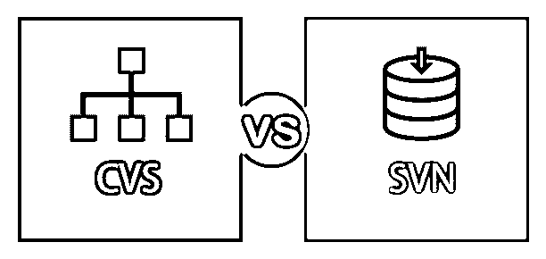
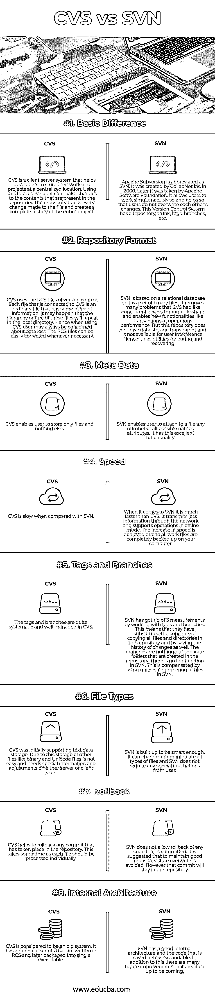

# SVN vs CVS

> 原文：<https://www.educba.com/svn-vs-cvs/>

## SVN 与 CVS 的区别

SVN vs CVS 都是版本控制文件。它们主要由在单个项目上协作的团队使用。SVN 代表 SubVersioN，CVS 代表 Concurrent Versions System。他们允许团队成员跟踪所有的变更，并且知道谁在开发什么。SVN 不同于 CVS，因为它允许原子提交。原子提交允许用户要么完全应用提交，要么根本不应用提交。使用 SVN，提交可以很容易地回滚，而在 CVS 中，不可能撤销部分提交。让我们看看下面的区别。

### SVN 和 CVS 的直接对比(信息图)

以下是 SVN 和 CVS 的 8 大区别:

<small>网页开发、编程语言、软件测试&其他</small>

### SVN 和 CVS 的主要区别

SVN 和 CVS 都是版本控制工具，帮助开发人员维护项目的代码和状态，并同时工作。让我们讨论一下 SVN 和 CVS 的主要区别:

在 SVN vs CVS 中，存储库是所有开发人员存储工作的中心。存储库不仅存储文件，还存储所有更改的历史记录。在 CVS 中，使用命令“cvs add myfile.c”可以很容易地将文件添加到存储库中。同样，也可以使用 add 命令添加目录。另一方面，在 SVN，有像入住和退房这样的操作。检出用于在存储库中创建代码的工作副本。这个工作副本只不过是一个工作场所，开发人员在这里做他们的更改，然后提交到存储库中。用户还可以更新、执行不同的更改、修复任何错误、解决冲突(如果存在的话),并提交存储库中的代码。

谈到冲突，SVN 提供了观看这些冲突的设施。一旦完成，如果不紧急，用户可以推迟冲突。“解决冲突”选项使用户能够在需要时解决所有冲突。在 CVS 中这个过程有点长。为了快速做到这一点，建议用户扫描整个文件，以便您可以一次性解决所有冲突。在所有冲突解决之前，CVS 不允许提交。

### SVN 和 CVS 对照表

让我们看看 SVN 和 CVS 之间的顶部比较。

| **SVN 与 CVS 的比较基础** | **CVS** | **SVN** |
| **基本差异** | CVS 是一个客户机-服务器系统，帮助开发人员将他们的工作和项目存储在一个集中的位置。使用这个工具，开发人员可以对存储库中的内容进行修改。存储库跟踪对文件的每一次更改，并创建整个项目的完整历史。 | 阿帕奇颠覆是缩写为 SVN。CollabNet 公司在 2000 年创建了它。后来被 Apache 软件基金会拿走了。它允许用户同时工作，这样有助于用户不会覆盖彼此的更改。这个版本控制系统有一个存储库、主干、标签、分支等。 |
| **储存库格式** | CVS 使用版本控制的 RCS 文件。连接到 CVS 的每个文件都是包含一些信息的普通文件。这些文件的层次结构或树可能会在本地目录中重复出现。因此，当使用 CVS 时，用户可能总是担心数据丢失。RCS 文件可以在任何需要的时候很容易地被修改。 | SVN 基于关系数据库，或者说它是一组二进制文件。它消除了许多 CVS 问题，如通过文件共享的并发访问，并支持新的功能，如操作性能的事务。但是这个存储库没有透明的数据存储，并且不允许用户干预。因此，它具有治愈和恢复的效用。 |
| **Meta Data** | CVS 允许用户只存储文件，不存储其他任何东西。 | SVN 使用户能够将任意数量的所有可能的命名属性附加到文件中。它有这种出色的功能。 |
| **速度** | 与 SVN 相比，CVS 很慢。 | 说到 [SVN](https://www.educba.com/install-svn/) ，它比 CVS 快多了。它通过网络传输较少的信息，并支持脱机模式下的操作。速度的提高是由于所有的工作文件都完全备份在您的计算机上。 |
| **标签和分支** | 标签和分支在 CVS 中是相当系统化和管理良好的。 | SVN 通过使用标签和分支，已经摆脱了 3 种测量方法。这意味着他们已经取代了复制存储库中所有文件和目录以及保存更改历史的概念。分支只是在存储库中创建的独立文件夹。SVN 没有标签功能。这通过使用 SVN 的通用文件编号来补偿。 |
| **文件类型** | CVS 最初支持文本数据存储。因此，像二进制和 Unicode 文件这样的其他文件的存储并不容易，需要特殊的信息和在服务器端或客户端的调整。 | SVN 被认为足够聪明。它可以改变和操纵所有类型的文件，SVN 不需要用户的任何特殊指令。 |
| **回滚** | CVS 有助于回滚存储库中发生的任何提交。这需要一些时间，因为每个文件都应该单独处理。 | SVN 不允许回滚任何已提交的代码。建议避免覆盖，以保持良好的存储库状态。但是，提交将保留在存储库中。 |
| **内部架构** | CVS 被认为是一个老系统。它有一堆用 RCS 编写的脚本，然后打包成一个可执行文件。 | SVN 有一个很好的内部架构，这里保存的代码是可扩展的。除此之外，还有许多未来的改进在等待着我们。 |

### 结论

SVN 和 CVS 都是版本控制工具，有助于有效地维护项目的代码。但说到选择更好的一个，它总是明智的选择与 SVN。原因是 SVN 更新，有更先进的选择。它允许原子提交，而 CVS 没有这个特性。 [SVN 有重命名](https://www.educba.com/install-svn/)和移动文件和目录的功能，而 CVS 没有。因此，可以得出结论，SVN 是一个更好的选择。

### 推荐文章

这是 SVN 和 CVS 之间最大区别的指南。我们已经讨论了 SVN 与 CVS 的直接比较、关键差异、信息图和比较表。您也可以看看以下文章，了解更多信息–

1.  [CNA 和 CCNP](https://www.educba.com/ccna-vs-ccnp/)
2.  [JSON 和 CSV](https://www.educba.com/json-vs-csv/)
3.  [SAS vs R](https://www.educba.com/sas-vs-r/)
4.  [硒 vs QTP](https://www.educba.com/selenium-vs-qtp/)

