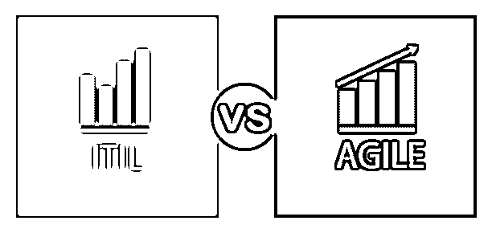
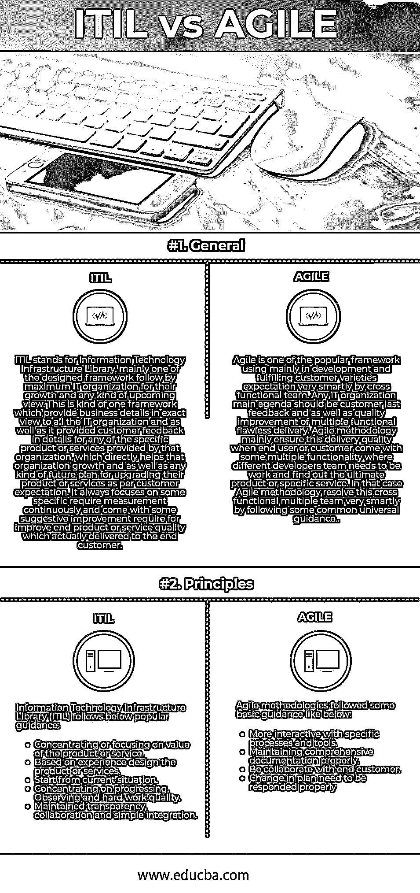

# Itil 与敏捷

> 原文：<https://www.educba.com/itil-vs-agile/>

## Itil 和敏捷的区别

它的组织目前非常专注于尽可能快地改善或发展他们的业务。由于满足了他们的标准，他们不断地遵循或计划遵循一些特定的方法，这些方法可能符合适当的行业标准。在许多商业意识形态之间，计划遵循其业务的最大 IT 公司应该遵循 ITIL(信息技术基础设施库)，而在一些最有价值或最大的商业行业的情况下，遵循像 ITSM (IT 服务管理)这样的框架。这种框架主要涉及改进组织已经提供的服务，并使它们在竞争激烈的行业中过于有效。

现在最有效和快速地改进他们的服务，公司很容易理解他们必须提高他们的产品质量，或者更准确地说，他们必须计划建立敏捷性。他们的主要目标是引入一些新技术或方法，使他们的产品或服务在整个市场上更具吸引力和竞争力。现在，任何 IT 组织都在提高这种能力，他们必须遵循适当的敏捷软件开发策略，包括任何类型的 IT 公司都遵循的软件开发的基本 IT 标准特性。敏捷太受欢迎了，主要是在与跨职能团队合作的情况下，以支持终端客户期望的各种功能，理解他们的需求，并提供与跨职能团队合作的适当敏捷方法的解决方案。

<small>网页开发、编程语言、软件测试&其他</small>

### Itil 和敏捷的直接比较(信息图)

下面是 Itil 与敏捷之间的两大区别

### Itil 和敏捷的主要区别

两者都是市场上的热门选择；让我们讨论一些主要的区别:

1.  信息技术基础设施库(ITIL)致力于通过与不同的组织和最终客户的反馈进行比较，提高组织在任何情况下的能力。它清楚地为信息技术组织提供了正确的观点，即他们的弱点是什么，他们的强项是什么，还为组织的更高权威提供了非常明智的观点，即他们对自己的产品或服务的未来观点，与当前市场情况相比，在很长一段时间内提供了非常公平的市场。它主要关注该特定产品的成本、基于资源实力的整个组织的生产率和组织的年收入、基于一些开放式问题答案的客户满意度、该组织在过去几个财政年度的收入、是否以适当的方式满足 SLA。而敏捷方法在上述与 ITIL 相关的点上主要保持了两部分特征。一个是专注于生产力和 SLA。正如敏捷以一种适当的、前瞻性的方式考虑可交付成果一样，它包括以一种可接受的方式理解客户的多种需求，基于功能分配相同的多个开发团队，基于单个跨职能团队准备需求理解文档，准备一个最终设计文档，开发人员开发他们的代码库，单独交付，合并和维护适当的跨职能团队可交付成果，并将其交付给最终客户进行验收。它还包括 SLA 维护、对客户未接受功能的支持、实施计划和后期制作支持。
2.  信息技术基础设施库(ITIL)遵循一些顺序框架，基于该特定顺序框架，被决定并向组织提供一个对其增长的预期视图或一些更关注的即将到来的预期。它首先考虑产品或支持的价值，并确保根据客户的期望开发正确的东西，然后根据最终客户的反馈或适当的经验专注于具体的设计，总是从当前的情况或组织开始计算，保持一个适当的资源友好型环境，以便任何人都不会超负荷工作，并保持家庭和工作环境之间的平衡，确保进展顺利，直接观察其他人或竞争对手的发展，以了解差距或改进点。 需要在整个组织的所有资源之间保持透明，尤其是在成本功能交付的情况下，协作需要避免任何业务中的复杂性，更好地保持尽可能简单。 而敏捷方法不能遵循任何顺序框架，因为任何种类的小变化或最小影响都必须在非常短的时间内交付，这造成了整个系统的不稳定性。

### Itil 与 Agile 对比表

下面是 Itil 和敏捷之间最重要的比较

| **比较的基础** | **ITIL** | **敏捷** |
| **通用** | ITIL 代表信息技术基础设施库，主要是最大限度的 IT 组织为他们的发展和任何一种即将到来的观点而设计的框架之一。这是一种框架，它为所有 IT 组织提供准确的业务细节，并为该组织提供的任何特定产品或服务提供详细的客户反馈，这直接有助于该组织的发展以及根据客户期望升级其产品或服务的任何类型的未来计划。它总是持续关注一些特定的需求度量，并提出一些建议性的改进要求，以提高最终产品或服务质量，并实际交付给最终客户。 | 敏捷是一种流行的框架，主要用于开发，并由跨职能团队非常灵活地满足客户的各种期望。任何 IT 组织的主要议程都应该是客户的最后反馈以及多种功能完美交付的质量改进。敏捷方法主要是在最终用户或客户带来一些多种功能时确保交付质量，在这种情况下，不同的开发团队需要工作并找出最终的产品或特定的服务。敏捷方法通过遵循一些通用的指导方针，非常聪明地解决了这种跨职能多团队的问题。 |
| **原则** | Information Technology Infrastructure Library (ITIL) follows below popular guidance:

*   专注于产品或服务的价值。
*   根据经验，设计产品或服务。
*   从现状出发。
*   专注于进步，观察和努力工作的品质。
*   保持透明、协作和简单集成。

 | 敏捷方法遵循一些基本的指导，如下:

*   Be more interactive with specific processes and tools.
*   Maintain comprehensive documents properly.
*   We work with end customers.
*   It is necessary to respond appropriately to changes in the plan.

 |

### 结论

ITIL 和敏捷都是非常流行的方法，被所有的 IT 组织直接或间接地遵循。ITIL 确保任何 IT 组织的整体业务增长，并通过提供一些可理解的观点非常聪明地提供未来计划。而敏捷确保向最终客户的顺利交付，这自动帮助 ITIL 捕捉公司的增长和即将到来的未来。

### 推荐文章

这是 ITIL 和敏捷之间最大区别的指南。在这里，我们还将讨论信息图和比较表的主要区别。你也可以看看下面的文章来了解更多。

1.  [ITIL VS PMP](https://www.educba.com/itil-vs-pmp/)
2.  [敏捷 vs 开发运维](https://www.educba.com/agile-vs-devops/)
3.  [SDLC 与敏捷](https://www.educba.com/sdlc-vs-agile/)
4.  [ITIL 生命周期](https://www.educba.com/itil-lifecycle/)

