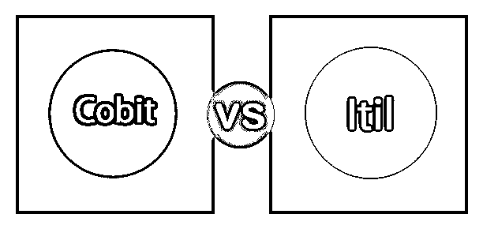
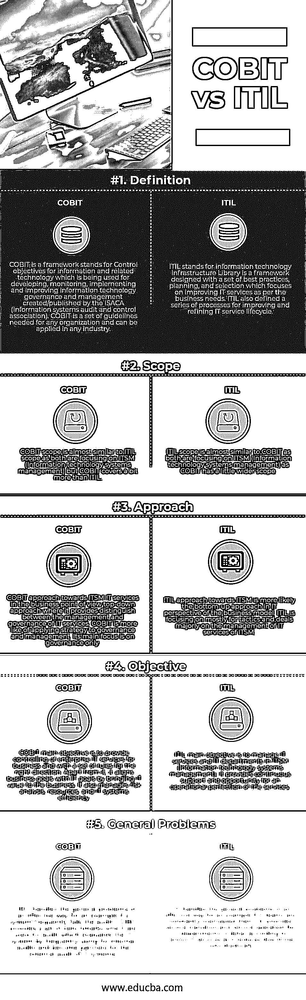

# 科比特 vs ITIL

> 原文：<https://www.educba.com/cobit-vs-itil/>

## COBIT 和 ITIL 的区别

COBIT 是一个代表信息和相关技术控制目标的框架，用于开发、监控、实施和改进由 ISACA(信息系统审计和控制协会)创建/发布的信息技术治理和管理。COBIT 的主要目标是提供一种通用的语言，在执行者之间交流规则、目标、需求、目标和结果。ITIL 代表信息技术基础架构库，它是一个框架，设计有一组最佳实践、规划和选择，重点是根据业务需求改进 IT 服务。ITIL 还将其定义为一系列改进和细化 IT 服务生命周期的过程。最新版本的 ITIL 于 2011 年发布，包含 IT 服务的最佳实践。

### 什么是 COBIT？

COBIT 是任何组织都需要的一套准则，可以应用于任何行业。它是一种工具，通过在控制需求、风险分析、业务风险和技术问题之间架起一座桥梁，对管理者有所帮助。它于 1996 年首次推出，主要侧重于审计，最新版本于 2013 年发布，拥有组织可以有效管理其治理的所有功能，并可以在企业级提出风险管理建议。它确保信息系统的控制、质量和可靠性，这是每个组织所必需的，也是当今现代商业的一个重要方面。

<small>网页开发、编程语言、软件测试&其他</small>

### 什么是 ITIL？

ITIL 使 IT 服务成为业务合作伙伴，而不是后端支持服务。当任何变化使组织变得脆弱时，它帮助组织、个人和服务。它使人们能够在短时间内切换到最新的变化，并在行业中保持竞争。ITIL 生命周期由以下五个不同阶段组成:ITIL 服务策略、设计、过渡、运营和持续服务/支持。它可以与其他实践结合使用，如 ISO 27000、COBIT、六适马等。

### COBIT 和 ITIL 的面对面比较(信息图)

以下是 COBIT 与 ITIL 的 5 大对比:

### COBIT 和 ITIL 的主要区别

两者都是市场上的热门选择；让我们讨论一些主要的区别:

*   针对 ISTM 的 COBIT 方法描述了为实现更好的治理和管理需要“做什么”,而针对 ISTM 的 ITIL 方法描述了如何管理 IT 服务。
*   COBIT 的主要目标是为企业提供对企业 IT 服务的控制，并为正确的方向提供一套规则。它通过为企业带来 It 价值来协调业务目标和 IT 目标，而 ITIL 的主要目标是管理 ITSM 的 IT 服务和 IT 部门。它为服务的运营完善提供持续的支持和机会。
*   COBIT scope 与 ITIL scope 几乎相似，都专注于 ITSM(信息技术系统管理)，但 COBIT 涵盖的范围比 ITIL 稍多，而 ITIL scope 与 COBIT 几乎相似，都专注于 ITSM(信息技术系统管理)，因为 COBIT 的范围稍宽。
*   COBIT 描述了支持组织的 IT 服务的规则，这些规则最大限度地利用了组织的资源和资产，而 ITIL 则详细描述了 IT 服务中有关服务管理的部分，如流程活动、组织结构等。

### 科比特与 ITIL 对比表

以下是科比特与 ITIL 之间最重要的比较:

| **比较的基础** | **COBIT** | **ITIL** |
| **定义** | COBIT 是一个代表信息和相关技术控制目标的框架，用于开发、监控、实施和改进由 ISACA(信息系统审计和控制协会)创建/发布的信息技术治理和管理。COBIT 是任何组织都需要的一套准则，可以应用于任何行业。 | ITIL 代表信息技术基础架构库，它是一个框架，设计有一组最佳实践、规划和选择，重点是根据业务需求改进 IT 服务。ITIL 还定义了一系列改进和完善 IT 服务生命周期的流程。 |
| **范围** | COBIT scope 与 ITIL scope 几乎相似，因为两者都专注于 ITSM(信息技术系统管理)，但 COBIT 涵盖的范围比 ITIL 多一点。 | ITIL 范围与 COBIT 几乎相似，因为两者都侧重于 ITSM(信息技术系统管理)，而 COBIT 的范围稍宽一些。 |
| **接近** | 从业务角度来看，COBIT 方法适用于 ITSM IT 服务，这是一种自上而下的方法，可以区分 IT 服务的管理和治理。COBIT 更像是将策略应用于治理和管理。它的主要重点是治理。 | 从商业模式的 IT 角度来看，ITIL 对 ITSM 的方法更可能是自下而上的方法。ITIL 主要集中在战术上，主要从事 ITSM IT 服务的管理。 |
| **目标** | COBIT 的主要目标是为企业提供对企业 IT 服务的控制，并为正确的方向提供一套规则。除此之外，它通过为业务带来 it 价值，使业务目标与 it 目标保持一致。它还管理风险分析、资源和 It 系统效率。 | [ITIL 的主要目标是管理 ITSM 的 IT 服务](https://www.educba.com/itil-vs-devops/)和 IT 部门(信息技术系统管理)。它为服务的运营完善提供持续的支持和机会。 |
| **一般问题** | COBIT 以有效的方式处理一般问题；例如，如果一个系统经常不能通过审计，COBit 提供一组用于审计的基准，这些基准通过经常用于内部审计来评估 IT 系统，并成为 IT 系统外部审计的伙伴。 | ITIL 以有效的方式处理一般问题；例如，如果 IT 团队经常超负荷工作，那么 ITIL 会根据各种 IT 服务为 IT 部门提供详细的服务过渡和服务运营，因为它大大降低了停机成本。 |

### 结论

最后，它是一个比较的概述。我希望在阅读了这篇 COBIT vs ITIL 的文章之后，您会对这些工具有更好的理解。我们已经讨论了 COBIT 和 ITIL 工具的优缺点。单靠这些工具中的一个无法解决 IT 组织的问题或专业业务问题。为了解决 ITSM 专业和 IT 组织的业务问题，他们需要同时使用 COBIT 和 ITIL，以充分利用这两种模式。这样我们就可以解决业务问题，利用组织优势来最大限度地实现企业目标。

### 推荐文章

这是科比特和 ITIL 之间最高区别的指南。在这里，我们还考虑了信息图和比较表的关键区别。您也可以阅读以下文章，了解更多信息——

1.  [ITIL VS PMP](https://www.educba.com/itil-vs-pmp/)
2.  [敏捷 vs 开发运维](https://www.educba.com/agile-vs-devops/)
3.  [laravel vs Ruby on Rail](https://www.educba.com/laravel-vs-ruby-on-rails/)
4.  [ITIL 服务设计](https://www.educba.com/itil-service-design/)

