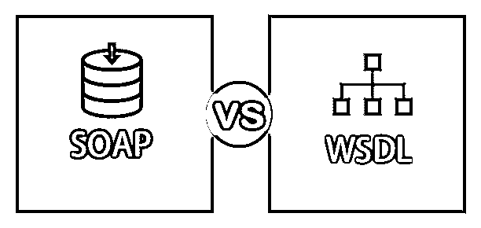
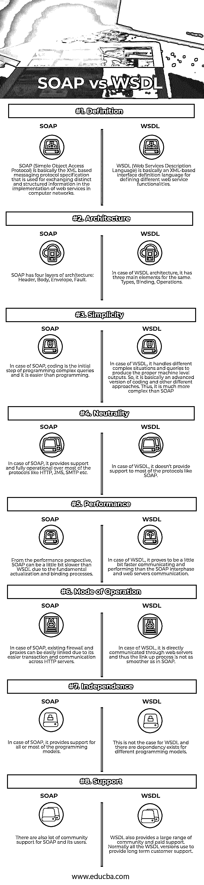

# 肥皂 vs WSDL

> 原文：<https://www.educba.com/soap-vs-wsdl/>

## 肥皂和 WSDL 的区别

SOAP(简单对象访问协议)基本上是基于 XML 的消息协议规范，用于在计算机网络中实现 web 服务时交换不同的结构化信息。WSDL (Web 服务描述语言)基本上是一种基于 XML 的接口定义语言，用于定义不同的 Web 服务功能。微软和 IBM 开发了它。

### 请在下面找到 XML 文档中的 SOAP 元素。

1.  **Header** :该部分主要包含消息的起始部分和可选属性。这基本上是一个可选元素。
2.  **Body** :该部分主要包含与通信消息相关的数据和信息。
3.  **Envelope** :这基本上定义了消息的起点和终点，这是强制的。
4.  **故障**:主要是故障元素信息，与报文处理错误相关信息相关。这是可选部分。

#### 下面是 SOAP 消息的三个重要特征。

1.  **扩展性**:这主要是从安全性和不同的相关扩展开发角度。
2.  **独立性**:为所有或大部分编程模型提供支持。
3.  **中立性**:它提供对大部分协议的支持和完全可操作性，如 HTTP、 [JMS](https://www.educba.com/what-is-jms/) 、SMTP 等。

### 下面是 WSDL 的一些重要特征。

1.  它是一种基于 XML 的协议，用于分散和分布式环境中的交换过程。
2.  它定义了 web 服务访问过程及其操作。
3.  它定义了基于 XML 的服务的实现和通信过程。
4.  UUDI 过去一直致力于 WSDL 语的研究。

### SOAP 和 WSDL 的直接对比(信息图)

以下是 SOAP 与 WSDL 的八大区别:

<small>网页开发、编程语言、软件测试&其他</small>

### SOAP 和 WSDL 的主要区别

两者都是市场上的热门选择；让我们讨论一些主要的区别:

1.  SOAP(简单对象访问协议)基本上是基于 XML 的消息协议规范，用于在计算机网络中实现 web 服务时交换不同的结构化信息，而 WSDL (Web 服务描述语言)是基于 XML 的接口定义语言，用于定义不同的 Web 服务功能。
2.  从可扩展性的角度来看，SOAP 比 WSDL 更适合，它提供了不同的安全层和相关的扩展支持。
3.  就 SOAP 而言，它提供了对所有或大多数编程模型的支持，但 WSDL 文件却不是这样。
4.  也有很多对 SOAP 及其用户的社区支持，而 WSDL 也提供了大量的社区和付费支持。通常所有 WSDL 版本都用于提供长期客户支持。
5.  从性能角度来看，WSDL 比 SOAP 更受欢迎，因为由于基本的实现和绑定过程，它有时可能会慢一点。
6.  WSDL 对网络服务器通信和互联网消息传输过程的框架模式的解释比 SOAP 更加严密和清晰。
7.  SOAP 具有对消息和受限视图过滤过程的加密能力，但是在 WSDL 的情况下，这并不容易处理。
8.  SOAP 为其相关支持提供了不同层次的安全补丁，看起来比 WSDL 安全处理更安全。
9.  SOAP 有四层体系结构，如头部、主体、信封和错误，而在 WSDL 体系结构中，它有三个主要元素，如类型、绑定和操作。

### SOAP 与 WSDL 对比表

下面是 SOAP 和 WSDL 之间最重要的比较:

| **比较的基础** | **肥皂** | **WSDL** |
| **定义** | SOAP(简单对象访问协议)是基于 XML 的消息协议规范，用于在计算机网络中实现 web 服务时交换不同的结构化信息。 | WSDL (Web 服务描述语言)是一种基于 XML 的接口定义语言，用于定义不同的 Web 服务功能。 |
| **架构** | SOAP 有四层架构:
头、体、信封、故障。 | 以 WSDL 建筑为例，它有三个相同的主要元素。
类型、装订、操作。 |
| **简单** | 就 SOAP 而言，编码是编写复杂查询的第一步，比编程更容易。 | 在 WSDL 的情况下，它处理不同的复杂情况和查询，以产生适当的机器级输出。因此，它是编码和其他不同方法的高级版本。因此，它比 SOAP 复杂得多。 |
| **中立** | 在 SOAP 的例子中，它提供了对大多数协议的支持和完全可操作性，如 HTTP、JMS、SMTP 等。 | 在 WSDL 的例子中，它不支持像 SOAP 这样的大多数协议。 |
| **性能** | 从性能角度来看，由于基本的实现和绑定过程，SOAP 可能比 WSDL 慢一点。 | 在 WSDL 的例子中，它被证明比 SOAP interphase 和 web 服务器通信要快一点。 |
| **模式** **操作** **操作** | 在 SOAP 的情况下，由于跨 HTTP 服务器的事务和通信更容易，现有的防火墙和代理可以很容易地链接起来。 | 在 WSDL 的例子中，它是通过 web 服务器直接通信的，因此连接过程不像在 SOAP 中那样平滑。 |
| **独立** | 就 SOAP 而言，它提供了对所有或大多数编程模型的支持。 | WSDL 的情况并非如此，不同的编程模型之间存在依赖关系。 |
| **支持** | 也有很多社区支持 SOAP 及其用户。 | WSDL 还提供大范围的社区和有偿支持。通常所有 WSDL 版本都用于提供长期客户支持。 |

### 结论

在一系列因素上比较了 SOAP 和 WSDL 之后，可以得出结论，这是两种重要的基于 XML 的 web 服务通信编程语言。SOAP 用于交换不同的结构化信息以在计算机网络中实现 web 服务，而 WSDL 用于定义不同的 web 服务功能。但是，就像硬币的两面一样，在同一时间点上，每一面都有它的优点和缺点。因此，在选择其中任何一个之前，开发人员应该学习和分析 SOAP 和 WSDL 的不同方面。因此，基于项目需求的类型、工作时间和所有其他不同的讨论方面，应该选择这两者中的任何一个来达到期望的目标。

### 推荐文章

这是一个关于 SOAP 和 WSDL 之间最大区别的指南。在这里，我们还将讨论信息图和比较表的主要区别。你也可以看看下面的文章来了解更多。

1.  [肥皂 vs 休息](https://www.educba.com/soap-vs-rest/)
2.  [JIRA vs Bugzilla](https://www.educba.com/jira-vs-bugzilla/)
3.  [SQL Server 和](https://www.educba.com/oracle-vs-sql-server/) [Oracle](https://www.educba.com/oracle-vs-sql-server/)
4.  [数据库管理系统与关系数据库管理系统](https://www.educba.com/dbms-vs-rdbms/)

