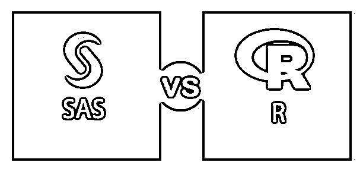
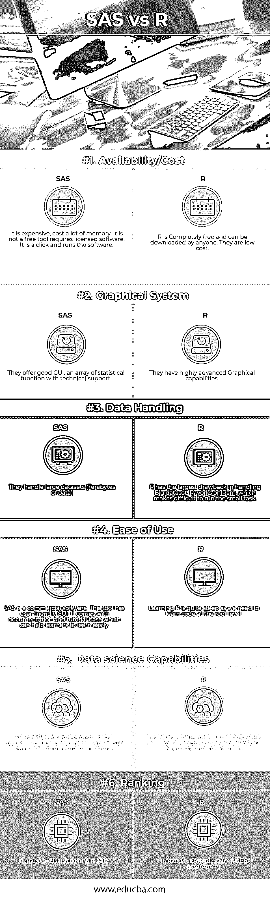

# SAS 与 R

> 原文：<https://www.educba.com/sas-vs-r/>

## SAS 和 R 的区别

SAS vs R 是两种业界领先的分析工具或语言之间的比较。SAS，即统计分析系统，是一个提供商业分析工具的企业软件。

而 R 是一种广泛用于统计和数据科学的开源编程语言。SAS 提供了一些现成的功能和对分析的支持，并且由于其许可限制，仅限于大型企业。R 语言得到了不断增长的社区的支持，高级包被构建并贡献给社区用于 R 程序的实现。SAS 对于处理非常大的数据集是有效的。而 R 在处理数据时受限于大规模数据处理。

<small>Hadoop、数据科学、统计学&其他</small>

### 数据分析工具

最流行和最常用的数据分析工具是 SAS vs R。

*   情景应用程序主要是在大公司中启动的，因为它们有很高的客户服务水平；这就是为什么他们在金融服务和营销公司中起着至关重要的作用。
*   SAS 代码在它自己的 SAS 系统中执行，R 代码在 R 的统计环境中执行。
*   SAS 在数据文件记录中有位循环；在 R 中，循环是避免的。
*   r 用于中型企业；电信公司需要非结构化数据来进行数据分析，因此他们使用机器学习算法来研究哪种 R 语言更适合。
*   诡计的功能类似于决策树、关联规则、挖掘；这就是在数据挖掘过程中使用它们的原因。
*   R 的显著缺点是它们只能在 RAM 上工作，而 SAS 只能处理增加的数据量。

#### 应用程序

一些 R 应用程序有:

1.  大量用于金融过程和市场。
2.  他们帮助数据导入，清理。
3.  它在数据科学中起着至关重要的作用，因为它提供了各种各样的统计数据。

### 情景应用程序可以应用于哪些领域？

*   金融、政府、医疗保健领域等。
*   预测分析
*   商业智能
*   规定性分析

### SAS 和 R 之间的直接比较(信息图表)

下面是 SAS 与 R 之间的 6 大区别

### SAS 和 R 之间的主要区别

SAS vs R 都是市场上的热门选择；让我们讨论一下 SAS 和 r 之间的一些主要区别。

#### 1.简单易学

SAS 不难学；他们有完整的操作手册。因为这是一个商业许可的产品，所以在编码方面不会有太多的困难，用户需要学习和构建代码。而 R 需要一种编程语言来学习。它们需要正确地实现，否则会导致复杂的代码。整体曲线导致平均到高。

#### 2.客户服务

SAS 有很好的客户服务；技术挑战很容易解决拥有最大的在线社区，但没有客户支持，这使得用户很难解决技术问题。SAS 有利于高质量的端到端基础设施。

#### 3.语言相关

r 是一种面向对象的函数式语言；它是一种高度扩展的语言。R 软件的源代码是用 C 和 FORTRAN 编写的。它是独立于平台的，支持所有操作系统。SAS 基于 SQL 语言&是一种过程语言。

#### 4.包装

r 内置库函数和包，是剧情可视化的最佳选择。SAS 在 SAS 系统(ETS、数据库)安装期间提供组件。在 SAS 中，输入在 excel 中给出或来自几个数据源，结果的统计分析以表格、图形、HTML 的形式给出。

#### 5.图像使用者界面

与统计软件包相比，r 的主要优势在于复杂的图形功能。r 的基本图形系统允许我们对基本的情节和图形进行精细的控制。

#### 6.数据安全

SAS–SAS 的安全性得到了高度维护，大型跨国公司依靠 SAS 来保护他们的数据，因为有大量的预测分析正在进行。谈到安全性，开源和商业产品之间总是有差距。而证券并没有很好地融入 r。

### SAS 与 R 对比表

下面是 SAS 与 R 之间的 6 个最重要的比较

| **比较的基础** | **SAS** |  

**R**

 |
| **可用性/成本** | 它很贵，需要很多内存。它不是一个需要授权软件的免费工具。这是一个点击和运行软件。 | r 是完全免费的，任何人都可以下载。它们的成本很低。 |
| **图形系统** | 他们提供良好的图形用户界面。一系列有技术支持的统计函数。 | 他们有非常先进的图形功能。 |
| **数据处理** | 它们处理大型数据集(万亿字节的数据) | r 在处理大数据集方面有最大的缺点。r 在 Ram 上工作，这使得运行小任务很困难。 |
| **易用性** | SAS 是商业软件。这个工具有一个用户友好的图形用户界面。它带有文档和教程库，可以帮助学习者轻松学习。 | 学习 R 是非常困难的，因为我们需要在根级别学习代码。 |
| **数据科学能力** | SAS 是高效的顺序数据访问。拖放界面使得创建统计模型变得容易。 | 统计模式是用几行代码编写的。r 主要在任务需要独立服务器时使用。 |
| **Ranking** | 2012 年 1 月排名第 31 位。 | 在 TIOBE 社区排名第 24 位位。 |

### 结论

为了在数据分析领域保持竞争力，高级编码和编程是专业知识所必需的。R 的一个局限是它的功能是基于消费者和用户的参与。与之相关的可伸缩性问题是由于 RAM 的速度较低。SAS 中的统计分析是通过直接编程和使用 SAS Analyst 完成的。作为高级预测分析，它们在当前市场中处于领先地位。如果我们是数据挖掘专家或需要高级图形绘图，R 是最好的选择。

### 推荐文章

这是 SAS 与 r 之间最大差异的指南。我们还讨论了信息图和比较表的主要区别。你也可以看看下面的文章来了解更多。

1.  [SAS vs RapidMiner](https://www.educba.com/sas-vs-rapidminer/)
2.  [最大差异——JIRA vs TFS](https://www.educba.com/jira-vs-tfs/)
3.  [萨斯 vs SCSS——惊人的对比](https://www.educba.com/sass-vs-scss/)
4.  [SQL Server 与 PostgreSQL 的区别](https://www.educba.com/sql-server-vs-postgresql/)

