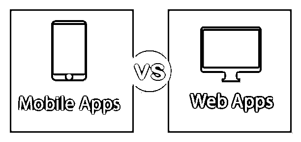
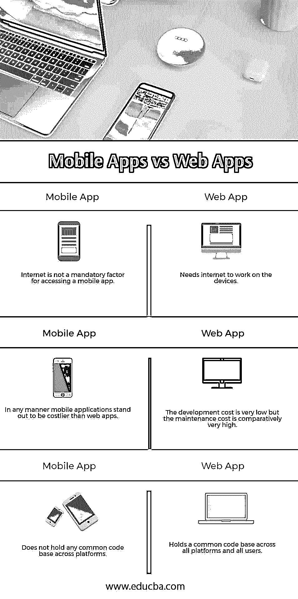

# 移动应用与网络应用

> 原文：<https://www.educba.com/mobile-apps-vs-web-apps/>

## 移动应用和网络应用的区别

移动应用程序是旨在平板电脑、智能手机和其他移动设备上运行的软件应用程序。移动应用基本上是针对特定的移动平台的，可以在相应的设备上直接安装。它们主要是为了高性能和良好的用户体验而构建的；此外，访问广泛的 API 将不会对应用程序的使用施加任何限制。由于移动应用程序是特定于平台的，因此开发成本更高。它们是使用特定的语言和集成开发环境构建的。通过移动设备的网络浏览器访问网络应用程序；它们也被称为渐进式网络应用。所有平台的编码都是一样的。在 web 应用程序的情况下，没有必要单独安装应用程序。这与任何其他计算机网站非常相似，因为它由链接在一起并通过互联网访问的基于浏览器的 HTML 页面组成。像网站一样，它们可以显示内容、数据图像和其他实体。区别标准网站和移动网站的关键特征是，它是为更小的手持显示器和触摸屏界面而设计的。

Google play 商店中有大约 280 万个移动应用程序，苹果应用商店中有 220 万个应用程序。苹果和谷歌 play 等应用商店被用来下载这些原生应用。

<small>网页开发、编程语言、软件测试&其他</small>

### 移动应用和网络应用的直接对比(信息图表)

下面是移动应用程序和网络应用程序的三大区别

### 移动应用和网络应用的主要区别

移动应用程序 vs Web 应用程序都是市场上的热门选择；让我们讨论一些主要的区别:

*   像照相机等硬件元件上。，手机应用的兼容性非常广泛。
*   web apps 对硬件组件的访问级别非常低。
*   web 应用程序没有与系统资源保持适当的联系。基于云服务的设置已建立；这连接到数据库的所有目的。
*   web 应用程序没有一个通用的规范。移动应用程序速度更快，组织更好，因此它们在移动设备上循环运行。由于用户通过在线应用商店获取，他们的质量是有保证的。
*   Web 应用程序易于访问，可以在任何平台用户之间轻松共享。与移动应用程序相比，web 应用程序的覆盖能力非常高。
*   当谈到更新内容的纯粹灵活性时，移动网站比应用程序活跃得多。
*   我们的应用程序 UI 设计相对来说比较难，因为每个浏览器和设备的屏幕大小都不一样；因此，这必须被认为是一个严重的因素。移动应用程序的用户界面有明确的指导方针，并且在某种程度上是有限制的。
*   手机应用被黑的可能性更高。获取 web 应用程序的代码非常容易，但是对于移动应用程序来说，这将是一个更困难的任务。站点脚本，SQL 注入是一个 web 应用程序面临的不同的漏洞。
*   在移动应用程序的情况下，环境复制是非常可能的。Web 应用程序是跨环境独立的，可以附着在大多数设备上。
*   移动应用和网络应用都可能包含应用内购买、广告和应用购买本身。

### 移动应用与网络应用对比表

下面是移动应用程序和网络应用程序之间的三个最重要的比较

| **网络应用** | **手机 App** |
| 需要互联网才能在设备上工作 | 互联网不是访问移动应用程序的强制因素。 |
| 开发成本很低，但是维护成本相对很高。 | 无论如何，移动应用程序显然比网络应用程序更昂贵。 |
| 拥有跨所有平台和所有用户的通用代码库 | 它不包含任何跨平台的公共代码库 |

### 结论

移动网站和原生 app 的选择取决于用户的必需品和目标。如果要构建一个交互式的图形应用程序，那么移动应用程序是一个合适的选择，但目标是向尽可能多的受众提供移动友好的内容，那么移动应用程序可能是一个不错的选择。

### 推荐文章

这是移动应用程序与网络应用程序之间最大差异的指南。在这里，我们还将讨论信息图和比较表的主要区别。你也可以看看下面的文章来了解更多。

1.  [Tensorflow vs Pytorch](https://www.educba.com/tensorflow-vs-pytorch/)
2.  [WebSocket vs REST](https://www.educba.com/websocket-vs-rest/)
3.  [手机应用 vs 网站](https://www.educba.com/mobile-apps-vs-website/)
4.  [AUTOCAD 和 CATIA](https://www.educba.com/autocad-vs-catia/)

