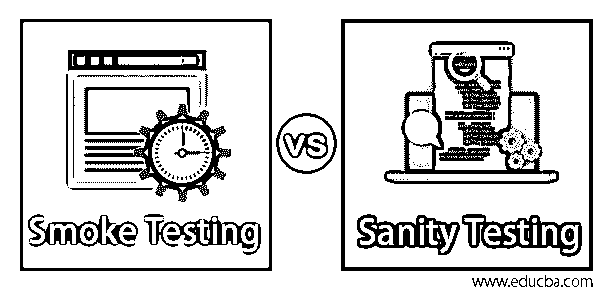

# 冒烟测试与健全性测试

> 原文：<https://www.educba.com/smoke-testing-vs-sanity-testing/>

## 冒烟测试和健全性测试的区别

下面的文章提供了冒烟测试和健全性测试的概要。冒烟测试是在开始更深入的功能测试过程之前执行的，以避免任何障碍，如环境就绪性、应用程序可访问性、数据库可用性等。另一方面，执行健全性测试是为了测试应用程序上的小修正，并确保应用程序是好的&运行时所有重要的功能都尽善尽美。健全性测试不一定包含在所有的测试生命周期中，而冒烟测试对于涉及多个系统特性、集成流程、多环境测试等的应用程序是强制性的。

### 烟雾测试的类型

以下是不同类型的测试，如下所示:

<small>网页开发、编程语言、软件测试&其他</small>

*   正式冒烟测试:在正式冒烟测试中，开发人员向测试工程师提供构建。在这里，测试工程师为构建的每个特性分配一个测试人员，并被要求执行冒烟测试。测试领导者然后分析构建的所有测试结果，并报告开发人员的最终结果。这些程序是通过适当的电子邮件链正式完成的，因此被称为正式的冒烟测试。
*   **非正式冒烟测试:**在这种测试方法下，对构建执行冒烟测试。然而，测试工程师并没有对此进行报告，也没有与首席测试工程师进行沟通。
*   **健全性测试:**这是一种软件技术，用于测试应用程序的一些基本测试。回归测试的这个子集通常在有足够的时间检查特性时执行。该方法通常用于检查项目中所有可用的菜单、命令或其他功能是否正常工作。

### 冒烟测试与健全性测试之间的直接比较(信息图)

以下是冒烟测试与健全性测试之间的 6 大区别:

### 冒烟测试与健全性测试之间的主要区别

冒烟测试和健全性测试都是市场上流行的选择。

*   在冒烟测试中，仅测试基本和关键特性。
*   进行冒烟测试有助于在测试周期之前或早期暴露集成和其他主要问题。
*   冒烟测试还帮助我们覆盖大多数主要功能，冒烟测试有助于软件的快速测试。但是，它不会对这些程序进行深入测试。
*   也可以说，冒烟测试是对程序进行的一种一般健康检查。
*   健全性测试是一种子回归。
*   它通常是为那些已经测试过的构建(程序)执行的，并且在[代码中发生了微小的变化](https://www.educba.com/how-to-learn-to-code/)。
*   因此，健全性测试是对程序中给出的任何功能进行深入测试的过程。
*   将健全性测试与冒烟测试区分开来的另一个事实是，它通常是为成熟的构建或者即将进入市场或者将冲击产品的构建而做的。
*   健全性测试是在那些已经从测试过程中移除的程序上执行的。
*   像冒烟测试一样，如果任何程序没有通过完整性测试，这些程序将被送回给开发人员来修复构建。

### 冒烟测试与健全性测试对比表

下面是冒烟测试和健全测试之间的 6 个最重要的比较

| **烟雾测试** | **健全性测试** |
| 冒烟测试有助于确定是否需要进一步的严格测试，从而节省时间。 | 只有在有足够时间的情况下，才会进行健全性测试。它主要用于检查程序的功能，一旦小的编辑完成。 |
| 冒烟测试主要包括所有主要部件的测试，但不深入。 | 主要集中在狭窄的测试，在理智上，测试只检查功能的几个领域。 |
| 它确保最重要的功能是否正常工作。然而，这个测试并不费事去寻找细节。 | 考虑到应用程序的所有规格，执行该测试是为了检查或证明应用程序正在运行。 |
| 在冒烟测试中，测试是通过一组编写的程序自动完成的。它是照本宣科的。 | 另一方面，健全性测试是无脚本的。 |
| 冒烟测试包括重要功能的高级测试。 | [健全性测试包括](https://www.educba.com/sanity-testing/)重要特性的深度和广度测试。 |
| 烟雾测试有助于及早发现问题。 | 只有在发现缺陷后，才能进行健全性测试。 |

### 结论

在深入了解了冒烟测试和健全性测试之后，最后，是时候通过强调这篇文章的关键要素来结束这次讨论了。您可以简单地理解为什么这两种技术在本质上如此独特，并且在软件测试中脱颖而出成为最有用的组件。虽然冒烟测试是一种更快、更便宜的错误检测方法，但它也节省了宝贵的时间。它总是在软件工程的初始阶段实现，因为它是软件构建进入下一阶段之前的最后一步。按照组织的要求，冒烟测试是手动和通过自动化完成的，这最终提高了应用程序的质量。另一方面，健全性也被称为表层测试，提供了关于发布和计划的快速状态；下一阶段是为什么健全性测试是首选。作为验收测试的一个子集，如果构建失败，它有助于节省测试过程中的时间和成本。因此，虽然 Smoke 和健全性测试有相似之处，但最终的结论是它们有一些关键的区别。

### 推荐文章

这是冒烟测试和健全测试之间最大区别的指南。在这里，我们还将讨论信息图和比较表的主要区别。您也可以看看以下文章，了解更多信息–

1.  [单元测试 vs 系统测试](https://www.educba.com/unit-testing-vs-system-testing/)
2.  [树莓派 vs Arduino](https://www.educba.com/raspberry-pi-vs-arduino/)
3.  [PHP vs JavaScript](https://www.educba.com/php-vs-javascript/)
4.  [组件测试 vs 单元测试](https://www.educba.com/component-testing-vs-unit-testing/)

