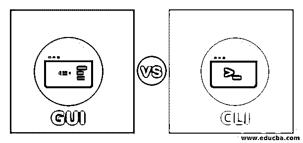
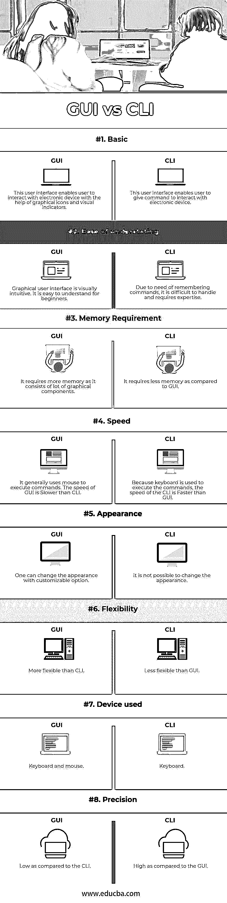

# GUI 与 CLI

> 原文：<https://www.educba.com/gui-vs-cli/>

## GUI 和 CLI 的区别

任何设备的操作系统只不过是用户和设备硬件组件之间的接口。操作系统提供 GUI 与 CLI 用户界面来与电子设备交互。一些操作系统提供 GUI 和 CLI，而其他操作系统只提供 CLI。GUI 是指图形用户界面，而 CLI 是指命令行界面。顾名思义，必须编写命令来执行某个 CLI 系统任务。另一方面，GUI 提供由图标和图像组成的图形，使用户能够直接完成任务。CLI 需要执行某项任务的命令方面的专业知识，而初学者可以操作 GUI。

为了工作，GUI [使用计算机图形](https://www.educba.com/application-of-computer-graphics/)。人们可以点击图标；借助鼠标拖动对象。在这种情况下，没有必要记住命令。GUI 附带了许多组件。在文本框编辑器的帮助下，可以在这里输入数据。菜单提供了可供选择的选项列表。按钮使用户能够选择特定的选项。checkbox 元素使用户能够从多个选项中选择一个选项。 [Linux 和 Windows](https://www.educba.com/linux-vs-windows/) 使用图形用户界面。它由图标、搜索框、窗口、菜单和许多其他图形元素组成。

<small>网页开发、编程语言、软件测试&其他</small>

命令语言解释器、字符用户界面和控制台用户界面是一些不同的命令行界面名称。在这个系统中，首先，用户输入命令并按回车键来执行该命令。通过这种方式，用户可以与设备进行交互。掌握正确的语法知识以给出有效的命令是很重要的。UNIX 这样的[操作系统有 CLI，而 Linux、windows 这样的操作系统既有 CLI 又有 GUI。](https://www.educba.com/what-is-unix/)

### GUI 和 CLI 的直接比较(信息图表)

以下是 CLI 与 GUI 之间的 8 大区别:

### GUI 和 CLI 的主要区别

以下是要点列表，描述了 GUI 与 CLI 之间的主要区别:

#### 方便用户的

命令行界面需要记住命令，因此对初学者来说很有挑战性。专业人士通常更喜欢 CLI。GUI 比 CLI 更加用户友好，初学者和有经验的专业人员都可以使用。

#### 多任务处理

命令行界面可能涉及也可能不涉及多任务处理。另一方面，在 GUI 中，人们可以轻松地进行多任务处理。比如——MS word，chrome 有多任务能力执行任务。

#### 处理复杂的任务

命令行界面最适合处理复杂的任务。人们可以通过编写一些命令来处理复杂的任务，而 GUI 需要遵循一些步骤才能工作。

#### 资源处理

交互时只使用键盘和系统；另一方面，GUI 有额外的资源与用户交互。

#### 表演

与命令行界面相比，图形用户界面较慢。执行任务需要更多的时间。另一方面，CLI 具有更好的性能。人们可以编写一系列指令来执行任务，而 GUI 不提供这种功能。

#### 建立工作关系网

图形用户界面与另一台计算机远程连接以获得访问权限，而另一方面，与 CLI 连接却非常困难。专业人员需要访问另一个电子设备。

#### 连接

在命令行界面中，界面始终保持一致。在 GUI 中，界面随着软件的更新而变化。

#### 互动

在命令行界面中眼睛的颜色疲劳会减少。在 GUI 中，颜色应变更多。CLI 通过命令行界面提供对系统的更多控制。在访问文件夹和执行特定任务时，GUI 几乎没有限制。

示例-[W](https://www.educba.com/introduction-to-windows/)I[n windows](https://www.educba.com/introduction-to-windows/)操作系统–MS word-GUI、MS Docs-CLI

### GUI 与 CLI 对比表

下面是 GUI 和 CLI 之间最重要的比较

| **比较的基础** | **GUI** | CLI |
| 基础 | 该用户界面使用户能够在图形图标和视觉指示器的帮助下与电子设备进行交互。 | 这种用户界面使得用户能够给出与电子设备交互的命令。 |
| 易于理解 | 图形用户界面在视觉上很直观。对初学者来说很容易理解。 | 由于需要记住命令，这是很难处理的，需要专业知识。 |
| 内存需求 | 它需要更多的内存，因为它由许多图形组件组成。 | 与 GUI 相比，它需要更少的内存。 |
| 速度 | 它通常使用鼠标来执行命令。GUI 的速度比 CLI 慢。 | 因为键盘用于执行命令，所以 CLI 的速度比 GUI 快。 |
| 出现 | 人们可以通过可定制的选项来改变外观。 | 不可能改变外观。 |
| 灵活性 | 比 CLI 更灵活 | 不如 GUI 灵活 |
| 使用的设备 | 键盘和鼠标 | 键盘 |
| 精确 | 与 CLI 相比较低 | 与 GUI 相比更高 |

### GUI 相对于 CLI 的优势

*   用户可以手动编辑配置。
*   人们可以像在 CLI 中一样轻松地记忆任务；人们必须在终端上键入命令，这对大多数初学者来说可能是困难的。
*   它使普通计算机用户能够与计算机进行交互。不需要有计算机方面的专业知识
*   任何软件的主要特点都是易于使用。客户通常更喜欢提供用户友好界面的软件。由于 GUI 提供了同样的功能，它有利于增加软件的销售。

### CLI 优于 GUI 的优势

*   无论是编写代码还是向计算机发出指令，CLI 都为用户提供了更好的控制。
*   浏览不同的图标会使 GUI 变慢。因此，CLI 提供了更快的速度，因为命令是直接给计算机的。由于 CLI 的速度和性能，许多专业人士更喜欢它。
*   有时专业人员需要用两种以上的语言工作。对于使用更多编程语言的专业人员来说，CLI 是一个很好的选择。

### 结论

在 GUI vs CLI 的文章中，我们提出了一些关于图形用户界面和命令行界面的要点。本文介绍了 GUI 和 CLI 的主要区别及其比较。

总之，GUI 与 CLI 的主要区别在于它使用户能够与系统交互的方式。GUI 被认为对用户更加友好，而 CLI 则更加先进和强大。

### 推荐文章

这是 GUI 和 CLI 之间最大区别的指南。在这里，我们还将讨论信息图和比较表的主要区别。你也可以看看下面的文章来了解更多-

1.  [数据仓库 vs 数据库](https://www.educba.com/data-warehouse-vs-database/)
2.  [敏捷 vs 看板](https://www.educba.com/agile-vs-kanban/)
3.  [冒烟测试与健全性测试](https://www.educba.com/smoke-testing-vs-sanity-testing/)
4.  [精益六部适马 vs 六部适马](https://www.educba.com/lean-six-sigma-vs-six-sigma/)

