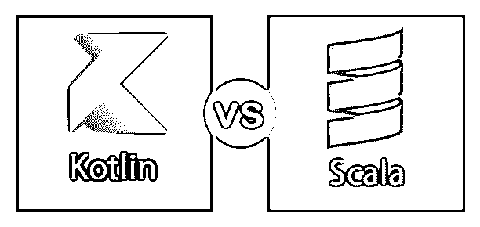
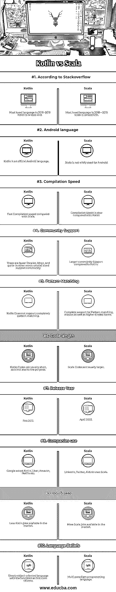
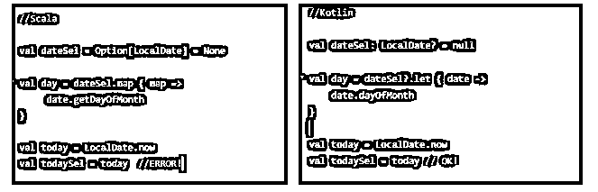
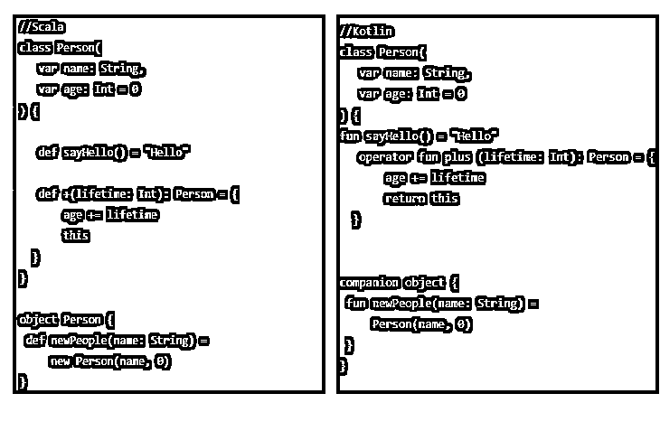

# 科特林 vs 斯卡拉

> 原文：<https://www.educba.com/kotlin-vs-scala/>

## kotlin 和 Scala 的区别

Kotlin 是一种在 java 虚拟机上运行的 JVM 语言，而 Scala 是一种开源编程语言；它们都是使用最广泛的语言，但在速度方面存在差异，即与 Scala 相比，Kotlin 在编译方面花费的时间更少，并且支持的社区组更少，Scala 支持模式匹配和宏，而这些功能在 Kotlin 中不可用。此外，代码大小也存在差异，即 Kotlin 的代码大小比 Scala 小。

### 科特林是什么？

*   Kotlin 是一种 JVM 语言，意味着它在 Java 虚拟机上运行，并编译成 Java 字节码。作为一种语言，它与 Java 非常相似。因此，如果你已经是一名 Java 程序员，那么使用 Kotlin 并不是一个很大的进步，不像 Scala 那样，你可能需要学习更多的新概念。
*   在 Kotlin 中，只需应用您已经知道的 Java 语言知识，就可以很容易地开始学习。Kotlin 是一种面向对象的语言。所以我们可以创建类。我们在这些类中有方法。我们可以创建这些类的实例。我们可以创造物品。这是一种标准的面向对象语言。
*   然而，Kotlin 从第一天起就被设计成一种函数式语言。嗯，作为函数式语言，Kotlin 支持高阶函数。所以我可以在集合中存储函数。我可以将一个函数作为参数传递给另一个函数。我可以从函数中返回函数。因此，科特林内部的职能部门被视为一等公民。
*   科特林没有爪哇那么讲究仪式。所以在 Kotlin 中，如果我想创建一个属性，我只需要声明一个文件或一个变量，这将为我声明一个只读或读写的属性。没有必要声明一个变量，然后有一个 get 方法和一个 set 方法。在幕后，Kotlin 将生成 getters 和 setters，因此这些属性可以在 Java 中使用。但这只是一个例子，说明在 Kotlin 中，用 Java 做同样的事情需要更少的代码。

### 什么是 Scala？

Scala 是一种在 BSD 或 Berkeley 软件分发许可证下发布的开源编程语言。它是由马丁·奥德斯基在 2001 年创作的，但直到两年后才公开发行。随后，2006 年发布了 2.0 版本，截至 2019 年 4 月，当前的稳定版本为 2.13.0

<small>网页开发、编程语言、软件测试&其他</small>

#### Scala 的主要特性

*   面向对象的 Scala
*   类型系统
*   函数和闭包
*   自定义控制结构
*   特征
*   收集

### Kotlin 和 Scala 的正面比较(信息图)

以下是 Kotlin 和 Scala 的 10 大区别。

### Kotlin 和 Scala 的主要区别。

让我们讨论一下 Kotlin 和 Scala 之间的一些主要区别。

**1。安全地为空:**由于这个原因，Scala 有利于选择单子，这可能以两种状态中的一种出现:一些(x)或者可能一个都没有。在 Kotlin 中，为了获得错误安全性，通常会添加新的不同类型的可空变量以及非空变量，空变量不能被写入。总的来说，Kotlin 方法和真正的程序都更容易理解和简洁。

**例如**

**2。数据类:** Scala 受益于 case 类，这些类通常支持创建新实例和声明属性的技术。Kotlin 给出了相关的一组特性，但是它的类更适合处理 Java 框架，因为它看起来像 JavaBean。

**例如** 

Scala 在中缀和后缀操作符的语法上有问题。Kotlin 是一种更官方的语言，它通常会增强程序的可读性，并消除这种语法的极端模糊性。

**3。Scala 中的隐式转换**可能会在很大程度上取代程序的行为——很难精确计算出哪个变量可能会被函数超过。然而，一旦在该 IDE 中工作，问题就解决了。

**4。收藏**

Scala 产生了独特的(非常高级的)可变的、不可变的以及并行的集合。

*   向量、列表、流、地图、集合等。
*   Scala 集合可以用最少的工作来扩展
*   与 Java 的互操作性通常是通过隐式转换来实现的

Scala . collections . Java conversions

Kotlin 目前依赖于 Java 集合,但有一些改进:

*   创建方法:listOf(1，2，3)，mapOf("a" to 1)
*   一组丰富的高阶函数(压缩、开窗、折叠)
*   数字集合的加法(sum()、average())
*   可变集合的不变观点

Scala 以简洁、优雅、类型安全的方式传达了常见的编程模式。

**科特林功能**

*   样板的最大减少量
*   使用空类型和不变性的安全性
*   使用扩展函数的可扩展性

Scala: 易于集成面向对象和功能特性。

Kotlin: Good 专注于 Java 和 Java 框架的互操作性。

**Scala:** 大数据——大容量、流。

**Kotlin:** 业务层面的可维护性以及规律性。

**Scala:** 复数域。

**科特林:**易学易用。

### Kotlin 与 Scala 对比表

让我们讨论一下 Kotlin 和 Scala 之间最重要的区别。

| **比较依据** | **锅炉** | **Scala** |
| 根据 StackOverflow 的说法 | 2018 -2019 年度最受喜爱的语言科特林排名第 2 和 | 2018-2019 年最受欢迎的语言 Scala 排名第 12 位 th |
| 安卓语言 | Kotlin 是一种官方 Android 语言。 | Scala 并没有被 Android 广泛使用。 |
| 编译速度 | 编译速度比 Scala 快。 | 编译速度和 Kotlin 相比比较慢。 |
| 社区支持 | 图书馆、博客和指南越来越少，换句话说，支持社区越来越小。 | 与科特林相比，社区支持更大。 |
| 模式匹配 | Kotlin 不完全支持模式匹配。 | 完全支持模式匹配、宏以及更高级的表单 |
| 电码长度 | 科特林代码通常很短，也很简洁。 | Scala 代码通常更大。 |
| 发布年份 | 2012 年 2 月 | 2003 年 4 月 |
| 公司使用 | 谷歌采用科特林、优步、亚马逊、网飞等。 | LinkedIn，Twitter，Airbnb 都用 Scala。 |
| 工作因素 | 市场上的科特林工作越来越少。 | 市场上有更多的 Scala 职位 |
| 语言信仰 | 简单的面向对象语言，具有一等公民的功能 | 多范例编程语言 |

### 结论

*   正如你可能比较任何一种编程语言一样，关于确定哪种语言通常可以被增强，没有一个单一的解决方案可能对每个人都有帮助。
*   如果 Scala 或 Kotlin 向您展示了一个改进的 Java 选项，特别是最终可能会基于您试图在编程语言中找到的东西，您打算应用这种新语言的方式，以及您开始脱离 Java 的目的。
*   如果您对 Java 提供的特性非常满意，但对需要编写的大量样板程序感到恼火，那么您可能希望考虑一下 Kotlin。然而，如果你厌倦了 Java 本身，并且还想要更多进步和有效的特性，特别是如果准备好处理大数据，那么 Scala 提供了 Java 的可靠替代品——你应该准备好花多一点时间来帮助你加快新编程语言的速度。

### 推荐文章

这是 Kotlin Vs Scala 的指南。在这里，我们还将讨论信息图和比较表的主要区别。您也可以浏览我们推荐的其他文章，了解更多信息——

1.  [围棋 vs Scala](https://www.educba.com/go-vs-scala/)
2.  [Groovy vs Kotlin](https://www.educba.com/groovy-vs-kotlin/)
3.  [Groovy vs Scala](https://www.educba.com/groovy-vs-scala/)
4.  [Clojure vs Scala](https://www.educba.com/clojure-vs-scala/)

