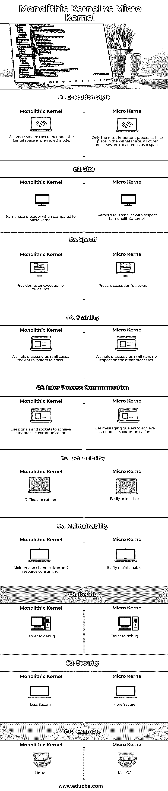

# 整体内核与微内核

> 原文：<https://www.educba.com/monolithic-kernel-vs-microkernel/>

## 单片内核和微内核(μ内核)的区别

内核是在硬件和操作系统之间形成一层的软件；它分为两种主要类型，即单片内核和微内核；这些类型主要是根据它们管理进程的方式来区分的，除此之外，它们在执行方式、规模、速度、稳定性、进程间通信、可扩展性、可维护性、调试、安全性等方面也有所不同。除了这些不同之处，重要的是要注意，单片内核比微内核要老得多，用于 Linux，而微内核用于 Mac OS。

内核与操作系统有什么不同？
内核是操作系统的一部分，或者你可以说它是操作系统的心脏。一个内核和有用的应用程序放在一起就成了一个操作系统。

<small>网页开发、编程语言、软件测试&其他</small>

**这里需要注意的重要一点是，操作系统由两部分组成:**

1.  内核空间(特权模式)
2.  用户空间(非特权模式)

**有不同类型的内核。两种主要类型分别是:**

1.  整体内核
2.  微内核

这些内核类型是根据它们管理来自进程(也称为系统调用)和资源的请求的方式来划分的。单片内核比微内核要古老得多。微内核是在 20 世纪 80 年代末发现的。

### **单片内核和微内核的面对面比较(信息图)**

下面是单片内核和微内核之间的 10 大区别

### **单片内核和微内核的主要区别**

让我们讨论一下单片内核和微内核之间的一些主要区别。

1.  **执行的空间使用:**单片内核在同一个地址空间，即内核空间中运行所有的操作系统指令，而微内核在用户空间中运行大多数系统指令，只有少数指令在内核空间中运行。在微内核的情况下，只有重要的进程，如进程间通信、调度和内存管理发生在内核空间。
2.  **内核的大小:**在 Monolithic 中，由于所有的系统指令都在内核空间下执行，所以增加了内核的整体大小。这也导致了操作系统规模的增加。
3.  **执行速度:**与微内核相比，单片内核提供了更快的速度，因为它在相同的地址空间下运行所有指令，这使得执行速度更快。在微内核的情况下，由于在不同的地址空间中运行的不同服务之间传递额外的消息，所以执行较慢。
4.  **稳定性:**如果一个进程在一个单一内核中崩溃，它会导致整个系统的暂停。这是因为在同一地址空间中运行的每个进程都会受到影响。而在微内核的情况下，由于系统操作在内核和用户空间之间的划分，服务崩溃不会影响其他服务。
5.  **进程间通信:**单片内核利用信号和套接字来实现进程间通信，而微内核利用消息队列来实现同样的功能。
6.  **可扩展性:**两种内核类型的主要区别之一是可扩展性。为了给一个单一的内核增加新的特性，必须重新编译整个内核。重新编译会导致更多的内存和时间消耗。另一方面，在微内核的情况下，服务是相互隔离的，因为它实现了消息队列，这使得添加或删除功能更加灵活。
7.  **可维护性:**这类似于扩展性。为了修复单一内核中的任何错误，必须重新编译整个内核。而对于微核来说，情况并非如此。
8.  **Debug:** 特权模式下内核空间的崩溃可能会破坏调试器本身。因此，与微内核相比，调试单片内核很困难。
9.  **安全性:**与单片内核相比，微内核更加安全，因为单片内核以特权模式运行它们的全部代码，增加了发生灾难的可能性。

### 单片内核与微内核对照表

让我们讨论一下单片内核和微内核之间最重要的区别。

| **比较的基础** | **单片内核** | **微核** |
| 执行风格 | 所有进程都在特权模式下的内核空间中执行。 | 只有最重要的进程发生在内核空间。所有其他进程都在用户空间中执行。 |
| 大小 | 与微核相比，内核更大。 | 相对于整体内核，内核的大小更小。 |
| 速度 | 它提供了更快的流程执行。 | 流程执行比较慢。 |
| 稳定性 | 单个进程崩溃将导致整个系统崩溃。 | 单个进程崩溃不会影响其他进程。 |
| 进程间通信 | 使用信号和套接字实现进程间通信。 | 使用消息队列实现进程间通信。 |
| 展开性 | 难以延伸。 | 易于扩展。 |
| 可维护性 | 维护会耗费更多的时间和资源。 | 易于维护 |
| 调试 | 更难调试 | 更容易调试 |
| 安全性 | 不太安全。 | 更安全 |
| 例子 | Linux 操作系统 | mac 操作系统 |

### 结论

两种内核架构都有各自的优缺点。因此，对于哪一种更好，应该使用哪一种，没有一个直接的答案。应该根据需要和需求来选择内核风格。一些其他类型的内核是混合内核，纳米内核，外核。

### 推荐文章

这是一个关于单片内核和微内核的指南。在这里，我们还将讨论信息图和比较表的主要区别。您也可以浏览我们推荐的其他文章，了解更多信息——

1.  [单片内核](https://www.educba.com/monolithic-kernel/)
2.  [Ubuntu vs Windows 10](https://www.educba.com/ubuntu-vs-windows-10/)
3.  [单片内核](https://www.educba.com/monolithic-kernel/)
4.  [嵌入式系统面试问题](https://www.educba.com/embedded-system-interview-questions/)

