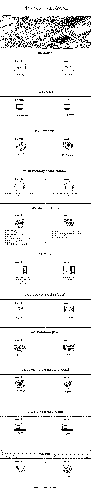

# Heroku vs AWS

> 原文：<https://www.educba.com/heroku-vs-aws/>

**T2】**

 **## Heroku 和 AWS 的区别

Heroku 和 AWS 被定义为云托管平台，Heroku 归 salesforce 所有，其客户可以构建、扩展和部署他们的应用程序。相比之下，AWS 属于亚马逊，是一个 IaaS 平台，为其客户提供大量服务，以及他们在数据库、内存缓存存储、工具、云计算、数据库成本、内存数据存储成本、主存储成本等方面的差异。总体而言，Heroku 选择创业。AWS 适合有 AWS 产品使用经验的用户。

### 什么是云托管？

*   为部署服务、数据和解决方案而采购云服务的过程。这种托管是一种 Iaas(基础设施即服务)类型的云交付模式，提供一组虚拟服务。在这里，购买者的主要需求是虚拟硬件、存储、网络和云供应商的解决方案。因此，这种技术的主要优势在于，多个用户可以同时使用更强大的计算能力。
*   [云托管在扩展托管资源方面提供了](https://www.educba.com/best-cloud-hosting/)未开发的弹性。此外，云托管还可以整合相当多的服务器的能力，以提供单一的云托管服务器。云存储、云桌面、云服务器是主要的托管服务。确保对数据的永久访问，因此编辑和文件修改也可以从世界上的任何位置实现。数据的安全备份也是可用的。

### 为什么选择云服务？

1.  **灵活性:**它提供了很大的灵活性和容量来以大量方式管理云服务，如数据。
2.  **备份:**提供数据的安全备份。
3.  **数据的集体使用:**确保对数据的永久访问，因此编辑和文件修改也可以从世界上的任何位置实现。
4.  **云托管:**它在扩展托管资源方面提供了未开发的弹性。此外，云托管还可以整合相当多的服务器的能力，以提供单一的云托管服务器。云存储、云桌面、云服务器是主要的托管服务。

### 什么是 Heroku？

*   基于云的平台，客户可以在其中构建、扩展和部署他们的应用程序。Heroku 有附加组件(超过 140 个),旨在覆盖从通知到安全服务的不同用途。
*   这个平台允许提高团队的生产力，这是通过开发过程中应用程序的部署环境来实现的。Heroku 系统比弹性计算云更易于使用。

### 什么是 AWS？

AWS 也是一个 Iaas 平台，为客户提供大量服务。它提供分析、管理和数据方面的服务。亚马逊简单存储服务(S3)和弹性计算云(EC2)是这些平台的主要流行服务。

<small>网页开发、编程语言、软件测试&其他</small>

### Heroku 与 AWS 的面对面比较(信息图)

以下是 Heroku 与 AWS 的 11 大区别

### Heroku 和 AWS 的主要区别

让我们讨论一下 Heroku 与 AWS 之间的一些主要区别:

1.Heroku systems 的服务器创建过程可以在不到 10 秒的时间内完成，这显然是一个比 AWS 更快的服务。

2.出于部署原因，Heroku 中使用了 Git push

3.AWS 服务在很大程度上是可扩展的

4.大量服务与 AWS 服务一起加入和销售

5.虽然价格政策的设计有些变化，但 AWS 是价格最低的云托管系统之一。

6.一个基于云的平台，客户可以在其中构建、扩展和部署他们的应用。Heroku 有附加组件(超过 140 个),旨在覆盖从通知到安全服务的不同用途。

7.AWS 也是一个 Iaas 平台，为客户提供大量服务。它提供分析、管理和数据方面的服务。亚马逊简单存储服务(S3)以及弹性计算云(EC2)是这个平台上很受欢迎的服务

8.Heroku 系统的日志分析过程要简单得多，这是通过添加 solr 等工具实现的。

9.排除带宽限制后，单流安装是免费的

10.从基础设施的角度来看，AWS 提供了很大程度的灵活性

11.有相当多的时间来开发移动或[网络应用程序设置](https://www.educba.com/what-is-web-application/)。

12.AWS 提供分析、管理和数据方面的服务。亚马逊简单存储服务(S3)以及弹性计算云(EC2)是这些平台的主要流行服务

13.Heroku 平台允许提高团队生产力，这是通过应用程序在开发过程中展开的环境来实现的。Heroku 系统比弹性计算云更易于使用。

### Heroku vs AWS 对比表

让我们来讨论 Heroku 和 AWS 之间最重要的区别:

| **比较的基础** | **Heroku** | **AWS** |
| **所有者** | 销售力量 | 亚马孙 |
| **服务器** | AWS 服务器 | 所有人 |
| **数据库** | Heroku Postgres | RDS Postgres |
| **内存缓存存储** | Heroku Redis，存储容量为 10 GB | 存储区域为 12 GB 的 ElastiCache |
| **主要特点** | 

*   Data editing
*   App index
*   Data rollback and code
*   expansibility
*   Elegant container (dynos)
*   Uninterrupted delivery
*   Automatic expansion and contraction
*   Complete GitHub integration

 | 

*   AWS feature integration
*   Customized components
*   Ability to provide
*   load leveling

 |
| **工具** | Command Line请求指标连接状态 | Visual Studio黯然失色 |
| **(Cost)Cloud computing****数据库**

**内存数据存储**

 | $4,000.00$750.00$1,450.00 | $2,000.00$600.00$164.16 |
| **主存储器** | $800 | $800 |
| **总计** | $7,000.00 | $3,564.16 |

### 结论

Heroku 是初创公司更喜欢的选择，而 AWS 则适合以前使用过 AWS 产品的用户。

### 推荐文章

这是 Heroku vs AWS 的指南。在这里，我们还将讨论信息图和比较表的主要区别。您也可以浏览我们推荐的其他文章，了解更多信息——

1.  [AWS vs Azure vs Google Cloud](https://www.educba.com/aws-vs-azure-vs-google-cloud/)
2.  [什么是 AWS CloudFront](https://www.educba.com/what-is-aws-cloudfront/)
3.  [AWS vs AZURE](https://www.educba.com/aws-vs-azure/)
4.  [AWS 存储服务](https://www.educba.com/aws-storage-services/)

**