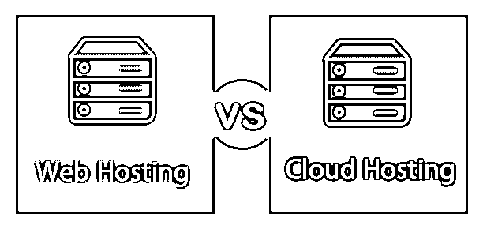
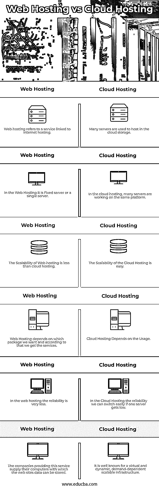

# 虚拟主机与云主机

> 原文：<https://www.educba.com/web-hosting-vs-cloud-hosting/>

## 虚拟主机和云主机的区别

主机云和共享主机有三个共同点:互联网主机提供商、服务器和网站。不幸的是，这是相似的程度。

### 什么是虚拟主机？

虚拟主机这个词与你在哪里以及如何从你的网站上托管文档有关。你的网站主机基本上包含了你网站上的所有文件。你的网站由主机上某处的一堆文档组成。如果用户键入您的域名，浏览器会从您的 web 主机下载这些文档并显示出来。你将把你网站的文件存储在一个带有标准虚拟主机的服务器上。根据您的站点大小、您接收的流量以及您的技术水平，您的服务器环境取决于您想要的环境类型。

<small>网页开发、编程语言、软件测试&其他</small>

最常用的托管方式如下:

1.  共享的
2.  专注的
3.  VPS
4.  管理

### 什么是云托管？

您不需要通过云托管来托管一台物理服务器。你所有的硬件本质上都是虚拟的。在过去的几年里，这是一个相当新鲜的主持风格，越来越受欢迎。云托管提供了无限的资源扩展，如果你的网站发展迅速，这是一件好事。你的网站也将免受故障服务器的影响，因为如果它不工作，你的网站可以切换到另一个。

出于一些不同的原因，云托管很棒:

定价很灵活，你只需为你使用的东西付费。因此，如果你有一个非常高的流量月，你可以迅速扩大你的资源。

如果你的网站流量时好时坏，你需要一个可以和你一起工作的主机。如果一台普通主机不需要削减，但是专用或托管主机上的可用服务器资源太高，那么云托管可以满足您的需求。

### 如何选择最佳的主机方案？

对于所有可用的主机类型，很难做出正确的选择。当你试图在云和虚拟主机之间做出选择时，想想你的主机想要什么样的东西。例如，如果你是一个喜欢你的在线网站的初学者，那么共享主机可以为你工作。但是如果你不想在高流量的网站上控制你自己的服务器，考虑托管主机。共享主机是一种传统的主机技术，对于许多大公司来说是一种非常划算的选择。如果您在访问期间遇到流量或点击，或者如果您需要彻底的安全特性，云托管是完美的。对于公司和需要大流量的公司，我们会推荐你[云托管](https://www.educba.com/what-is-cloud-hosting/)。因为你不仅仅依赖于一个服务器，如果出现问题，你的网站可以很容易地快速转移到另一个服务器上。当你有一个非常大的网站，后面有很多资源，并且有速度问题时，云托管是一个很好的选择。

### 虚拟主机和云主机的直接比较(信息图表)

以下是虚拟主机和云主机之间的 6 大区别

### 虚拟主机和云主机的主要区别

虚拟主机和云主机的主要区别如下:

*   有了虚拟主机，人们和公司可以通过万维网(WWW)让他们的网站在国际上可见。对于虚拟主机，一个组织或任何人都必须有自己的计算机或服务器，而在云主机中，网站托管在多个互连的网络服务器上。因此，数据是从位于不同数据中心的不同服务器上存储和收集的，这些服务器可能位于不同的位置。在定制基础设施的情况下，企业家或组织可以添加防火墙、负载平衡和 IP 部署。
*   云托管具有高度的可扩展性和可靠性，因为与云托管相比，Web 托管的可扩展性较差。虚拟主机取决于我们想要哪个包，根据这个包，我们得到服务，而云主机取决于使用情况。
*   如果物理服务器出现故障，虚拟主机的服务器将无法正常运行，或者可能会被关闭。而在云托管的情况下，服务器可以毫不费力地迁移到另一台物理服务器。即使云客户负载增长，也不会出现 RAM 滞后的情况。

### 虚拟主机与云主机对比表

让我们讨论一下虚拟主机与云主机之间的主要比较:

| **虚拟主机** | **云托管** |
| 虚拟主机是指与互联网主机相关的服务。 | 许多服务器被用来托管在云存储中。 |
| 在虚拟主机中，它是一个固定的服务器或单个服务器。 | 在云托管中，许多服务器在同一个平台上工作。 |
| 虚拟主机的可扩展性不如云主机。 | 云托管的可扩展性很容易。 |
| 虚拟主机取决于我们想要哪个包，根据这个，我们得到服务。 | 云托管取决于使用情况。 |
| 在虚拟主机中，可靠性是很少的。 | 在云托管中，可靠性，如果一个服务器变得很低，我们可以很容易地切换。 |
| 提供这种服务的公司提供他们的计算机来存储网站数据。 | 众所周知，它是一个虚拟的、动态的、按需扩展的基础设施。 |

### 结论

在这篇文章中，我们已经看到了什么是虚拟主机和云主机，它们之间的区别。在购买任何工具之前，你可以浏览一下虚拟主机和云主机中使用的其他功能和工具。

### 推荐文章

这是一个关于虚拟主机和云主机的指南。在这里，我们已经讨论了虚拟主机与云主机的关键区别，并提供了信息图表和比较表。您也可以浏览我们推荐的其他文章，了解更多信息——

1.  [云计算的类型](https://www.educba.com/types-of-cloud-computing/)
2.  [云托管提供商](https://www.educba.com/cloud-hosting-providers/)
3.  [SAAS vs 云](https://www.educba.com/saas-vs-cloud/)
4.  [本地 vs 云端](https://www.educba.com/on-premise-vs-cloud/)

