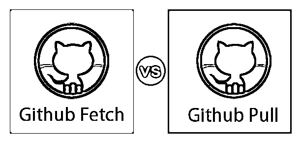
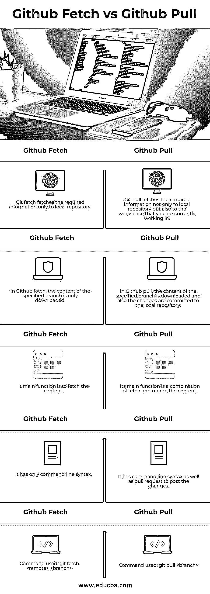

# Git Fetch vs Git Pull

> 原文：<https://www.educba.com/git-fetch-vs-git-pull/>

## Git 提取和 Git 提取之间的区别

GitHub 是一个在软件开发版本控制下托管代码的平台。它提供了访问控制和各种功能，如错误跟踪、任务管理等。，针对每个项目。GitHub 上的项目可以通过使用 Git 命令行界面来访问和修改，所有标准的 Git 命令都可以使用它。

GitHub Fetch 是 GitHub 上可用的一个特性，它将使用跟踪分支将新的/已更改的分支检索到本地存储库中，GitHub pull 是一个请求，它将让其他人知道您正在向特定存储库中的分支推送的更改。一旦您打开了一个拉请求，用户就可以在合并到基础分支之前讨论和检查变更。

<small>网页开发、编程语言、软件测试&其他</small>

### Git Fetch 和 Git Pull 之间的直接比较(信息图表)

下面是 Git Fetch 和 Git Pull 之间的 5 大区别

### Git 获取和 Git 拉取之间的主要区别

让我们讨论一下 Git Fetch 和 Git Pull 之间的一些主要区别。

#### Git Fetch

为了更好地理解[什么是 Git fetch](https://www.educba.com/what-is-git-fetch/)，让我们来理解 GitHub 是如何本地和远程存储所有提交的。本地分支的引用存储在。/.git/refs/heads 位置。如果您想要列出本地存储库的引用，您可以使用 git branch 命令。远程分支类似于我们的本地分支，除了由其他用户的存储库完成的提交。对于远程目录，引用存储在。/.git/refs/remotes/ directory。要查看远程分支的详细信息，您必须将–r 选项与命令一起传递。为了检查远程分支的细节，您可以[使用 git checkout 命令](https://www.educba.com/git-checkout-command/)。如果您认为远程分支的更改是正确的，并且希望在本地存储库中进行更新，那么您可以简单地使用 git merge 命令。

以下是 GitHub fetch 的一些语法和示例:

**语法:** `git fetch <remote>`

它将从存储库中获取所有的分支。它还将下载所有需要的提交，以及来自其他存储库的文件。如果你想获取一个指定的分支，那么使用 git fetch <remote><branch>命令。如果您想要获取所有远程分支的详细信息，那么使用 git fetch–all 命令。</branch></remote>

#### Git Pull

Git pull 命令用于从任何远程存储库中提取内容，并更新本地存储库。git pull 命令将执行两个命令的组合，即 fetch 和 merge。在 git fetch 的帮助下，它将下载所有内容，在 git merge 的帮助下，它将合并用户完成的所有提交。

以下是 GitHub pull 的一些语法和示例:

*   git pull——该命令将获取当前分支的指定远程存储库的副本，并将其合并到本地存储库中。
*   git pull–no–commit–该命令将只从远程存储库中获取内容，而不会提交本地存储库的更改。
*   git pull–rebase–该命令用于将远程分支与本地存储库集成在一起。
*   git pull——verbose——该命令将提供下载的所有细节和合并的细节作为输出。

为了更好的理解，我们来举个例子。假设我们有一个存储库，分支作为主存储库，源存储库作为远程存储库。Git pull 命令将从指定的远程存储库和主存储库的分歧点下载所有内容。现在，拉请求将创建一个新的合并，并且将包含要合并到新的分支的远程储存库中的内容。

### Git 提取和 Git 提取比较表

下面是 Git Fetch 和 Git Pull 的比较表

| **Git Fetch** | **Git Pull** |
| Git fetch 只将所需的信息提取到本地存储库中。 | Git pull 不仅将所需的信息提取到本地存储库，还提取到您当前工作的工作区。 |
| 在 Github fetch 中，只下载指定分支的内容。 | 在 Github pull 中，下载指定分支的内容，并且将更改提交到本地存储库。 |
| 它的主要功能是获取内容。 | 它的主要功能是获取和合并内容。 |
| 它只有命令行语法。 | 它有命令行语法以及发布更改的 pull 请求。 |
| 使用的命令:git fetch<remote>T1】</remote> | 使用的命令:git pull<branch></branch> |

### 如何发出 Git 拉取请求？

Git pulls request 是一个讨论您提出的功能的论坛。如果同事/队友觉得应该有所改变，他们会在请求中发布反馈。所有的活动都在请求本身中被跟踪。

*   用户/开发人员在其本地存储库的分支中有代码变更。
*   他们将分支代码推送到公共位存储库。
*   现在，开发人员创建了一个拉请求。
*   在创建请求之后，团队审查代码，讨论，建议，并给出反馈。
*   如果开发人员发现建议和反馈是有效的，并且想要实现它，他再次开始在他的本地存储库中开发代码，并且遵循相同的过程。
*   然后，项目维护人员将代码合并到原始存储库中，并关闭拉请求。

即使特性的实现不完整，也可以创建一个拉请求。例如，如果用户/开发人员在实现需求时遇到困难，他们可以创建一个包含工作进展状态的拉请求。其他开发人员也可以帮助自己解决问题并添加提交。拉请求也可以用来与项目之外的其他源代码开发人员进行协调。与 git fetch 相比，我们使用 git pull 有很多好处，因为开发人员发现它有助于讨论特性和实现。

### 结论

正如我们讨论的关于 git fetch 和 git pull 命令的几点，我们可以通过理解 Git Pull 比 Git Fetch 更好的事实来总结，因为它提供了两个命令的功能。然而，与 Git Pull 相比，Git Fetch 被认为是更安全的方法。

### 推荐文章

这是 Git 获取和 Git 拉取的指南。在这里，我们还将讨论信息图和比较表的主要区别。你也可以浏览我们推荐的其他文章，了解更多信息。

1.  [GIT 简介](https://www.educba.com/introduction-to-git/)
2.  [GIT 面试问题](https://www.educba.com/git-interview-questions/)
3.  [数字海洋 vs 自动气象站](https://www.educba.com/digital-ocean-vs-aws/)
4.  [GitHub 替代品](https://www.educba.com/github-alternatives/)
5.  [GIT 版本控制系统](https://www.educba.com/git-version-control-system/)
6.  [去推](https://www.educba.com/git-push/)

