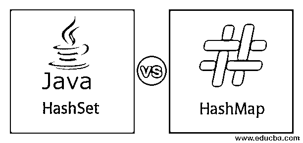
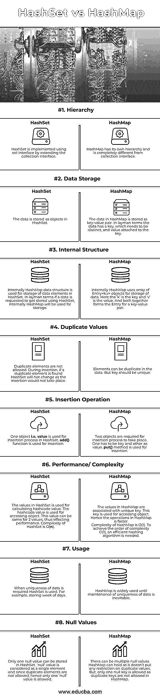

# HashSet vs HashMap

> 原文：<https://www.educba.com/hashset-vs-hashmap/>

## **HashSet 和 HashMap 的区别**

在本文中，HashSet vs HashMap，集合框架的两个关键元素，HashSet 和 HashMap，通常被认为是一个集合项，可以互换。但是这两者之间有很大的不同。让我们从讨论什么是集合框架开始，然后我们将逐个研究它们，然后讨论它们之间的相似之处，最后讨论它们的差异和一些常见错误，指出它们的可互换使用趋势。这两个元素也在多线程概念中广泛使用。

### HashSet 和 HashMap 的术语

下面是 HashSet 和 HashMap 的术语:

<small>网页开发、编程语言、软件测试&其他</small>

**1。集合框架:**这种类型的框架支持一组对象的存储和操作。这是接口、类和算法的集合架构。简而言之，这个框架可以让我们用不同的材料建造一座建筑，比如砖、水泥、木棒等等。，它们是接口、类和算法。

**设计这种架构时，请记住:**

*   这个框架应该是高性能的。
*   允许不同类型的集合以相似的方式工作。
*   易于扩展和适应。

**2。集合:**这些是标准的类/接口组，每个组执行特定的任务。有些组是完全实现的，有些组提供框架支持。

**3。Hash:** Hashing 是一个函数，用于将任意大小的数据映射到固定大小的值。

**4。HashSet:** 顾名思义，这个类型表示 set A 的实现 [set 接口有唯一的](https://www.educba.com/set-interface-in-java/)元素散列到它上面。这种类型的接口不允许重复的元素。

**5。HashMap:** 它有一个映射接口(关联映射)的实现，其中有一个键值对表示。这种类型的接口不允许重复的键。

### HashSet 和 HashMap 的相似之处

*   这两个概念是不同步的。这给线程选项的使用带来了危险。如果我们想在线程安全操作中使用它们，我们需要显式地同步它们。
*   不能保证元素的顺序保持不变。
*   深入挖掘，我们看到 HashMap 支持 HashSet 源代码。
    *   添加/插入、删除/移除等基本操作的时间性能是恒定的。
*   它们都使用相同的函数来继续维护数据中的独特元素；hashcode()和 equals()是使用的方法。

### HashSet 和 HashMap 的直接比较(信息图)

下面是 HashSet 和 HashMap 之间的 8 大比较:

### HashSet 和 HashMap 的主要区别

让我们讨论一下 HashSet 和 hashmap 之间的一些关键区别:

*   HashSet 和 HashMap 之间的关键区别在于，HashSet 使用的散列函数只作用于一个元素，而 HashMap 使用的函数作用于两个元素。
*   当在已经存在键的 HashMap 中插入新值时，新值将覆盖以前的值。而在 HashSet 中，在插入已经存在的新值时，不允许插入。
*   在 HashSet 中，对象被存储。例如，字符串对象的 HashSet 将被描述为{'You '，' have '，' a '，' good '，' day'}。在 HashMap 中，一个相似的句子用一个键值对来表示。比如{1à'有'，2à'有'，3à'有'，4à'好'，5à'日}。键是整数类型，值是字符串。
*   就用法而言，如果任务是检查一个元素的存在，我们使用 Set 实现。代码更干净，更容易理解。如果任务是存储元素的数据或者需要基于键的更快的搜索操作，我们使用 Map 实现。

### HashSet 与 HashMap 比较表

下表总结了 HashSet 和 HashMap 之间的比较:

| 型 | 在 HashSet 中是如何实现/使用的？ | 在 HashMap 中是如何实现/使用的？ |
| **层级** | HashSet 是使用 Set 接口通过扩展 collection 接口实现的。 | HashMap 有它的层次结构，与集合接口完全不同。 |
| **数据存储** | 数据作为对象存储在 HashSet 中。 | HashMap 中的数据存储为键值对。通俗地说，数据有一个键，这个键需要是不同的，并且值附加到这个键上。 |
| **内部结构** | 内部 HashMap 数据结构用于 HashSet 中数据元素的存储。通俗地说，如果请求使用 HashSet 存储数据，那么在内部，HashMap 将用于存储。 | 在内部，HashMap 使用 Entry <k>对象数组来存储数据。这里的“k”是键，“v”是值。两者共同构成了一个键值对的条目。</k> |
| **重复值** | 不允许重复的元素。在插入过程中，如果发现重复的元素，HashSet 不会改变，因为插入不会发生。 | 数据中的元素可以重复。但是键应该是唯一的。 |
| **插入操作** | 一个对象，即值，用于 HashSet 中的插入过程。add()函数用于插入。 | 插入过程需要两个对象。一个必须是键，另一个必须是值。Put()方法用于插入。 |
| **性能/复杂性** | HashSet 中的值用于计算 hashcode 值。hashcode 值用于访问对象。这两个值可以相同，从而影响性能。HashSet 的复杂度为 O(n)。 | HashMap 中的值与唯一键相关联。该键用于访问对象。因此 HashMap 中的操作更快。HashMap 的复杂度是 O(1)。为了达到复杂度的数量级，需要 O(1)和有效的散列算法。 |
| **用途** | 当要求数据的唯一性时，使用 HashSet。例如，存储一周的天数。 | [HashMap 被广泛使用](https://www.educba.com/hashmap-in-java/)直到维护数据的唯一性不可避免。 |
| **空值** | HashSet 中只能存储一个空值。“null”值被视为单个元素，由于不允许重复的元素，因此只允许一个“null”值。 | HashMap 可以保存多个空值，因为它对重复值没有任何限制。但是，只允许一个空键，因为 HashMap 中不允许重复键。 |

### 结论

尽管 HashSet 和 HashMap 之间有明显的区别，但有时它们可以互换使用，这可能会导致错误的实现。虽然 HashMap 在内部用于 HashSet，但通常认为它们可以互换使用，不会有太大的阻力，但是必须小心使用。上面强调的使用方面的关键差异可能会为选择何时需要使用哪种类型提供一个良好的平台。

### 推荐文章

这是 HashSet 和 HashMap 之间最大区别的指南。在这里，我们还讨论了 HashSet 和 HashMap 在信息图和比较表方面的主要区别。您也可以看看以下文章，了解更多信息–

1.  [抽象 vs 封装](https://www.educba.com/abstraction-vs-encapsulation/)
2.  [HashMap vs TreeMap](https://www.educba.com/hashmap-vs-treemap/)
3.  [集线器 vs 交换机](https://www.educba.com/hub-vs-switch/)
4.  [Java 中的 HashSet](https://www.educba.com/hashset-in-java/)

