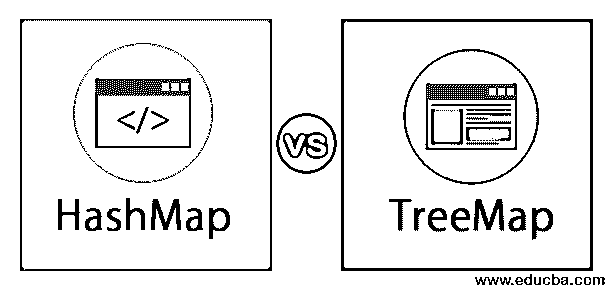
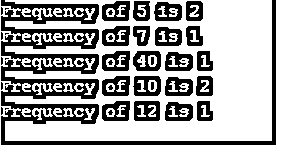
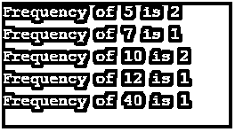
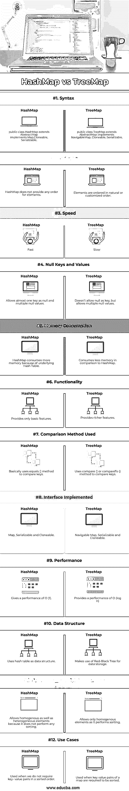

# HashMap vs TreeMap

> 原文：<https://www.educba.com/hashmap-vs-treemap/>




## HashMap 和 TreeMap 的区别

HashMap 是 Java 集合的一部分。它提供了 Java Map 接口的基本实现。数据存储在(键，值)对中。您需要知道它的键来访问一个值。HashMap 之所以被称为 HashMap，是因为它使用了散列技术。 **TreeMap** 用抽象类实现 Map 接口和 NavigableMap。根据使用的构造函数，映射按其键的自然顺序或创建映射时提供的比较器进行排序。

【HashMap 和 TreeMap 的相似性

<small>网页开发、编程语言、软件测试&其他</small>

除了差异之外，hashmap 和 treemap 还有以下相似之处:

*   HashMap 和 TreeMap 类都实现了可序列化和可克隆的接口。
*   HashMap 和 TreeMap 都扩展了 AbstractMap <k v="">类。</k>
*   HashMap 和 TreeMap 类都对键值对进行操作。
*   HashMap 和 TreeMap 都是非同步集合。
*   HashMap 和 TreeMap 都无法进行快速收集。

这两个实现都是集合框架的一部分，并以键值对的形式存储数据。

### 显示 HashMap 和 TreeMap 的 Java 程序

下面是一个 java 程序，演示了如何从 hashmap 中放置和检索元素:

```
package com.edubca.map;
import java.util.*;
class HashMapDemo
{
// This function prints frequencies of all elements
static void printFrequency(int arr[])
{
// Create an empty HashMap
HashMap <Integer, Integer> hashmap =
new HashMap <Integer, Integer>();
// Iterate through the given array
for (int i = 0; i < arr.length; i++)
{
Integer value = hashmap.get(arr[i]);
// If first occurrence of the element
if (hashmap.get(arr[i]) == null)
hashmap.put(arr[i], 1);
// If elements already present in hash map
else
hashmap.put(arr[i], ++value);
}
// Print result
for (Map.Entry m:hashmap.entrySet())
System.out.println("Frequency of " + m.getKey() +
" is " + m.getValue());
}
// Main method to test the above method
public static void main (String[] args)
{
int arr[] = {10, 40, 5, 12, 5, 7, 10};
printFrequency(arr);
}
}
```

**输出:**




从输出来看，很明显 hashmap 没有维护任何顺序。下面是一个 java 程序，演示了如何在 treemap 中放置和检索元素。

**代码:**

```
package com.edubca.map;
import java.util.*;
class TreeMapDemo
{
// This function prints frequencies of all elements
static void printFrequency(int arr[])
{
// Create an empty HashMap
TreeMap <Integer, Integer> treemap =
new TreeMap <Integer, Integer>();
// Iterate through the given array
for (int i = 0; i < arr.length; i++)
{
Integer value = treemap.get(arr[i]);
// If first occurrence of element
if (treemap.get(arr[i]) == null)
treemap.put(arr[i], 1);
// If elements already present in hash map
else
treemap.put(arr[i], ++value);
}
// Print result
for (Map.Entry m: treemap.entrySet())
System.out.println("Frequency of " + m.getKey() +
" is " + m.getValue());
}
// Main method to test above method
public static void main (String[] args)
{
int arr[] = {10, 40, 5, 12, 5, 7, 10};
printFrequency(arr);
}
}
```

**输出:**




从输出中可以看出，键是按自然顺序排序的。因此，Treemap 保持排序的顺序。

### HashMap 和 TreeMap 的直接区别(信息图)

下面给出了 HashMap 和 TreeMap 之间的主要区别。




### HashMap 和 TreeMap 的主要区别

以下是 HashMap 和 TreeMap 之间的关键区别:

#### 1.结构和实施

哈希映射是基于哈希表的实现。它扩展了抽象 Map 类并实现了 Map 接口。哈希映射的工作原理是哈希。Map 实现充当分桶哈希表，但是当桶变得太大时，它们被转换成树节点，每个树节点都具有与 TreeMap 的节点相似的结构。TreeMap 扩展了抽象 Map 类，并实现了一个可导航的地图接口。树形图的底层数据结构是红黑树。

#### 2.迭代顺序

哈希映射的迭代顺序是未定义的，而树映射的元素是按自然顺序或使用比较器指定的自定义顺序排序的。

#### 3.表演

由于 Hashmap 是基于[哈希表的](https://www.educba.com/hashtable-in-java/)实现，它为大多数常见操作提供了等于 O (1)的常数时间性能。在散列映射中搜索一个元素所需的时间是 O (1)。但是如果 hashmap 中存在不正确的实现，那么这可能会导致额外的内存开销和性能下降。另一方面，TreeMap 提供 O (log (n))的性能。由于 hashmap 是基于[哈希表的](https://www.educba.com/hashtable-in-powershell/)，它需要一个连续的内存范围，而树形图只使用保存项目所需的内存量。因此 HashMap 比 treemap 更节省时间，但是 treemap 比 HashMap 更节省空间。

#### 4.零处理

HashMap 几乎允许一个空键和许多空值，而在树形图中，尽管允许空值，但不能将 null 用作键。如果在 hashmap 中使用 null 作为键，它将抛出一个 null 指针异常，因为它在内部使用 compare 或 compareTo 方法对元素进行排序。

### 表格的比较

下面是一个比较表，显示了 hashmap 和 treemap 之间的差异:

| **比较的基础** | **HashMap** | **树图** |
| **语法** | 公共类 HashMap 扩展 AbstractMap 实现映射，可克隆，可序列化 | 公共类 TreeMap 扩展抽象映射实现导航映射，可克隆，可序列化 |
| **订购** | HashMap 不为元素提供任何顺序。 | 元素按自然顺序或定制顺序排序。 |
| **速度** | 快速的 | 慢的 |
| **空键和值** | 允许几乎一个键为空值和多个空值。 | 它不允许 null 作为键，但允许多个 null 值。 |
| **内存消耗** | [HashMap 因为底层哈希表消耗了](https://www.educba.com/hashmap-in-java/)更多的内存。 | 与 HashMap 相比消耗更少的内存。 |
| **功能** | 仅提供基本功能 | 它提供了更丰富的功能。 |
| **使用的比较方法** | 基本上使用 equals()方法来比较键。 | 使用 compare()或 compareTo()方法比较键。 |
| **接口实现** | 映射，可序列化和可克隆 | 可导航地图，可序列化和可克隆 |
| **性能** | 给出 O (1)的性能。 | 提供 O (log n)的性能 |
| **数据结构** | 使用哈希表作为数据结构。 | 利用红黑树进行数据存储。 |
| **同质和异质元素** | 它允许同质和异质元素，因为它不执行任何排序。 | 它在执行排序时只允许同质元素。 |
| **用例** | 当我们不需要排序的键值对时使用。 | 当需要对映射的键值对进行排序时使用。 |

### 结论

从文章中可以得出结论，hashmap 是 map 接口的通用实现。它提供 O (1)的性能，而 Treemap 提供 O (log (n))的性能。因此 HashMap 通常比 TreeMap 快。

### 推荐文章

这是 HashMap vs TreeMap 的指南。这里我们讨论 Hashmap 和 Treemap 之间的主要区别以及一个比较表。您也可以浏览我们推荐的其他文章，了解更多信息——

1.  [列表 vs 集合](https://www.educba.com/list-vs-set/)
2.  [Git Fetch vs Git Pull](https://www.educba.com/git-fetch-vs-git-pull/)
3.  [卡夫卡 vs 火花](https://www.educba.com/kafka-vs-spark/)
4.  [卡夫卡 vs 克瑞斯](https://www.educba.com/kafka-vs-kinesis/)


