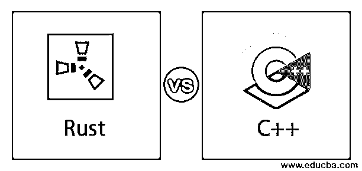
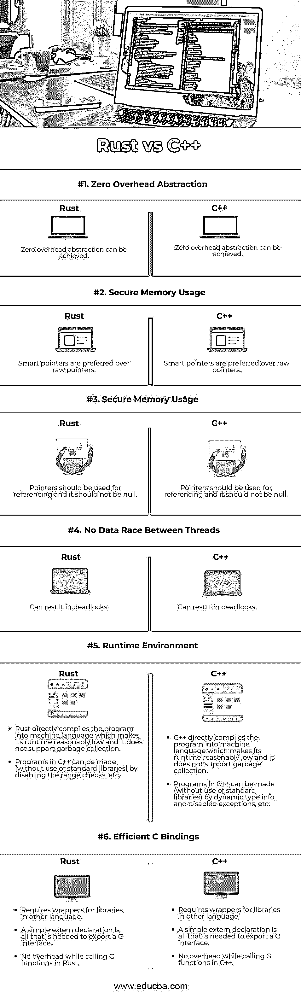

# Rust vs C++

> 原文：<https://www.educba.com/rust-vs-c/>

## RUST 和 C++简介

Rust 是一种系统级编程语言，注重速度、安全性、内存和并行性。它在语法上[与 C++](https://www.educba.com/access-modifiers-in-c-plus-plus/) 不相上下，但是它通过提供更好的内存安全性来保持高性能。Rust 是 Mozilla 的产品，它是开源的，这有助于广大开发者使用它。开发人员正在使用 rust up 构建各种新的软件应用程序，如文件系统、游戏引擎、浏览器组件、操作系统、虚拟现实模拟引擎等。

C++是全球最被接受的编程语言之一，如今，它可以在大多数图形用户界面、操作系统、游戏和嵌入式系统中找到。C++使用面向对象的方法，这使我们对程序的复杂性有一个清晰的认识，并允许我们重用我们的代码，从而获得更好的可读性和更低的开发成本。此外，C++易于使用和移植，可用于开发基于 Windows、Linux、UNIX、Mac 等多种平台的应用程序。

<small>网页开发、编程语言、软件测试&其他</small>

### Rust 和 C++的直接差异(信息图)

下面是 Rust 和 C++之间的主要区别:

### Rust 和 C++的主要区别

Rust 和 C++都是市场上的热门选择。让我们来讨论一些主要区别:

#### 1.移动语义

移动构造函数会导致具有未指定状态的无效对象，从而由于使用移动对象而导致错误。在 Rust 中移动对象后，静态分析器(内置)会将其状态更改为不可用。所有的优化都被标记到分析器(内置的)，使得编译器不受其影响。而在 C++中，由于使用移动对象而导致的错误可以在编译时被静态代码分析器(外部)发现。一个特殊的标记状态用于在运行时检测这些错误。

#### 2.安全内存使用

检查自由变量的使用，悬空指针等。在 Rust 中，可以使用工具来查找在不安全的块中使用的原始指针。而在 C++中，原始指针只能在手工完成的代码审查中发现，而智能指针很容易跟踪。

#### 3.安全内存使用

空取消引用错误。在 Rust 中，选项类型可以模拟空引用，在使用前需要显式地进行空检查。智能指针返回可选引用；因此，它们也需要显式检查。只有在不安全的块中使用原始指针时，才能使其为空。而在 C++中，即使对于智能指针，空解引用也是可能的；因此应该避免，因为它被认为是未定义的行为。在这种问题上，C++中的编译器永远不会发现警告或错误。但是编译时错误可以被静态代码分析器(外部的)捕获。

#### 4.安全内存使用

缓冲区溢出导致的错误。在 Rust 中，运行时会自动对所有切片类型执行范围检查。而在 C++中，范围检查可以由包装类强制执行，包装类必须在代码中显式引入。

#### 5.线程之间没有数据竞争

并发数据的修改(不安全)。在 rust 中，Rust 参考模型和内置的借用检查器可以在编译时跟踪可能的不一致。通过不安全地锁定 API，可以防止互斥体的不安全滥用。而在 C++中，一些错误可以在编译时被静态代码分析器(外部)发现。良好的知识、仔细的审查和编程纪律对于避免并发错误是必要的。一些错误可以在运行时被代码清理器(外部)发现。

#### 6.对象初始化

[变量的初始化](https://www.educba.com/variables-in-java/)。在 Rust 中，任何在 Rust 程序中创建的变量都应该被初始化。(否则会导致编译器错误)。Rust 中的所有类型都有一些默认的定义值。而在 C++中，未初始化的变量可以被静态代码分析器(外部)发现。如果没有初始化，任何基本类型的对象都将导致未定义的值。

#### 7.模式匹配

应该正确处理 switch 语句的每个分支，如果没有处理，那么应该做什么？.在《锈》中，一个模式的每一个可能的价值都在《锈》中得到保证；否则不会编译。而在 C++中，switch 语句的每一个可能的分支都可以被静态代码分析器(外部)和代码审查发现。

#### 8.静态(编译时)多态性

有时为了实现编译时多态性，会使用静态接口。在 Rust 中，静态和动态接口都由 Traits 以统一的方式指定。Rust 中的所有编译时多态性都可以在编译时得到解决。而在 C++中，一些编译器可能会在一些已知的情况下优化对虚函数的调用。使用抽象类和虚函数来声明[接口。](https://www.educba.com/abstract-classes-in-javascript/)

#### 9.类型推理

手动键入一些(复杂的)变量类型是非常繁琐的。在 Rust 中，函数声明需要显式类型，以确保程序的可读性。在 Rust 的函数体中，(局部)类型推理允许我们更少地显式指定类型。而在 C++中，decltype & auto [关键字为](https://www.educba.com/c-keywords/)提供了有限类型的类型推断(用于代码的表达式)。

#### 10.宏指令

在 Rust 中，Rust 中定义宏的语法是 macros_rules！.而在 C++中，[定义宏的语法在 C++中](https://www.educba.com/macros-in-c-plus-plus/)是#define

#### 11.标准库

标准库充分利用了实用程序类型的遗留设计。在 Rust 中，元组、枚举、结构形成了 Rust 的一些内置结构化类型。标准库充分利用所有可用的模式匹配来提供万无一失的接口。而在 C++中，Ad-hoc 结构可以替换结构化类型，如 std:: variant、std:: tuple 和 std:: pair。

### Rust 与 C++的对比表

对比表解释如下:

| **关键因素** | **生锈** | **C++** |
| **零开销抽象**
零开销抽象是一种存在于源代码中但对编译后的目标代码没有任何开销的功能。 | A zero-overhead abstraction can be achieved. | A zero-overhead abstraction can be achieved. |
| **安全内存使用** 检查自由变量使用情况、悬空指针等。 | Smart pointers are preferred over raw pointers. | Smart pointers are preferred over raw pointers. |
| **安全内存使用**
空解引用错误 | 指针应该用于引用，不能为空。 | 指针应该用于引用，不能为空。 |
| **线程间无数据竞争**
修改并发数据(不安全) | It can result in deadlocks. | It can result in deadlocks. |
| **运行时环境**
裸机或嵌入式编程对运行时有很高的限制。 | • Rust directly compiles the program into machine language, which makes its runtime reasonably low, and it does not support garbage collection.

通过禁用范围检查等，可以生成 C++程序(不使用标准库)。

 | • C++ directly compiles the program into machine language, which makes its runtime reasonably low, and it does not support garbage collection.C++中的程序可以由动态类型信息、禁用异常等创建(不使用标准库)。 |
| **高效的 C 绑定**
使用现有的 C 或其他语言库。 | • Requires wrappers for libraries in other languages.导出一个 C 接口只需要一个简单的外部声明。在 Rust 中调用 C 函数时没有开销。 | • Requires wrappers for libraries in other languages.导出一个 C 接口只需要一个简单的外部声明。在 C++中调用 C 函数时没有开销。 |

### 结论

Rust 是一种现代的新编程语言，具有与 C++类似的编码结构，但它更快，更安全，使用简单的内置方法。

### 推荐文章

这是 Rust vs C++的指南。这里我们用信息图和比较表来讨论 Rust 和 C++的主要区别。您也可以浏览我们推荐的其他文章，了解更多信息——

1.  [以太坊 vs 以太坊经典](https://www.educba.com/ethereum-vs-ethereum-classic/)
2.  [合资企业 vs 战略联盟](https://www.educba.com/joint-venture-vs-strategic-alliance/)
3.  [敏捷 vs Scrum vs 瀑布](https://www.educba.com/agile-vs-scrum-vs-waterfall/)
4.  [Rust vs Golang](https://www.educba.com/rust-vs-golang/)

