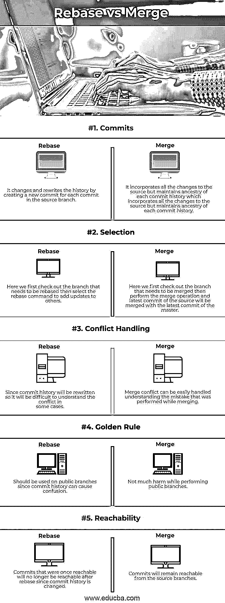
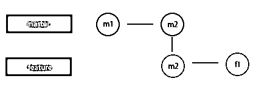
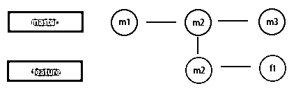
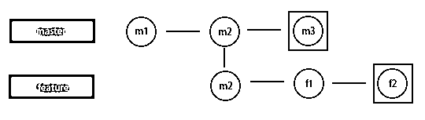
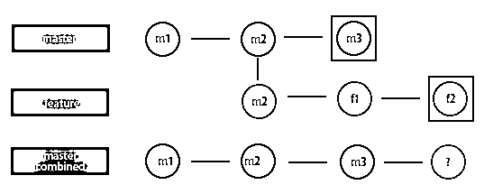
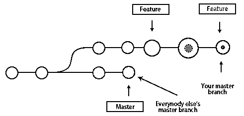

# Git ReBase vs Merge

> 原文：<https://www.educba.com/git-rebase-vs-merge/>

## Git ReBase 与 Merge 的区别

下面的文章提供了 Git ReBase vs Merge 的概要。在本文中，我们将讨论两个这样的工具 Rebase 和 Merge 以及它们的区别。GIT 是程序员中最常用的分布式版本控制器 DVCS 之一，因为它的动态特性和巨大的工具可用性来处理版本。有两种方法可以将我们的变更从一个分支发送到另一个分支。一种是使用 Rebase，另一种是 Merge，这是非常流行的。

### Git ReBase 与 Merge 的直接比较(信息图)

以下是 Git ReBase 与 Merge 之间的 5 大比较:

<small>Hadoop、数据科学、统计学&其他</small>

### Git ReBase 与 Merge 的主要区别

让我们讨论一下 Git ReBase 和 Merge 之间的主要区别:

#### 1\. Git Rebase

Git Rebase 从两个分支之间的公共提交开始工作。从这里开始，Master 和 feature 对两者进行比较，并捕获其中一个分支中的差异快照，然后将其添加到其他分支中。

假设我们有一个主分支和对它的最新提交 m2，如上面的截图所示。我们从这个提交中创建了一个特性分支，我们做了一些修改，并用 f1 消息提交。现在让我们考虑某人已经将他的工作合并到 master，现在 master 的最新提交是 m3，而不是 m2，如下所示。

我们还继续处理 feature 分支，将其最新提交添加到 f2，如下所示。

从上面的屏幕截图可以看出，我们已经掌握了最新的提交，m3，并且我们有一个与主服务器不同步的特性，因为它是从 m2 提交快照创建的，而 m2 提交快照的最新提交是 f3。现在把这些努力与大师的生成结合起来如下所示。

现在我们需要整合上面的更改，这可以通过两种方式完成，一种是使用 merge，另一种是 rebase。这里我们将看看如何与 rebase 集成。

`$ git checkout feature
Switched to a new branch 'feature'
$ git rebase master`

从上面的 rebase 命令中，我们将尝试从主服务器和功能服务器中寻找一个共同的提交，在本例中，它是 m2。然后，由于我们必须对 master 进行重置，它将寻找 master 完成的附加功能，并将快照 m3 和重置功能从 m2 转移到 m3。所以现在我们有了一个 m3(代替 m2)的特性，f1，f2 提交。现在，我可以在特性上应用 rebase，使主分支随着特性的变化而更新。需要记住的一点是，对主文件的任何更改都必须经过审核。

`$ git checkout master
Switched to a new branch 'master'
$ git rebase feature`

现在，我们将最新的提交功能分支 f2 应用到主服务器，主服务器的最新提交快照将是 f2。您可以使用 git log 命令列出提交，但是我们需要首先检查我们需要查看哪个分支的日志，如下所示。

`$ git checkout feature
Switched to a new branch 'feature'
$ git log`

现在有了 rebase，我们已经将一个特性的更新集成到 master 中。让我们通过合并来实现这一目标。

#### 2\. Git Merge

我们将在这里使用上面的截图作为参考，我们可以实现与 rebase 和 merge 相同的效果。

Git merge 提交我们在 feature 分支中的最后一次提交，这里的情况是 f2 提交，它收集所有的更改，并将其与我们在 master 分支中的最新提交(这里是 m3)合并。这看起来很复杂，但可以通过 merge 命令轻松完成。我们可以直接合并，也可以挤压合并，两者的区别在于。

`$ git checkout master
Switched to a new branch 'master'
$ git merge feature`

上述命令将获取特性的所有提交，并将它们添加到主服务器的日志中。为了避免这种情况，我们可以使用 squash，这样在主服务器的日志中，我们将在 m3 之后只提交一次，这就是更新。

`$ git checkout master
Switched to a new branch 'master'
$ git merge –squash feature`

使用 git rebase 时应该小心，并尽量避免。黄金法则是避免使用公共分支。

Just look at the above scenario. This can happen when u try to rebase master on top of your feature branch, and our master branch is public; now the master branch is updated, but everybody else is working on an older version of master. Since rebasing will result in brand new commits, git can think that the history of the master branch has diverged from everybody else. The only way to solve this will be to synchronize both the master by merging them back together and have a resultant set of commits that will be confusing.

### Git ReBase 与 Merge 对比表

下表总结了 Git ReBase 与 Merge 之间的比较:

| **比较的基础** | **Rebase** | **合并** |
| **提交** | 它通过为源分支中的每个提交创建一个新的提交来更改和重写历史。 | 它包含对源的所有更改，但维护每个提交历史的祖先。 |
| **选择** | 在这里，我们首先检查需要重定基础的分支，然后选择 rebase 命令
将它的更新添加到其他分支。 | 这里首先检查需要首先合并的分支。然后执行合并操作，源
的最新提交将与主的最新提交合并。 |
| **冲突处理** | 因为提交历史将被重写，所以在某些情况下理解冲突将是困难的。 | 合并冲突很容易处理，理解在合并时执行的错误。 |
| **黄金法则** | 应该在公共分支上使用，因为提交历史记录会导致混淆。 | 执行公共分支时没有太大的伤害。 |
| **可达性** | 由于提交历史被改变，曾经可到达的提交在重设基础后将不再可到达。 | 提交将仍然可以从源分支访问。 |

### 结论

Merge 和 rebase 是 Git 的两个强大的工具，两者都用于合并对分支的更改，但是我们必须小心 Rebase，因为它将重写提交的历史，并且在公共分支上使用它们会妨碍其他人的工作，导致他们的混乱。而您可以使用 merge 选项，因为它的提交可以从源分支到达，如果我们理解正确的话，可以很容易地解决合并冲突。

### 推荐文章

这是 Git ReBase 和 Merge 之间最大区别的指南。在这里，我们还将讨论信息图和比较表的主要区别。您也可以看看以下文章，了解更多信息–

1.  [获取 Git 与获取 Git–最大差异](https://www.educba.com/git-fetch-vs-git-pull/)
2.  [GIT 面试问题|前 11 名](https://www.educba.com/git-interview-questions/)
3.  [GIT 版本控制系统](https://www.educba.com/git-version-control-system/)
4.  [去推](https://www.educba.com/git-push/)

