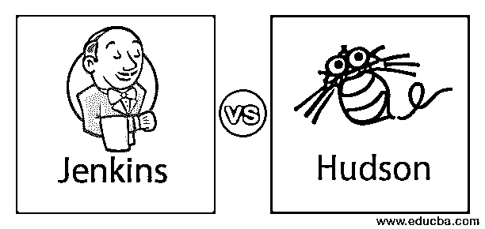
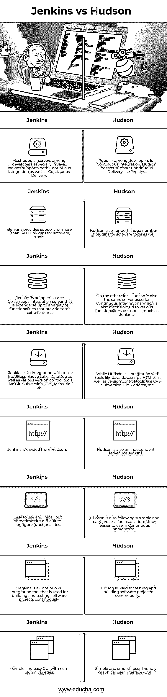

# 詹金斯对哈德森

> 原文：<https://www.educba.com/jenkins-vs-hudson/>

## 詹金斯和哈德森的区别

在本文中，Jenkins vs Hudson 都是帮助软件开发的持续集成(CI)的服务器。这两个工具都完全基于 Java。它源于相同的来源，并由于一些公司问题而分裂，这在 Jenkins 和 Hudson 之间产生了争议，即使它们是相同的工具。就像最新的哈德森改名为詹金斯一样。60%的开发者使用 Jenkins，而 Hudson 只占 3%。詹金斯不仅[用于持续集成](https://www.educba.com/what-is-continuous-integration/)；它支持一些更复杂的功能。两者都是 Java 开发的重要部分。

### 詹金斯和哈德森的对决(信息图)

以下是詹金斯 vs 哈德森的 8 大对比:

<small>Hadoop、数据科学、统计学&其他</small>

### 詹金斯和哈德森的主要区别

以下是它们之间的一些主要区别:

*   哈德森和詹金斯之间没有太大的区别，因为詹金斯在哈德森的基础上完全变成了新的东西。由于 Hudson 的创造者和 Oracle 的意见分歧，他们需要被分开，这在公司业界引起了轰动，使得这两个持续集成工具都很出名。
*   Hudson 和 Jenkins 之间的主要区别在于，一个是开放源代码，而另一个是不同的源代码，尽管两者源自相同的源代码。要构建基于持续集成的环境，可以使用 Jenkins 或 Hudson。两者都有利于持续集成。
*   作为持续集成工具，它们都有助于基于每日、每周或每小时需求的 Java 项目的自动化和部署。它们都有助于 Java 项目的整体自动化，从构建源代码到通过单元测试运行它；获得成功的测试结果后，您可以将代码部署到您首选的生产服务器上。
*   每当开发人员对源代码进行更改或提交更改时，如果您已经安排好了所有的任务和工作，整个自动化过程将自动开始，无需任何人工干预。Jenkins 易于使用和安装，Hudson 也是如此。
*   突出的主要区别是 Hudson 商标归甲骨文所有，而 Jenkins 商标归麻省理工学院所有。还可以在 Jenkins 中创建一个管道来调度作业。您可以从 Jenkins 服务器的主页直接创建管道，也可以编写运行管道的脚本。
*   我们可以指出 Jenkins 和 Hudson Continuous Integration server 提供的众多种类和功能，但这完全取决于您正在开发的项目类型以及您在软件开发过程中需要的功能。
*   世界上有一个很大的开发者社区在使用 Jenkins over Hudson，因为当谈到 Java 项目时，Jenkins 支持 300 多个插件，而不是它已经支持的 1000 多个插件，这使得 Jenkins over Hudson 很受欢迎。
*   但这并不意味着哈德森已经不在市场上了。正如我告诉你的，这完全取决于项目需求，有一个项目只需要 Hudson 的支持，因为它很容易进行配置管理，而在 Jenkins 中有时会变得非常困难，因为插件版本的差异会在构建或部署项目到服务器时导致错误。
*   如果您的项目很大，并且从事该项目的开发人员数量更多，并且分布在世界各地，那么这款开源服务器是软件市场中具有成熟记录的最佳选择，因为如果您允许您的团队成员访问 Jenkins，那么您的项目中的每个人都可以使用 Jenkins，这可以从世界上的任何位置以及任何时间触发构建过程和部署，从而节省大量时间。
*   与使用 Hudson 提交相比，Jenkins 在 Git 上有更多的提交。Hudson 支持变革管理，而另一方面 Jenkins 不支持。最重要的是，持续交付仅由詹金斯支持，而不是由哈德森。Hudson 仅用于持续集成目的。

### 詹金斯 vs 哈德森对比表

下表总结了 Jenkins 与 Hudson 之间的比较:

| 詹金斯 | **哈德森** |
| 最受开发人员欢迎的服务器，尤其是在 Java 中。Jenkins 支持持续集成和持续交付。 | 因持续集成而受到开发人员的欢迎。Hudson 不支持像 Jenkins 那样的连续交付。 |
| Jenkins 为 1400 多个软件工具插件提供支持。 | Hudson 也支持软件工具的大量插件。 |
| Jenkins 是一个开源的持续集成服务器，可以扩展到各种功能，提供一些额外的特性。 | 另一方面，Hudson 也是用于持续集成的同一个服务器，它也可以扩展到各种功能，但不如 Jenkins **。** |
| Jenkins 集成了 JBoss、Sauce Labs、DataDog 等工具，以及 Git、Subversion、CVS、Mercurial 等各种版本控制工具。 | 而 Hudson 集成了 Java、Javascript、HTML5 等工具和 CVS、Subversion、Git、Perforce 等版本控制工具。 |
| 詹金斯和哈德森分开了。 | 哈德森和詹金斯一样也是独立服务器。 |
| 易于使用和安装，但有时很难配置功能。 | Hudson 也遵循简单易行的安装流程。在持续集成中更容易使用。 |
| Jenkins 是一个持续集成工具，用于持续构建和测试软件项目。 | Hudson 用于连续测试和构建软件项目。 |
| 简单易用的图形用户界面，丰富的插件种类。 | 简单流畅、用户友好的图形用户界面(GUI)。 |

上表是詹金斯和哈德森从各种可能的角度看后最好的比较。至于现在，我们已经看到了 Jenkins 和 Hudson 是什么，以及为什么他们在开发者中如此受欢迎。它们的功能因项目需求而异。现在是时候谈谈詹金斯和哈德森之间的主要区别了，这会让你对他们每个人都有更清晰的认识。

### 结论

Hudson 和 Jenkins 都可以在项目自动化过程中单独用于触发构建。根据项目规范，部署也可以由两者共同完成。与 Hudson 相比，Jenkins 支持插件的数量，吸引开发者使用 Jenkins 而不是 Hudson。

### 推荐文章

这是一个指南之间的詹金斯与哈德森的顶部差异。在这里，我们还将讨论信息图和比较表的主要区别。您也可以看看以下文章，了解更多信息–

1.  [获取 Git 与获取 Git–最大差异](https://www.educba.com/git-fetch-vs-git-pull/)
2.  [抽象与封装|六大对比](https://www.educba.com/abstraction-vs-encapsulation/)
3.  [h base 面试问题介绍](https://www.educba.com/hbase-interview-questions/)
4.  [詹金斯备选方案|最佳前 5 名](https://www.educba.com/jenkins-alternatives/)
5.  [Tableau 版本](https://www.educba.com/tableau-versions/)
6.  [JavaScript 封装](https://www.educba.com/encapsulation-in-javascript/)

