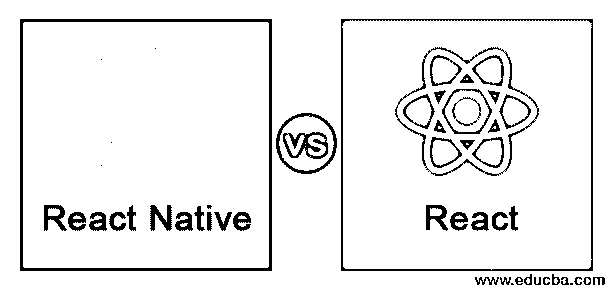
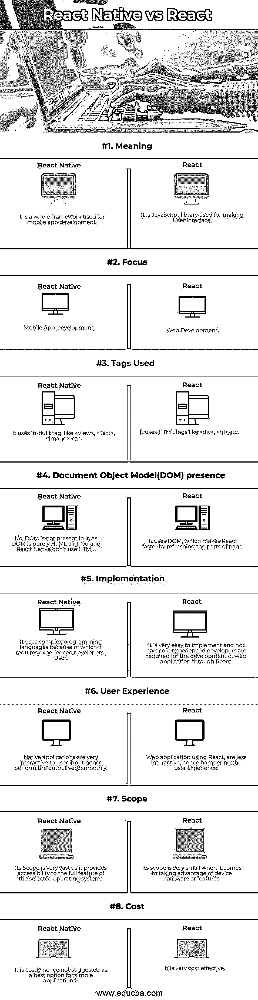

# 反应本地 vs 反应

> 原文：<https://www.educba.com/react-native-vs-react/>

## React Native 和 React 之间的区别

React Native 是一个在 Android 和 iOS 平台上开发移动应用的框架。它基于 React。它帮助开发人员使用他们非常熟悉的 JavaScript 库编写移动应用程序。React native 使得为 Android 和 iOS 编写移动应用程序变得非常简单，甚至大部分编写的代码都可以跨平台共享。React 本机代码大部分是使用 JavaScripts 和 JSX 编写的。React Native Bridge 有助于分别为 iOS 或 Android 平台呈现 Objective-C 或 Java 中的 API。它也有助于暴露 API 的 JavaScript，这使得应用程序可以访问手机摄像头或位置等功能。

React Native 凭借其使用主机平台标准渲染 API 的处理能力，从 Cordova 或 Ionic 等竞争对手中脱颖而出，这使得应用程序流程使用真正的移动用户界面组件，而不是 webviews。React Native 将标记转换为真正的用户界面元素，并且在不牺牲功能的情况下保持高性能。React Native 和 React 的主要区别在于，它使用主机的 UI 库，而不是使用 HTML。

<small>网页开发、编程语言、软件测试&其他</small>

React 是一个基于组件的 JavaScript 库，用于制作 ui。由于 React 是基于 JavaScript 的，这就是它也被称为 React.js 的原因。它是一种使用 Java 脚本构建 Web 应用程序的方法。它使用 JSX，即 Java Script XML，这有助于 XML 文本与 Java Script react 代码共存，这些语法用于将 JavaScript 文件中的 XML 文本转换为标准的 JavaScript 对象。JSX 还帮助在 JavaScript 中嵌入 HTML 代码，这最终使 JavaScript 易于理解，并提高了其制作健壮应用程序的效率。React 使用虚拟 DOM 在 React 组件之外创建节点树。

### React Native 和 React 之间的直接差异(信息图)

下面给出了 React Native 与 React 之间的主要差异:

### React Native 和 React 之间的主要区别

让我们讨论一下 React Native 和 React 之间的一些主要区别:

1.  React Native 是一个用来开发移动应用的完整框架，而 React 只是一个 JavaScript 库。
2.  React 的主要重点是 web 开发，React Native 的重点是移动 App 开发。
3.  用 React 编码太冗长和复杂，而 React Native 的使用使代码变得简单和容易。
4.  对于 React，需要 DOM 进行 HTML 标签的路径渲染，而 React Native 使用 AppRegistry 注册手机 App。
5.  React 使用 DOM，而 DOM 对于 HTML 来说基本已经存在，所以 React 用于 web 开发而 React Native 不使用 DOM 或 HTML；因此它不能用于 web 开发。
6.  React Native 没有用于任何交互的 DOM，所以与 React 中的 HTML 标记相比，它使用自己设计的标记。例如:React Native 不使用 **<** div **>** 标签(React 中使用的)，而是使用内置的 **<** View **>** 标签，并且在保护伞下，这个标签会编译成其他的原生代码(例如 Android 的 View 和 iOS 的 UIView)。
7.  React 用于前端，而 React Native 用于整个移动开发。
8.  早期的开发人员必须编写不同的 iOS 和 Android 代码，而在 React Native 中，您只需根据您的要求下拉至原生代码并优化代码；因此，开发者不必为 iOS 和 Android 设计不同的代码。
9.  React 的速度更快，因为它使用了 DOM(文档对象模型)，与标准的完全刷新模型相比，它可以刷新页面的一部分，而 React Native 附带了本机模块和本机组件，可以提高特定应用程序的性能。
10.  React 非常易于实现和阅读，即使对于不熟悉 React 的人也是如此。对于 React 来说，人们不必学习大量的概念，而原生应用程序开发效率低下，部署缓慢。React Native 主要是为混合空间的用户带来 web 应用程序开发的高效、协调和最佳体验。

### React 本机与 React 对比表

对比表解释如下:

| **功能** | **反应** | **反应原生** |
| 意义 | 这是一个用于制作用户界面的 JavaScript 库。 | 这是一个用于移动应用程序开发的整体框架。 |
| 集中 | Web 开发 | 移动应用程序开发 |
| 使用的标签 | 它使用 HTML 标签，如、

# 等。

 | 它使用内置标签，如<view>、<text>、等。</text></view> |
| 文档对象模型(DOM)存在 | 它使用 DOM，通过刷新页面的各个部分使 React 更快。 | 不，DOM 不存在于其中，因为 DOM 是纯 HTML 对齐的，而 React Native 不使用 HTML。 |
| 履行 | 它非常容易实现，并且通过 React 开发 web 应用程序不需要经验丰富的开发人员。 | 它使用复杂的编程语言，因此需要有经验的开发人员。 |
| 用户体验 | 使用 React 的 Web 应用程序交互性较差，因此妨碍了用户体验。 | 本机应用程序与用户输入的交互性很强；因此执行输出非常顺利。 |
| 范围 | 当谈到利用设备硬件或功能时，它的范围非常小。 | 它的范围非常广泛，因为它提供了对所选操作系统的全部功能的访问。 |
| 费用 | 性价比很高。 | 这是昂贵的，因此不建议作为简单应用的最佳选择。 |

### 结论

根据上面的解释，React 最适合开发基于 web 的应用，React Native 最适合开发 iOS 和 Android 的移动应用。React web 开发的例子有脸书(React Web Development Creators)、Instagram、网飞、雅虎邮箱等。使用 React 刷新页面变得很快，因为它使用 DOM (DocumentObject Model)。React 原生移动应用开发的例子有 Skype、特斯拉、沃尔玛、Airbnb 等。这些组织已经迁移到 React Native 来开发他们的移动应用程序，因为 React Native 提供了一种完全不同的开发风格，可以快速获得反馈，因为 React Native 的编译时间非常短，而且非常强大。因此，对于基于 web 的应用程序，应该使用 React，而对于移动应用程序开发，应该使用 React Native。

### 推荐文章

这是 React 本机 vs React 的指南。这里我们讨论信息图和比较表的主要区别。您也可以浏览我们推荐的其他文章，了解更多信息——

1.  [视图。JS vs React .js〔t1〕](https://www.educba.com/react-js-vs-vue-js/)
2.  [PHP vs JavaScript](https://www.educba.com/php-vs-javascript/)
3.  [反应自然 vs 颤动](https://www.educba.com/react-native-vs-flutter/)
4.  [React Native vs Native script](https://www.educba.com/react-native-vs-nativescript/)

