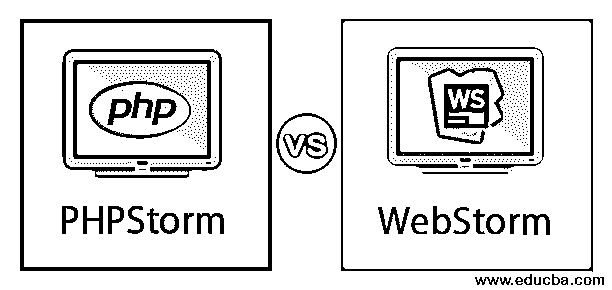
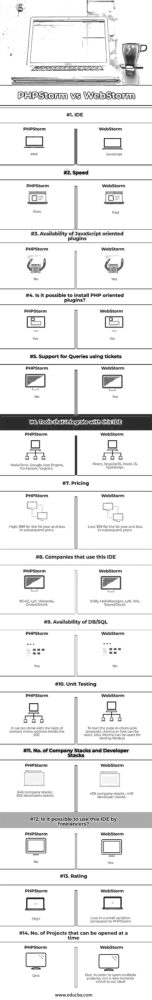

# PHPStorm vs WebStorm

> 原文：<https://www.educba.com/phpstorm-vs-webstorm/>

## PHPStorm 和 WebStorm 的区别

PHPStorm: 这是一个为 PHP 和 Web 开发人员开发的 IDE，包含几个现代工具。它还提供了诸如功能、代码导航、PHP 智能代码编辑器、测试和调试工具等特性。除此之外，数据库技术的出现是 PHPStorm 的一个有趣的方面。

WebStorm: WebStorm 是众所周知的最聪明、最智能的 JavaScript due，这是因为它的特性，如编码帮助、项目模板、代码编辑器、轻量级的客户端 JavaScript 内置调试器等

<small>网页开发、编程语言、软件测试&其他</small>

众所周知，集成开发环境是一个软件应用程序，它为软件程序员开发软件提供了大量的工具。有几种集成开发环境(ide)可用于不同的编程语言。例如，Eclipse 是 Java 的 IDE。类似地，PHPStorm 和 WebStorm 分别是 PHP 和 JavaScript 的两个 ide。主要差异、优点、缺点和重要特性将在下面的章节中详细讨论。

### PHPStorm 和 WebStorm 的正面比较(信息图表)

以下是 PHPStorm 和 WebStorm 之间的 14 大区别

### PHPStorm 和 WebStorm 的主要区别

让我们讨论一下 PHPStrom 和 WebStorm 之间的一些主要区别。

如前所述，PHPStorm 和 WebStorm 分别是 PHP 和 Javascript 等编程语言的两种不同的 ide(集成开发环境)。

让我们看看两者在客户端、速度等几个方面的主要区别；支持的语言、价格、服务器和应用程序等。

#### 1.客户

开发人员选择特定的 IDE 来开发他们的软件有几个原因。一个主要原因是 IDE 提供的高级特性。

PHPStorm 是一个 IDE，支持几乎所有流行的 PHP 框架。它提供了几个功能，例如:

*   PHPStorm = PHP + WebStorm + DB/SQL
*   健壮的插件架构
*   包括前端技术
*   支持 Drupal、Yii 和 WordPress 等框架。
*   高级代码分析
*   适用于 Mac 和其他几个操作系统。
*   现代工具的出现将 web 开发提升到了一个新的水平。
*   跨平台集成开发环境

WebStorm 是最著名的 JavaScript IDE 之一。WebStorm 的功能不限于:

*   智能环境
*   易于调试
*   非常聪明
*   拼写检查工具是集成的。
*   支持多种网络技术
*   跨平台集成开发环境

#### 2.支持的语言

WebStorm 支持不同用途的不同语言。

它们如下:

*   对于 Web 开发:VueJS、AngularJS 和 ReactJS
*   用于移动开发:Cordova、React Native 和 Ionic
*   对于服务器端开发 node.js 和 meteor
*   桌面开发:电子

PhpStorm 还支持大量编程语言。

也就是说，

*   服务器端和前端技术，例如:JavaScript、TypeScript、CSS、CoffeeScript、HTML 和 Stylus。
*   数据库技术，如 DB 和 SQL

#### 3.速度

与速度最慢的 PhpStorm 相比，WebStorm 是速度最快的 IDE。PHPStorm 速度慢的主要原因是内存使用率高。如果没有可用内存，性能可能会显著下降。

#### 4.定价

关于定价，这取决于用户订阅 IDE 的条款。对于 PhpStorm，第一年的初始费用是 89 美元，但随着时间的推移会逐渐减少。

以 WebStorm 为例，第一年的费用是 59 美元，从第三年开始降低到 35 美元。定价也取决于用户选择的技术。例如，如果用户正在研究每项技术，有一个选项是所有产品打包，第一年和第三年的费用分别为 249 美元和 149 美元。

还提供了试用版，以便在购买前试用不同的功能。此外，还有几种薪资包可用于组织和业务目的。

#### 5.客户端或服务器端

在 PHPStorm 的情况下，软件开发人员也可以开发服务器端和客户端。对于 WebStorm 来说，即使服务器端开发也是允许的，但更适用于客户端开发。

#### 6.应用

由于这些 ide 提供了大量的特性，WebStorm 和 PHPStorm 被几家公司使用。

使用 PhpStorm 的知名公司有 9GAG、GrooveShark、Lyft、Appit Ventures、Webedia 等。，而 WebStorm 在宝马、PedidosYa、SalesForce、Wix、Soundcloud 等品牌中知名度较高。

**备注:**

除了这些，WebStorm 和 PHPStorm 还有其他一些有趣的事实。这些问题如下:

*   由于 PHPStorm 包含有助于开发的数据库技术，它被称为 PHP、DB/SQL 和 WebStorm 的融合或混合。
*   PHPStorm 和 WebStorm IDEs 都是由同一家公司 JetBrain 开发的。

### PHPStorm 与 WebStorm 的比较表

让我们使用下表来讨论 PHPStorm 和 WebStorm 之间的主要比较。

| **参数** | **PHPStorm** | **网络风暴** |
| **这里** | 服务器端编程语言（Professional Hypertext Preprocessor 的缩写） | Java Script 语言 |
| **速度** | 慢的 | 快速的 |
| **面向 JavaScript 的插件的可用性** | 不 | 是 |
| 有可能安装面向 PHP 的插件吗？ | 是 | 不 |
| **支持使用票证查询** | 不 | 是 |
| **与该 IDE 集成的工具** | WakaTime，谷歌应用引擎，作曲家，流浪者 | 反应，角度，节点。JS，类型脚本 |
| **定价** | 高；第 1 年 89 美元，随后年份更少 | 低；第一年 59 美元，随后几年更少 |
| **使用该 IDE 的公司** | 9GAG，Lyft，Webedia，GrooveShark | 陶冶，HelloReceipts，Lyft，Wix，SoundCloud |
| **数据库/SQL 的可用性** | 是 | 不 |
| **单元测试** | 这可以在 ide 中的上下文菜单选项的帮助下完成。 | 要在客户端 javascript 中测试代码，可以使用 Karma 或 Jest。此外，Mocha 可以用于测试 Node.js |
| **公司栈和开发者栈的数量** | 646 company stacks ;502 个开发人员堆栈 | 469 家公司书库；449 个开发人员堆栈 |
| 自由职业者可以使用这个 IDE 吗？ | 不 | 是 |
| **评级** | 高的 | 与 PHPStorm 相比，变化较小。 |
| **一次可以打开的项目数。** | 任何人 | 一；为了打开多个项目，运行一个不理想的新实例。 |

### 结论

PHPStorm 和 WebStorm 是分别为 PHP 和 JavaScript 开发的两个 ide。根据每个版本提供的功能和试用版的性能，可以帮助用户确定他们可以选择的 IDE。主要特征、差异和相似之处在上述章节中详细讨论。

### 推荐文章

这是 PHPStorm vs WebStorm 的指南。在这里，我们已经讨论了 PHPStorm 和 WebStorm 的关键区别，包括信息图表和比较表。您也可以看看以下文章，了解更多信息–

1.  [PHP vs.Net](https://www.educba.com/php-vs-dot-net/)
2.  [Node.js vs PHP 性能](https://www.educba.com/node-js-vs-php-performance/)
3.  [Laravel vs CakePHP](https://www.educba.com/laravel-vs-cakephp/)
4.  [HTML vs PHP](https://www.educba.com/html-vs-php/)

