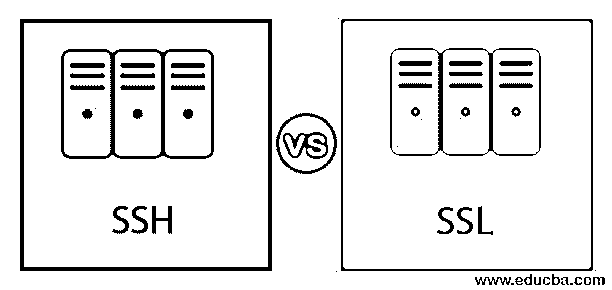
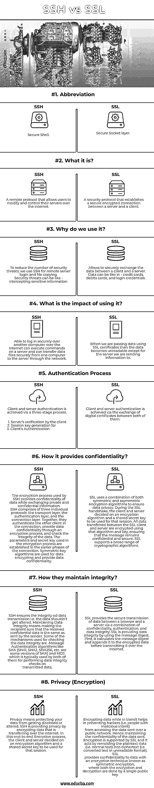

# SSH 与 SSL

> 原文：<https://www.educba.com/ssh-vs-ssl/>

## SSH 和 SSL 的区别

由于有许多门和窗是开着的，黑客和窃听者可能会秘密收集你的个人数据，访问你自己的敏感应用程序和文件。所以现在人们要求网站安全。SSH 和 SSL 是结合在一起的。对于信用卡和银行等关键信息的安全传输，主要使用 SSL。相比之下，SSH 可以通过互联网安全地执行命令。为了建立安全的连接，SSH 使用用户名/密码认证系统，尽管 SSL 不支持。

### SSH 和 SSL 之间的直接比较(信息图表)

下面是 SSH 和 SSL 之间的 8 大区别

<small>网页开发、编程语言、软件测试&其他</small>

### SSH 和 SSL 之间的主要区别

SSH 和 SSL 都是公钥加密协议，可以在互联网上创建安全、机密的数据交换和连接。让我们来讨论一些主要的关键区别:

1.  通常，SSH 使用端口 22，而 SSL 使用端口 443。
2.  SSH 使用用户名/密码认证过程来建立安全连接，而 SSL 不考虑这一点。
3.  SSH 基于网络隧道，而 SSL 基于证书。
4.  SSL 用于安全传输关键信息，如信用卡和银行业务。而 SSH 用于通过互联网安全地执行命令。
5.  SSL 用于加密浏览器和服务器之间的通信。另一方面，SSH 用于加密互联网上两台计算机之间的通信。
6.  在 SSL 中，通信通过私钥/公钥对进行身份验证。而在 SSH 中，通信是通过私钥/公钥对或用户名/密码对进行认证的。
7.  从技术上讲，SSH 是为了保护计算机网络的安全，而 SSL 是为了保护在线数据传输。
8.  SSL 通常(除了例外)使用 X.509 数字证书进行服务器和客户端认证过程，而 SSH 不使用**。**
9.  另一个主要区别是 SSH 比 SSL 有更多的内置功能。它有助于用户登录到服务器并远程执行命令，而 SSL 没有这种功能。为了实现这一功能，您需要将其与另一种协议(如 HTTP、FTP)配对。

### SSH 与 SSL 的比较表

让我们来讨论 SSH 和 SSL 之间的 8 大区别。

| **关键因素** | **宋承宪** | **SSL** |
| 缩写 | 安全外壳 | 安全套接字层 |
| 什么事？ | 一种远程协议，允许用户通过互联网修改和控制他们的服务器。 | 在服务器和客户端之间建立安全加密连接的安全协议。 |
| 我们为什么要用它？ | 

*   To reduce the number of security threats, we use SSH for remote server login and file copy.
*   Security threats can be like-intercepting sensitive information.

 | 

*   Allows secure data exchange between client and server.
*   Data can be like credit cards, debit cards and login credentials.

 |
| 用了有什么影响？ | 能够通过互联网安全地登录另一台计算机，能够在服务器上执行命令，并能够通过网络将数据文件从一台计算机安全地传输到服务器。 | 当我们使用 SSL 证书传递数据时，除了我们向其发送信息的服务器之外，数据变得不可读。 |
| 认证过程 | 客户端和服务器认证通过一个三阶段过程实现。

*   The authentication of the server is performed by the client's
*   Session key generated as
*   Authentication of client

 | 客户端和服务器的认证是通过它们之间的数字证书交换来实现的。 |
| 它如何提供保密性？ | SSH 使用的加密过程在交换私有和机密信息时提供了数据的机密性。SSH 由三个独立的协议组成:传输层、认证层和连接层。它们一起验证连接中的另一个客户端，通过加密过程提供数据机密性，并检查数据的完整性。加密过程中使用的参数和密钥是在连接的早期阶段建立的。对称密钥算法用于数据加密并提供数据机密性。 | SSL 结合使用对称和非对称加密算法来确保数据隐私。在 SSL 握手期间，客户端和服务器决定用于该会话的加密算法和共享密钥。SSL 客户机和服务器之间传输的所有数据都使用该算法和密钥进行加密，确保消息的机密性和安全性。SSL 支持广泛的加密算法。 |
| 他们如何保持诚信？ | SSH 确保数据传输的完整性，即数据不应被更改。维护数据完整性意味着让收件人确信收到的机密数据与发件人发送的相同。用于检查数据完整性的一些机制是消息认证算法，如 SHA (SHA1、SHA2、SHA256 等)。是 SHA)和 MD5 的一些版本，它们通常使用 MD5 对传输的数据执行数据完整性检查。 | SSL 通过结合机密性、身份验证和数据完整性，在浏览器和服务器之间提供安全的数据传输。SSL 通过使用消息摘要来提供数据完整性。首先，它计算消息摘要，并在通过互联网传输之前将其附加到加密数据中。 |
| 隐私(加密) | 隐私意味着保护您的数据不被泄露或更改。SSH 通过加密在互联网上传输的数据来保护隐私。在这个端到端加密过程中，客户端和服务器决定了用于该会话的加密算法和共享密钥。 | 对传输中的数据进行加密有助于防止黑客(即怀有恶意的人)访问通过公共网络发送的数据。因此保持了所发送数据的机密性。SSL 支持加密，它通过将明文数据(即普通文本)转换为密文(即不可读格式的转换文本)来实现。SSL 通过一种称为对称加密的加密技术为数据提供机密性，其中加密和解密都是由一个公钥完成的。 |

### 结论

SSL 和 SSH(安全套接字层和安全外壳)都是非对称密钥加密安全协议，它们的目标是在公共网络或互联网上提供机密和安全的数据交换和连接。

### 推荐文章

这是 SSH 与 SSL 的对比指南。这里我们用信息图和比较表来讨论 SSH 和 SSL 的主要区别。您也可以看看以下文章，了解更多信息–

1.  [HTML vs HTML5](https://www.educba.com/html-vs-html5/)
2.  [Html5 vs Html4](https://www.educba.com/html5-vs-html4/)
3.  [SOAP vs HTTP](https://www.educba.com/soap-vs-http/)
4.  [Web Sockets vs Ajax](https://www.educba.com/web-sockets-vs-ajax/)

