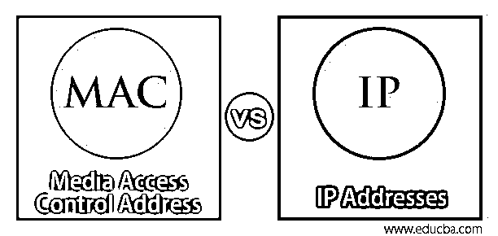
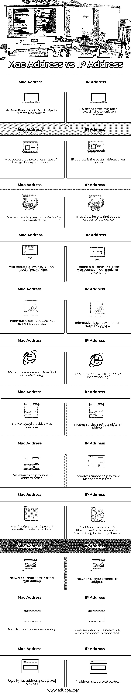

# Mac 与 IP 地址

> 原文：<https://www.educba.com/mac-vs-ip-addresses/>

## Mac 和 IP 地址之间的区别

Mac 和 IP 地址定义了连接到网络的设备。Mac 是计算机的物理地址，就像我们的家庭地址一样。因此，在网络中，可以使用 Mac 地址来识别各种设备。而 IP 地址通过给定一个数字来定义网络的连接。在文章 Mac 与 IP 地址中，这两个地址对于将设备连接到网络都很重要。Mac 地址分配给设备，并且对于设备的网卡是唯一的。IP 地址识别计算机到计算机和网络到网络之间的连接。

### mac 地址

*   制造商为计算机硬件组件中的 NIC(网络接口控制器)分配一个编号。这个数字被称为 Mac 地址。Mac 地址控制网络从设备获取的数据。设备通过以太网或 Wi-Fi 连接到互联网，这些设备使用网络中的 Mac 地址。Mac 地址中有 12 个十六进制数字。这 12 个数字以冒号分隔的 6 对形式出现。Mac 地址的前半部分是制造商 ID，后半部分用于识别设备。第一部分也称为组织唯一标识符。
*   该号码在设备本身的制造过程中被登记在设备中。制造商重新使用 Mac 地址的后半部分，即识别零件的设备。但是，每个 Mac 地址对于设备中的网卡都是唯一的。制造商有 168 万个可用地址，因此同一网络中不会出现两个地址相同的设备。当一个设备的网卡被烧录后，数字从 00 开始。因此，数量相同的可能性较小。如果具有相同 Mac 地址的两台设备出现在同一个网络中，网络将会混淆，无法向设备发送数据包。它将数据发送给首先响应的设备。如果它不是应该接收数据的设备，它就成为设备的问题，因此 Mac 的唯一地址是优选的。命令提示符通过在那里键入 getmac 来给出 Mac 地址。

### IP 地址；网络地址

*   IP 地址有助于在全球市场上识别设备。IP 地址由点分隔的 4 个十进制数字组成。有些号码是留作特殊用途的。IPv4 包含 32 位，而 IPv6 包含 128 位。使用 IPv4 地址进行网络和设备识别。IPv6 地址以十六进制书写，包含 8 组 4 位数字，并用冒号分隔。IPv6 还具有网络和设备标识。软件配置有助于 IP 地址与全球网络中的设备绑定。
*   网络路由设备使用设备的 IP 地址。路由器用于隐藏 IP 地址。如果设备是直接连接的，IP 地址在互联网上是可见的。如果设备通过路由器连接，互联网会显示路由器的 IP 地址。路由器会设置一个专用网络，这样设备的 IP 地址就不会直接出现在互联网上。我们可以称 IP 地址为邮政地址，这使得数据的接收与到达地址的路径无关。

### Mac 和 IP 地址的直接比较(信息图表)

以下是 Mac 与 IP 地址之间的前 12 项比较:

<small>网页开发、编程语言、软件测试&其他</small>

### Mac 地址和 IP 地址的主要区别

让我们讨论一下 Mac 地址与 IP 地址之间的主要比较:

**1。** Mac 是媒体访问控制，而 IP 是互联网协议。

**2。** Mac 是[物理地址](https://www.educba.com/what-is-a-physical-address/)，IP 是设备的逻辑地址。

**3。** Mac 地址标识本地网络中的设备，IP 地址标识全局网络中的设备。

**4。** Mac 地址始终是 6 字节的十六进制地址。IP 地址可以是 IPv4 或 IPv6，其中 IPv4 是 4 字节的十进制地址，IPv6 是 16 字节的十六进制地址。

**5。**一个设备只有一个 Mac 地址。设备的 IP 地址数量取决于它所连接的网络数量。

**6。** Mac 地址对设备是唯一的，但 IP 地址不是唯一的。

7 .**。**设备制造商提供 Mac 地址，互联网服务提供商提供 IP 地址。

**8。** Mac 地址无法对设备隐藏，而 IP 地址可以使用路由器隐藏。

**9。** Mac 地址出现在网络接口层，IP 地址出现在 OSI(开放系统互联)模型的互联网层。

10。 Mac 地址面向硬件，IP 地址面向软件。

### Mac 与 IP 地址对照表

下表总结了 Mac 地址与 IP 地址之间的比较:

| **Mac 地址** | **IP 地址** |
| 地址解析协议有助于检索 Mac 地址。 | 反向地址解析协议有助于检索 IP 地址。 |
| Mac 地址是我们家邮箱的颜色或者形状。 | IP 地址是我们家的邮政地址。 |
| Mac 地址由制造商提供给设备。 | IP 地址有助于找出设备的位置。 |
| Mac 地址是 OSI 网络模型中的低层地址。 | 在 OSI 网络模型中，IP 地址的级别高于 Mac 地址。 |
| 信息通过以太网使用 Mac 地址发送。 | 信息通过互联网使用 IP 地址发送。 |
| Mac 地址出现在 OSI 网络的第 2 层。 | IP 地址出现在 OSI 网络的第 3 层。 |
| 网卡提供一个 Mac 地址。 | 互联网服务提供商提供 IP 地址。 |
| Mac 地址有助于解决 IP 地址问题。 | IP 地址不能帮助解决 Mac 地址问题。 |
| Mac 过滤有助于防止黑客的安全威胁。 | IP 地址没有特定的过滤，而是依靠 Mac 过滤来应对安全威胁。 |
| 网络更改不会影响 Mac 地址。 | 网络变化改变 IP 地址。 |
| Mac 定义了设备的身份。 | IP 地址显示设备连接的网络。 |
| 通常，Mac 地址由冒号分隔。 | IP 地址由点分隔。 |

Mac 地址和 IP 地址对于设备在网络中高效运行都很重要。虽然 IP 地址的功能更面向硬件，但 Mac 地址可以在本地网络中唯一标识设备。

### 结论

Mac 地址以物理方式将设备连接到网络，IP 地址以逻辑方式连接设备。IP 地址有助于将数据路由到具有 Mac 地址的正确设备。IP 地址给出了连接到网络的系统的信息，而 Mac 没有。本地通信由 Mac 地址完成。全球范围内的设备都是通过 IP 地址来识别的。对这两个地址都有了解是很好的。

### 推荐文章

这是一个 Mac 和 IP 地址的指南。在这里，我们还将讨论信息图和比较表的主要区别。您也可以浏览我们推荐的其他文章，了解更多信息——

1.  github vs SVN
2.  [数据湖 vs 数据仓库](https://www.educba.com/data-lake-vs-data-warehouse/)
3.  [什么是路由器？](https://www.educba.com/what-is-router/)
4.  [集线器 vs 交换机](https://www.educba.com/hub-vs-switch/)

