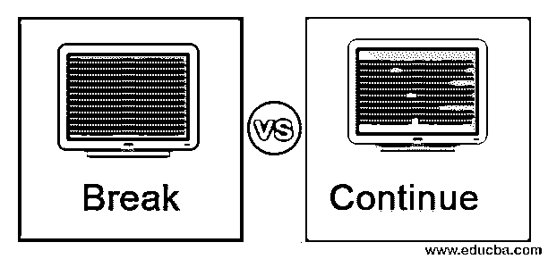
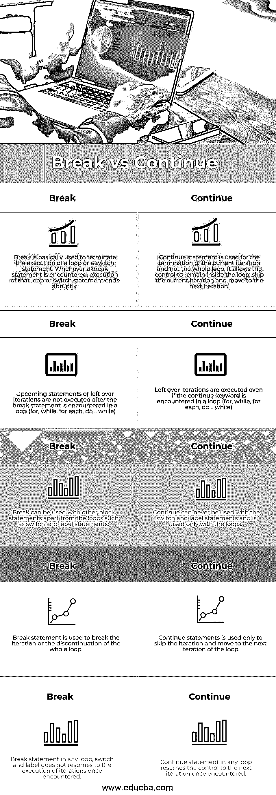
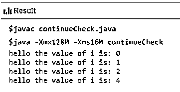

# 中断与继续

> 原文：<https://www.educba.com/break-vs-continue/>




## 中断和继续的区别

在[任何编程语言](https://www.educba.com/best-programming-languages/)中，都有一些重要的关键词，每个关键词都有自己的含义。几乎在所有的编程语言中像 [C，C++](https://www.educba.com/c-vs-c-plus-plus/) ， [Java，Python](https://www.educba.com/java-vs-python/) 等等。，用于 web 开发，有两个常用的关键字，即“中断”和“继续”。Break vs Continue 虽然是关键字，但却是跳转语句，用于循环和切换的情况，以根据程序员的要求执行操作。在某些情况下，当满足某些标准时，我们希望对循环或块语句的执行进行一些修改。

考虑两个场景，场景 1 在一个数组中按 id 搜索雇员，场景 2 从数组中打印除一个雇员之外的所有雇员的姓名。

<small>网页开发、编程语言、软件测试&其他</small>

对于前者，使用“break”语句，因为一旦找到所需的雇员，我们希望退出循环，并且不希望进一步执行任何循环，对于后面的“continue”语句，将使用“continue”语句，因为我们需要跳过特定雇员的打印，并且一旦该雇员匹配，它将跳过它并将控制 1 迭代向前移动并继续其执行。break 用于在满足某个条件时退出循环，而 [Continue 用于在 C#中](https://www.educba.com/continue-in-c-sharp/) continue 跳过当前迭代并恢复到循环的下一次迭代。

### **中断和继续**之间的面对面比较(信息图)

以下是休息和继续之间的 5 大区别:




### 中断和继续之间的主要区别

让我们讨论一下中断和继续之间的一些主要区别:

1.  break 用于突然终止即将到来的语句和循环迭代的执行，并移动到循环后的下一个语句，而 continue 用于不同的目的，即跳过当前迭代并移动到下一个迭代。
2.  break 语句允许控件移出循环，无论何时遇到都跳过循环的剩余语句的执行，而它们继续允许控件仅通过向前移动 1 次迭代而留在循环内。
3.  当谈到两个跳转语句的原因时，break 语句导致循环的终止或退出，而 continue 语句允许循环的早期/快速执行。
4.  关于 break 和 continue 语句的使用，需要记住的最重要的事情之一是 break 语句可以与循环(for，while，for each，do..而等。)以及开关和标签，而 continue 语句只能与循环(for、while、for each 等)一起使用。)并且永远不能与开关和标签一起使用。
5.  由于 break 关键字允许我们移出循环，我们可以说它不允许继续循环，而 continue 关键字允许继续同一个循环。
6.  嵌套循环中的 break 语句允许终止最内层的循环，并且控件保留在最外层的循环中(它不会影响最外层的循环)，而嵌套循环中的 continuing 语句允许跳过当前迭代并执行最内层循环的下一次迭代。

**break 语句示例:**

**代码**

```
public class breakCheck{
public static void main(String[] args)
{
for (int i=0; i<5; i++)
{
for (int j=1;j<3;j++)
{
System.out.println("hello the value of i is: "+ i);
if(j==1)
break;
}
}
}
}
```

**输出:**
T3】


在上面的示例中，一旦内部循环变量“j”的值变为 1，将满足所需的条件，并且遇到“break”关键字，则最内部的循环将终止，但控件仍在最外部的循环内，它将按预期工作并正常递增。

**continue 语句示例:**

**代码**

```
public class continueCheck{
public static void main(String[] args)
{
for (int i=0; i<5; i++)
{
if(i==3)
continue;
System.out.println("hello the value of i is: "+ i);
}
}
}
```

**输出:**




在上面的例子中，当变量“I”的值为 0，1，2 时，没有问题，控件按预期工作。一旦变量‘I’的值变成 3，它就满足了期望的条件。continue 关键字保持当前语句的执行，并移至下一个迭代。

### 中断与继续比较表

让我们讨论一下中断与继续之间的主要比较:

| **序列号** | **突破** | **继续** |
| 

1.  T2】

 | 中断主要用于终止循环的执行，或者终止 switch 语句的执行。每当遇到 break 语句时，循环或 switch 语句的执行就会突然结束。 | continue 语句用于终止当前迭代，而不是整个循环。它允许控件留在循环内，跳过当前迭代并移到下一个迭代。 |
|     2. | 在循环中遇到 break 语句后，不会执行即将到来的语句或剩余的迭代(for，while，for each，do..while) | 即使在循环中遇到 continue 关键字(for，while，for each，do..while) |
|     3. | 除了循环之外，breaks 还可以与其他块语句一起使用，例如 switch 和 label 语句。 | Continue 不能与 switch 和 label 语句一起使用，只能与循环一起使用。 |
| 4. | breaks 语句用于中断迭代或整个循环的中断。 | Continue 语句仅用于跳过迭代并转到循环的下一次迭代。 |
|    5. | 任何循环、开关和标签中的 Break 语句一旦遇到就不会恢复迭代的执行。 | 任何循环中的 Continue 语句一旦遇到就将控制恢复到下一次迭代。 |

### 结论

上面的解释清楚地描述了两个跳转语句之间的区别，即 break vs continue。虽然它们有很大的不同，用于不同的目的，但对于新生来说，理解它们是很棘手的，尤其是当涉及到嵌套循环时。因为它们是任何编程语言中常用的语句，所以在根据任何特定情况使用它们之前，彻底理解它们是很重要的。

### 推荐文章

这是一个打破 vs 继续的指南。在这里，我们讨论中断与继续之间的区别，信息图的主要区别，以及比较表。您也可以浏览我们推荐的其他文章，了解更多信息——

1.  [WCF vs 网络服务](https://www.educba.com/wcf-vs-web-services/)
2.  [WebLogic vs WebSphere](https://www.educba.com/weblogic-and-websphere/)
3.  [移动应用与网络应用](https://www.educba.com/mobile-apps-vs-web-apps/)
4.  [虚拟主机 vs 云主机](https://www.educba.com/web-hosting-vs-cloud-hosting/)


