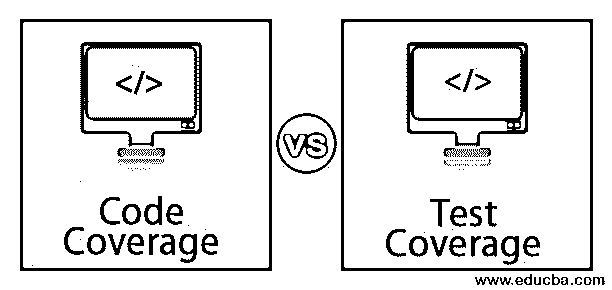

# 代码覆盖率与测试覆盖率

> 原文：<https://www.educba.com/code-coverage-vs-test-coverage/>

## 代码覆盖率和测试覆盖率的区别

当软件被创建时，它应该满足所有的需求。为了检查这一点，代码应该覆盖所有的需求，而测试用例应该按照需求覆盖所有的用例。代码覆盖率和测试覆盖率是有区别的。代码覆盖率有助于了解程序的源代码程度，这已经过测试。代码覆盖率与测试覆盖率是白盒测试的一种形式，在白盒测试中，代码被测试，程序中没有被测试用例使用的区域被发现。它有助于收集关于运行程序的信息。测试覆盖率是一个度量标准，它定义了特定集合的测试量。代码覆盖率与测试覆盖率决定了哪些部分在套件中运行，并找到分支的不同条件语句。

### 代码覆盖率和测试覆盖率的直接比较(信息图)

下面是代码覆盖率和测试覆盖率之间的 4 大区别:

<small>网页开发、编程语言、软件测试&其他</small>

### 代码覆盖率和测试覆盖率的主要区别

让我们讨论一下代码覆盖率和测试覆盖率之间的一些主要区别:

*   代码覆盖率描述了当一个应用程序运行时，有多少应用程序代码被执行。另一方面，测试覆盖描述了在任何文档中编写和提到的测试用例。
*   代码覆盖是测试代码的白盒测试的一部分，而测试[覆盖是按照需求文档测试功能的黑盒测试](https://www.educba.com/black-box-testing-techniques/)的一部分。测量代码覆盖率的重点是准确地测试哪个应用程序代码。
*   测试覆盖主要覆盖以需求文档为基础创建的测试用例。当测试覆盖率出现时，没有必要查看代码。
*   代码覆盖是一个直截了当的过程，它寻找改进被测代码的覆盖并发现更多的缺陷。另一方面，测试覆盖是一种黑盒测试方法；测试方法应符合规定的要求。
*   代码覆盖率很容易建立，有助于发现程序流程中的错误。测试覆盖检查软件的功能并测试其特性。

### 代码覆盖率与测试覆盖率对照表

让我们来讨论一下顶级的比较代码覆盖率和测试覆盖率:

| **比较的基础** | **代码覆盖率** | **测试覆盖率** |
| **定义** | 它描述了被测试程序的源代码。这是白盒测试的一部分，测试用例无法提供帮助。它增加了测试的覆盖率，并有助于找到代码覆盖率的定量度量。 | 它决定了由一组测试用例执行的测试量。它也有关于被执行的程序的不同部分的信息。测试套件有助于测试所提供的不同条件语句和函数。 |
| **为什么要用这些？** | 它有助于衡量测试实现的效率。它检查定量测量。源代码是可以测试的，它也定义了测试的程度。 | 它提供了新的[测试用例，帮助](https://www.educba.com/test-cases-vs-test-scenario/)提高测试覆盖率，反过来，增加缺陷。它有助于识别测试覆盖的度量，这有助于提高软件的质量。它还消除了无用的测试用例，不会增加软件的测试覆盖率。这也有助于找到没有被任何测试用例实现的区域。 |
| 这些覆盖面是如何完成的？ | 以下代码覆盖方法有助于实现正确的代码覆盖
1)语句覆盖
2)决策覆盖
3)分支覆盖
4)切换覆盖
5) FSM 覆盖
语句覆盖:这有助于至少执行一次所有可执行文件。它计算代码中语句的数量，并返回可以执行的数量。
Decision Coverage:以真或假的格式返回结果。由于表达式有时会变得复杂，因此无法实现 100%的覆盖率。分支覆盖:来自任何模块的每个结果都在这里被测试。如果结果是真的和假的，这两者都应该被测试。
条件覆盖:这有助于展开如何评估变量或子表达式。出现的逻辑操作数通常用于此范围。它提供了对流量的适当控制。但是，它不能保证完全的决策覆盖。 | 这项活动可以通过运用静态评审技术很容易地完成，静态评审技术包括同行评审、检查和多次走查。通过使用自动化代码覆盖或者使用不同的测试覆盖工具，很容易在代码级别增加覆盖。通过使用这种技术，在运行时发现的缺陷可以被转换成可执行的测试用例。此外，市场上有许多工具可以帮助正确测试这些工具。 |
| **计算测试和代码覆盖率的方法** | 代码不同覆盖率的公式如下:
语句覆盖率=执行的语句数/语句总数 X 100
所以如果执行的语句总数为 6，语句总数为 7，那么语句覆盖率将为 6/7*100= 85%
决策覆盖率可以通过:
决策覆盖率=执行的决策结果数/决策结果总数。
分支覆盖率=
已执行分支数量/分支总数
条件覆盖率=
已执行操作数数量/操作数总数 | 测试覆盖率可以通过以下步骤来找出:
计算被测软件的总行数
应该找出当前正在执行的所有测试用例的所有代码的行数。
第一步中的计数除以第二步中的计数。乘以 100 的结果就是测试覆盖率的百分比。
例如:
如果代码的总行数是 1000，总共执行的行数是 100，那么测试覆盖率是 10%。 |

### 结论

测试和编码的覆盖都是检查构建的应用程序质量的措施。一个覆盖编码方面，而另一个覆盖需求方面。代码覆盖率描述了运行哪个应用程序代码，测试覆盖率描述了覆盖了哪个需求。当一个应用程序被测试时，两者都很重要，并且有助于交付一个高质量的产品。

### 推荐文章

这是代码覆盖率和测试覆盖率的指南。在这里，我们讨论代码覆盖率和测试覆盖率之间的区别，以及关键的区别、信息图和比较表。您也可以浏览我们推荐的其他文章，了解更多信息——

1.  [RedHat vs Debian](https://www.educba.com/redhat-vs-debian/)
2.  [白盒测试 vs 黑盒测试](https://www.educba.com/white-box-testing-vs-black-box-testing/)
3.  [詹金斯 vs 特拉维斯 CI](https://www.educba.com/jenkins-vs-travis-ci/)
4.  [测试覆盖工具](https://www.educba.com/test-coverage-tools/)

