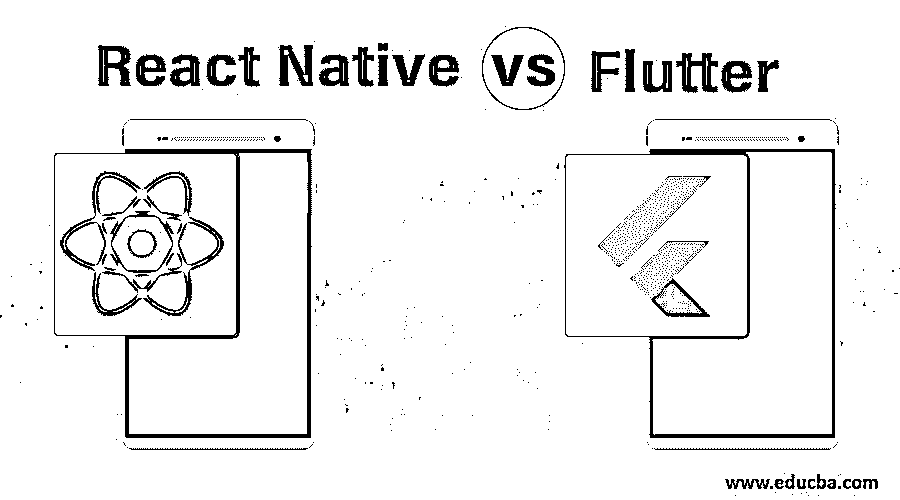
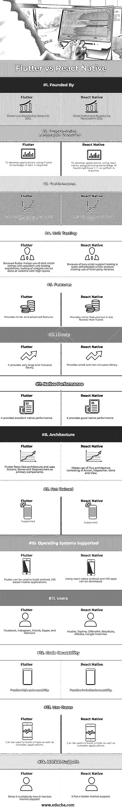

# 反应自然 vs 颤动

> 原文：<https://www.educba.com/react-native-vs-flutter/>

## 反应自然与颤动之间的差异

React native 和 flutter 都是很棒的移动开发工具。flutter 和 react-native 在市场上都很受欢迎。在本文中，我们将详细比较 react-native 和 flutter，并关注以下几点:

*   他们哪一个更好？
*   什么时候去扑或反应本土？

**React Native:** React Native 是一个开源的[移动应用开发框架](https://www.educba.com/mobile-app-design-software/)。React Native 可用于构建 IOS 和 Android 应用。要构建基于 react native 的应用程序，您需要了解 JavaScript 和 react 等编程语言。React Native 于 2015 年 3 月发布。

<small>网页开发、编程语言、软件测试&其他</small>

**Flutter:** Flutter 基本上是 Google 开发的基于反应式编程的移动开发框架。它是一个跨平台的移动应用程序开发框架，可用于构建 IOS 和 android 应用程序。要开发基于 Flutter 的应用程序，您需要具备 Dart 的编程知识。谷歌在 2011 年推出了 dart。对于熟悉 Java 或 JavaScript 的开发人员来说，Dart 很容易学习，因为它支持大多数面向对象的概念。

### **React Native 和颤振之间的正面比较(信息图)**

以下是 React Native 和 Flutter 之间的 14 大区别:

### 反应自然和颤动之间的主要区别

让我们从以下几个方面来评价 react native 与颤振:

*   **性能:**就性能而言，flutter 比 react native 给出了更好的性能。Flutter 在框架内部构建了本地组件，不需要使用桥来与本地组件通信。Flutter 将 dart 代码编译成可由 CPU 直接运行的 ARM 代码。另一方面，react-native 使用原生组件来解释 UI。由于多了一层原生组件，基于 react native 构建的应用程序往往会更慢。
*   **架构** : React Native 使用 Flux 架构，其中存在由动作、调度器、存储和视图组成的单向数据流。Flutter 也遵循单向数据流，包含动作、存储和停止观察器。
*   **灵活性和稳定性【react native 和颤振都是可扩展的，并提供同等的稳定性。在灵活性方面，flutter 赢得了比赛，因为与 react-native 相比，它包含了一组丰富和高级的小部件。**
*   **开发时间:【react native 和 flutter 都提供了更快的应用开发时间。但是由于它的简单性，flutter 节省了更多的时间，因为它不使用理解起来很耗时的原生组件。**
*   **快速修改支持:** React native 支持热重载特性，能够在运行新代码的同时保持应用状态不变，而不是执行重新编译。这个特性提供了即时高效的开发。Flutter 还支持有状态热重载，这允许在不改变当前状态的情况下即时反映代码更改。
*   **应用:**使用 React Native 构建的常见应用[有脸书、Instagram、Airbnb、Skype、沃尔玛，而 Hookle、Topline、OfflinePal、BetaBubs、Alibaba、Google Greentea 都是使用 flutter 开发的。](https://www.educba.com/react-native-image-picker/)
*   创始人:React Native 是脸书开发的，而 Google 发明了 flutter。

### 反应固有振动和颤振对照表

下面是一个比较表，显示了 React Native 与 Flutter 之间的差异:

| **比较的基础** | **颤动** | **反应原生** |
| **由**创建 | Flutter 由谷歌于 2013 年创立。 | React Native 由脸书于 2015 年创立。 |
| **所需编程语言** | 要使用 Flutter 开发应用程序，需要具备 dart 知识。 | 要使用 react native 开发应用程序，需要具备 JavaScript/Java/ [C++或 Python](https://www.educba.com/python-vs-c-plus-plus/) 的编程知识。 |
| **性能** | 与 react-native 相比，Flutter 提供了更快的 UI。 | 反应原生通常比颤动慢。 |
| **单元测试** | 因为 flutter 利用了 dart，dart 具有优秀的单元测试能力，所以可以在运行时高速完成对小部件的测试。 | Java script 支持测试相当复杂，其中涉及到利用第三方库。 |
| **特性** | 它提供了更加丰富和先进的功能。 | 它提供了更丰富的功能，但不如 flutter 灵活。 |
| **图书馆** | 它提供了一个非常大和包容的图书馆。 | 它提供了一个小型且不完整的库。 |
| **原生性能** | 它提供了出色的本机性能。 | 它提供了良好的本机性能。 |
| **架构** | Flutter 流 Skia 架构，使用动作、存储和 Stopwatchers 作为主要组件。 | 利用由动作、调度程序、存储和视图组成的 Flux 体系结构。 |
| **热重装** | 支持 | 支持 |
| **支持的操作系统** | Flutter 可以用来构建基于 android、IOS 的移动应用。 | 使用 react 可以开发原生 android 和 IOS 应用。 |
| **用户** | 脸书、Instagram、Airbnb、Skype 和沃尔玛。 | Hookle，Topline，OfflinePal，BetaBubs，阿里巴巴，谷歌绿茶 |
| **代码可重用性** | 它提供了高度的代码可重用性。 | 它提供了有限的代码可重用性。 |
| **用例** | 它可以用于构建简单和复杂的应用程序。 | 它可以用于构建简单和复杂的应用程序。 |
| **市场支持** | 由于它相对较新，所以市场支持较少。 | 它有更好的市场支持。 |

### 结论

在介绍了 flutters 和 react 本机特性之后，很难确定哪个框架优于另一个。这两个框架都适合应用程序开发，但正如我们在上面看到的，flutter 相对来说比 react native 更好。虽然由于 flutter 是一个比较新的框架，要获得更多的普及还需要时间，估计 flutter 会是移动发展的未来。如果你有 dart 开发方面的专业知识，那么在一段时间内，flutter 肯定是更好的选择；如果开发者对 react 的 JavaScript 有很强的[知识，那么你应该选择 react-native。值得注意的是，flutter 和 react-native 都可以用于跨平台开发，其中 flutter 提供了更多的功能。](https://www.educba.com/what-is-javascript/)

### 推荐文章

这是一个反应自然与颤动的指南。在这里，我们讨论 React Native 与 Flutter 的直接比较、主要差异、信息图和比较表。您也可以浏览我们推荐的其他文章，了解更多信息——

1.  [反应与角度 2](https://www.educba.com/reactjs-vs-angular2/)
2.  React JS 的用途
3.  [Ember JS vs React JS](https://www.educba.com/ember-js-vs-react-js/)
4.  [如何克服沟通障碍](https://www.educba.com/how-to-overcome-barriers-of-communication/)

