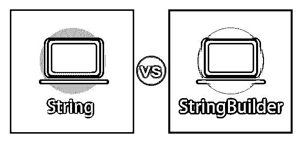
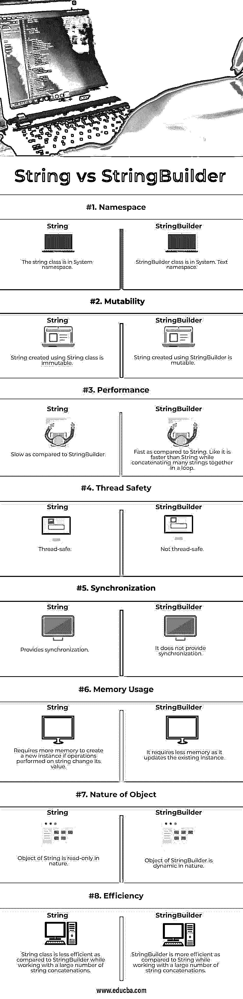
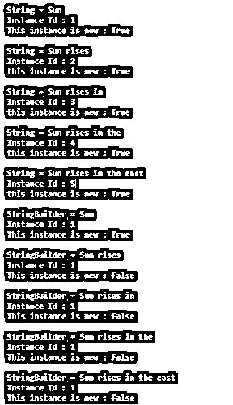
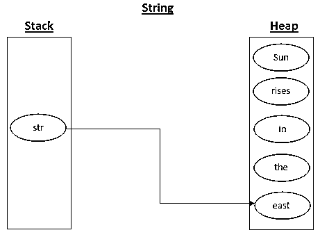
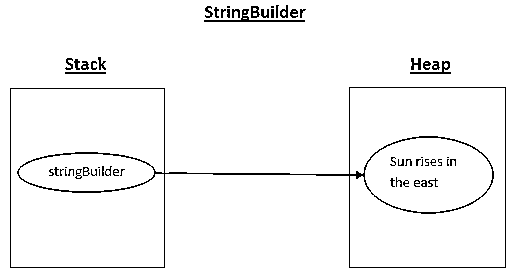

# String vs StringBuilder

> 原文：<https://www.educba.com/string-vs-stringbuilder/>




## String 与 StringBuilder 的区别

在本文中，String vs StringBuilder 表示字符序列；它们之间的第一个区别是 String 类在 System 命名空间中，而 StringBuilder 在 System 中。文本名称空间。

主要区别在于:

<small>网页开发、编程语言、软件测试&其他</small>

**string 是不可变的**:一旦创建了 String 的实例，就不能更改。如果您更改字符串的值，那么这将保留旧的实例，并在内存中创建一个具有新值的新实例。

**StringBuilder 是可变的**:如果你用 StringBuilder 改变 string 的值，它不会创建新的实例；相反，它将更新现有实例中的值。

### String 与 StringBuilder 的面对面比较(信息图表)

以下是 String 和 StringBuilder 之间的 8 大比较 **:**




### String 与 StringBuilder 的主要区别

让我们从以下几点来讨论 String 与 StringBuilder 之间的一些关键区别:

**1。**使用 String 类时，每次对字符串执行一些操作时，都会在内存中一遍又一遍地重新创建整个字符串，而 StringBuilder 会在内存中分配一些缓冲空间，并将修改应用到该缓冲空间中。

**2。**由于 StringBuilder 对象是可变的，当涉及大量字符串操作时，它提供了比 String 对象更好的性能。

让我们借助下面给出的例子来理解上述观点:

**代码:**

```
using System;
using System.Text;
using System.Diagnostics;
public class StringAndStringBuilder
{
static void Main()
{
//using Stopwatch to calculate time
Stopwatch stopWatch = new Stopwatch();
string str = string.Empty;
//starting stop watch
stopWatch.Start();
for (int i = 0; i < 1000; i++)
{
str += i.ToString();
}
stopWatch.Stop();
Console.WriteLine("Time taken by string : {0}", stopWatch.Elapsed);
StringBuilder stringBuilder= new StringBuilder(string.Empty);
//restarting stop watch for StringBuilder
stopWatch.Restart();
for (int i = 0; i < 1000; i++)
{
stringBuilder.Append(i.ToString());
}
stopWatch.Stop();
Console.WriteLine("Time taken by StringBuilder : {0}", stopWatch.Elapsed);
}
}
```

**输出:**


**3。**与 StringBuilder 相比，String 操作使用更多内存，因为 String 在每次操作后都会创建中间垃圾实例。让我们看看下面的例子:

**代码:**

```
using System;
using System.Text;
using System.Runtime.Serialization;
public class StringAndStringBuilder
{
public static void Main()
{
//using ObjectIDGenerator to generate ID for objects
ObjectIDGenerator idGenerator1 = new ObjectIDGenerator();
bool flag = new bool();
String str = "Sun";
Console.WriteLine("String = {0}", str);
Console.WriteLine("Instance Id : {0}", idGenerator1.GetId(str, out flag));
//flag will be True for new instance otherwise it will be False
Console.WriteLine("This instance is new : {0}\n", flag);
//concatenating strings
str += " rises";
Console.WriteLine("String = {0}", str);
Console.WriteLine("Instance Id : {0}", idGenerator1.GetId(str, out flag));
Console.WriteLine("this instance is new : {0}\n", flag);
str += " in";
Console.WriteLine("String = {0}", str);
Console.WriteLine("Instance Id : {0}", idGenerator1.GetId(str, out flag));
Console.WriteLine("this instance is new : {0}\n", flag);
str += " the";
Console.WriteLine("String = {0}", str);
Console.WriteLine("Instance Id : {0}", idGenerator1.GetId(str, out flag));
Console.WriteLine("this instance is new : {0}\n", flag);
str += " east";
Console.WriteLine("String = {0}", str);
Console.WriteLine("Instance Id : {0}", idGenerator1.GetId(str, out flag));
Console.WriteLine("this instance is new : {0}\n", flag);
//initializing string using StringBuilder
StringBuilder stringBuilder = new StringBuilder("Sun");
ObjectIDGenerator idGenerator2 = new ObjectIDGenerator();
Console.WriteLine("StringBuilder = {0}", stringBuilder);
Console.WriteLine("Instance Id : {0}", idGenerator2.GetId(stringBuilder, out flag));
Console.WriteLine("This instance is new : {0}\n", flag);
stringBuilder.Append(" rises");
Console.WriteLine("StringBuilder = {0}", stringBuilder);
Console.WriteLine("Instance Id : {0}", idGenerator2.GetId(stringBuilder, out flag));
Console.WriteLine("This instance is new : {0}\n", flag);
stringBuilder.Append(" in");
Console.WriteLine("StringBuilder = {0}", stringBuilder);
Console.WriteLine("Instance Id : {0}", idGenerator2.GetId(stringBuilder, out flag));
Console.WriteLine("This instance is new : {0}\n", flag);
stringBuilder.Append(" the");
Console.WriteLine("StringBuilder = {0}", stringBuilder);
Console.WriteLine("Instance Id : {0}", idGenerator2.GetId(stringBuilder, out flag));
Console.WriteLine("This instance is new : {0}\n", flag);
stringBuilder.Append(" east");
Console.WriteLine("StringBuilder = {0}", stringBuilder);
Console.WriteLine("Instance Id : {0}", idGenerator2.GetId(stringBuilder, out flag));
Console.WriteLine("This instance is new : {0}\n", flag);
Console.ReadKey();
}
}
```

**输出:**




上述程序内部工作的图示:







**4。** String 对象可以跨线程使用，而 StringBuilder 对象不是线程安全的。因此，两个或多个线程可以同时调用 StringBuilder 方法。

**5。由于 String 对象是线程安全的，所以它们提供同步，而 StringBuilder 不提供同步。**

**6。**当字符串的值在整个程序中保持不变时，或者当需要对其进行很少的修改时，使用 String class，而当需要对字符串执行许多重复的修改或繁重的操作时，使用 StringBuilder。

7 .**。**对于数量非常少的连接，string 类比 StringBuilder 工作得更快，因为在缓冲区空间中容纳字符，然后再次将整个值转换为 String 会产生开销。因此，对于少量的连接，与 String 类的按值复制行为相比，StringBuilder 的运行速度较慢。

**8。**要将 String 对象转换为 StringBuilder 对象，我们需要将 String 对象传递给 StringBuilder 类的构造函数[，而 StringBuilder 对象可以使用 to String()方法转换为 String。](https://www.educba.com/stringbuilder-class-in-java/)

```
String str = "abc";
StringBuilder StringBuilder = new StringBuilder(str);
StringBuilder StringBuilder = new StringBuilder("abc");
String str = StringBuilder.ToString();
```

### String 与 StringBuilder 对照表

下表总结了 String 与 StringBuilder **:** 之间的比较

| **参数** | **字符串** | **StringBuilder** |
| **命名空间** | string 类位于系统命名空间中。 | StringBuilder 类位于系统文本命名空间中。 |
| **可变性** | 使用 string 类创建的字符串是不可变的。 | 使用 StringBuilder 创建的字符串是可变的。 |
| **性能** | 与 StringBuilder 相比速度较慢。 | 与字符串相比更快。比如在一个循环中将许多字符串连接在一起时，它比 String 更快。 |
| **线程安全** | 线程安全。 | 不是线程安全的。 |
| **同步** | 提供同步。 | 它不提供同步。 |
| **内存使用量** | 如果对字符串执行的操作更改了其值，则需要更多内存来创建新实例。 | 它更新现有实例时需要较少的内存。 |
| **物体的性质** | String 对象本质上是只读的。 | StringBuilder 的对象本质上是动态的。 |
| **效率** | 与 StringBuilder 相比，String 类在处理大量字符串连接时效率较低。 | 与 String 相比，StringBuilder 在处理大量字符串连接时效率更高。 |

### 结论

String 仅在字符串的值更改时创建新的实例。如果您对字符串执行某些操作而不更改其值，那么 string 将不会创建任何新的实例。具有相同内容的两个或多个字符串可能具有相同的内存位置。

### 推荐文章

这是一个关于 String 和 StringBuilder 之间最大区别的指南。在这里，我们还将讨论 String 与 StringBuilder 的关键区别，包括信息图和比较表。您也可以看看以下文章，了解更多信息–

1.  [什么是 C#中的 StringBuilder](https://www.educba.com/what-is-stringbuilder-in-c-sharp/)
2.  [串缓冲区 vs StringBuilder](https://www.educba.com/stringbuffer-vs-stringbuilder/)
3.  [String vs StringBuffer](https://www.educba.com/string-vs-stringbuffer/)
4.  [字符串 vs 字符串 C#](https://www.educba.com/string-vs-string-c-sharp/)


