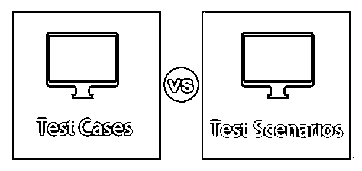
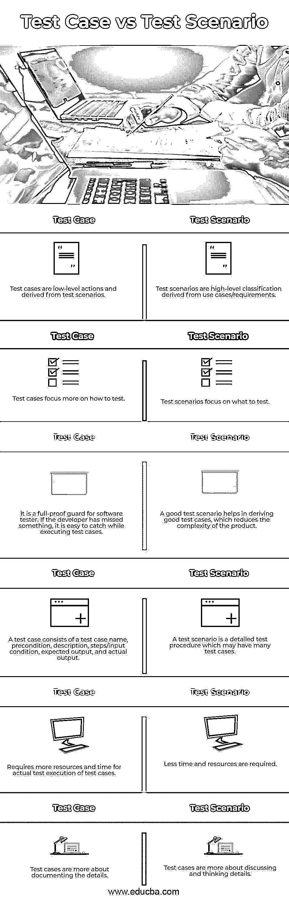

# 测试用例与测试场景

> 原文：<https://www.educba.com/test-cases-vs-test-scenario/>

## 测试用例与测试场景之间的区别

虽然测试用例与测试场景文档都是软件测试过程中的重要工件，但是测试用例给出了关于测试执行应该如何进行的详细、深入的信息。测试场景是高层次的功能规范，测试人员必须集中精力来完成所提供的需求描述。测试用例文档应该具有测试用例名称、前置条件、后置条件、描述、输入数据、测试步骤、预期输出、结果和每个用例的状态字段，并且测试场景文档可以根据测试团队的选择以任何格式创建。

**为什么要测试场景？**

<small>网页开发、编程语言、软件测试&其他</small>

*   编写测试场景有助于识别系统中最关键的部分。
*   编写测试场景的主要原因是为了验证系统的完整功能。
*   一旦你有了测试场景，为它们确定测试用例就变得容易了。
*   测试场景还有助于确保业务流程是一致的，并且符合定义的流程。
*   它们还可以作为一个快速的工具来帮助确定测试工作，并相应地为客户创建一个关于工作人员的提议。

**为什么要测试用例？**

*   测试用例是测试功能的步骤。
*   它有助于发现系统中特定点的缺陷。
*   测试用例有助于跟踪和修复错误。
*   测试用例有助于模拟真实的用户场景。
*   有了测试用例，测试工程师的工作被组织和简化了。

### 测试用例与测试场景云之间的直接比较(信息图)

下面是测试用例与测试场景 **:** 之间的 6 大对比

### 测试用例与测试场景之间的主要区别

让我们从以下几点来讨论测试用例与测试场景之间的一些关键区别:

软件产品由多种功能组成；将这些功能视为单独的场景。为了测试每个场景，你需要测试用例。所以我可以说测试用例是测试场景的一个子集。或者换句话说，编写许多测试用例来测试一个场景。让我们用一个简单软件产品的例子来理解，比如说，计算器。

**举例:**

计算器具有以下功能:

1.  两个数的相加。
2.  两个数的除法。
3.  两个数相乘。
4.  两个数相减现在，这些功能中的每一个都是测试场景，为了测试它们，我们需要每个场景的测试用例。让我们为“两个数相除”功能编写测试用例。

| **测试用例#** | **描述** | **预期产出** | **实际产量** | **结果** |
| One | 输入一位数。 | 系统允许你输入输入。 | 系统允许你输入输入。 | 及格 |
| Two | 按下除法键。 | 屏幕上应显示“/”。 | 屏幕上应显示“/”。 | 及格 |
| Three | 输入 0 作为另一个输入。 | 系统允许你输入输入。 | 系统允许你输入输入。 | 及格 |
| Four | 按=键 | 屏幕应在屏幕上显示一条错误消息。 | 屏幕应在屏幕上显示一条错误消息。 | 及格 |

请注意，对于大型复杂系统，这是可能的；这四个功能一起可能成为一个测试场景。并且每个特性都可能作为一个测试用例而结束。但是为了理清思路，可以把它看作是一个测试场景，为了做到这一点，你需要测试用例。

### 测试用例与测试场景对照表

下表总结了测试用例与测试场景 **:** 之间的比较

| **测试用例** | **测试场景** |
| 测试用例是低级动作，并且从测试场景中派生出来。 | 测试场景是来自用例/需求的高级分类。 |
| 测试用例更关注如何测试。 | 测试场景关注于测试什么。 |
| 它是软件测试人员的全面防护。如果开发人员遗漏了什么，在执行测试用例时很容易发现。 | 一个好的[测试场景有助于](https://www.educba.com/what-is-test-scenario/)衍生出好的测试用例，从而降低产品的复杂性。 |
| 测试用例由测试用例名称、前提条件、描述、步骤/输入条件、预期输出和实际输出组成。 | 一个测试场景是一个详细的测试过程，可能有许多测试用例。 |
| 测试用例的实际测试执行需要更多的资源和时间。 | 需要更少的时间和资源。 |
| 测试用例更多的是记录细节。 | 测试用例更多的是讨论和思考细节。 |

但是等等，我们总是需要给他们写信吗？我们现在知道是什么和为什么，但是我们也应该知道什么时候。以下是您可能不会选择编写测试场景的情况。

*   交付产品时时间紧迫。
*   当产品复杂且不稳定时。
*   当项目遵循敏捷、Scrum、[看板方法论](https://www.educba.com/kanban-methodology/)时。
*   当有 bug 修复，并且需要进行回归测试(在 bug 修复后进行的测试)时。
*   当项目处于维护阶段时，项目测试场景可能已经编写好了。

### 结论

我们已经走过了什么是测试，对于测试，我们需要测试用例以及测试场景。它们的重要性和差异。对于软件测试人员来说，两者都是必不可少。但是久而久之，新的方法论接管，我们可能选择写他们中的任何一个。老实说，这取决于团队，工作性质，还有，是的，你的项目经理。但是我想知道他们两个是很好的。

### 推荐文章

这是测试用例与测试场景之间最大区别的指南。在这里，我们用信息图和比较表来讨论测试用例与测试场景的主要区别。您也可以查看我们的其他相关文章，了解更多信息——

1.  什么是测试文档？
2.  [突变测试](https://www.educba.com/mutation-testing/)
3.  [如何写测试用例？](https://www.educba.com/how-to-write-test-case/)
4.  [测试用例设计技术](https://www.educba.com/test-case-design-techniques/)

