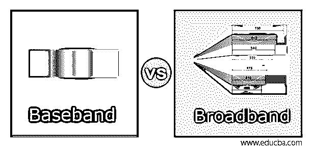
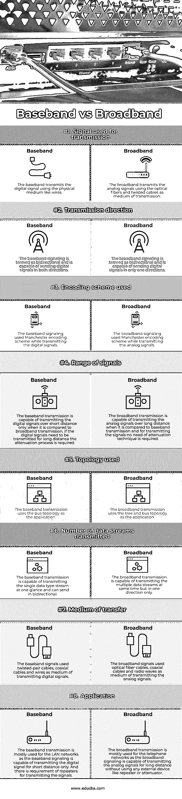

# 基带与宽带

> 原文：<https://www.educba.com/baseband-vs-broadband/>

## 基带与宽带的区别

以下文章概述了基带与宽带。基带是一种频率范围接近于零的信号。基带信号用于在电信世界中传输信号，而不使用调制，这意味着不改变信号的频率。基带信号的带宽接近于零。基带的另一个名称是低通传输。宽带是另一种类型的信号，具有用于同时传输多个信号的宽带宽，并且可以用于传输不同的流量类型。宽带使用光纤、双绞线作为传输介质来传输信号。

### 基带与宽带的直接对比(信息图表)

以下是基带和宽带之间的 8 大区别:

<small>网页开发、编程语言、软件测试&其他</small>

### 基带与宽带的主要区别

让我们讨论一下基带和宽带之间的一些主要区别:

*   宽带传输和基带传输的主要区别在于，基带传输使用完整的带宽来传输信号，并且占用整个电缆，而在宽带传输中，同时，可以使用多个频率仅使用一个信道来传输多个信号。在基带传输中，频率不能分割或复用，但时间可以复用，因为电缆中只传输一个信号。在宽带传输中，可以传输多个信号，一个通道可以传输模拟信号。频率复用可以在宽带传输中完成。
*   宽带传输和基带传输的另一个区别在于传输信号的方向。在基带传输中，信号可以同时在两个方向上传输。在宽带传输中，信号可以单向传输。基带传输使用数字信令来传输信号。宽带传输使用模拟信令来传输模拟信号。
*   宽带传输和基带传输的另一个关键区别是信号的范围。在基带传输中，信号距离的范围太短。因此，在基带传输中，外部设备被放置在网络中用于传输数字信号。外部设备包括衰减器和中继器，它们将信号传输到目的节点。LAN 网络使用基带传输来传输信号，如同在 LAN 网络中一样；要求在短距离内发送信号。在宽带传输中，信号范围很长，信号可以很容易地传输到很远的距离，而不需要使用任何外部设备进行信号传输。无线电网络和电视使用宽带传输，因为在这种通信中需要将信号发送到很远的地方。
*   宽带传输和基带传输的另一个关键区别是信号传输的成本。在基带传输中，由于只需要将信号发送到较短的距离，因此安装成本较低，因为对线缆的需求较少，这降低了安装成本。另一方面，在宽带传输中，与基带传输相比，设置成本要高得多。与宽带传输一样，信号是长距离传输的；需要更多的电线电缆，增加了宽带传输中的传输成本。与宽带传输相比，基带传输的维护成本也更低。维护成本增加了宽带传输的总成本。
*   宽带传输和基带传输的另一个主要区别是两者的信令能力。基带传输只能在网络上传输数据和语音。在宽带传输中，网络可以在传输介质中长距离发送数据、语音和视频呼叫。由于光纤用于在宽带传输中传输模拟信号，因此视频质量不会受到影响。宽带传输的传输速度接近每秒 100 MB 左右。

### 基带与宽带对照表

让我们讨论一下基带与宽带之间的主要对比:

| **因子** | **基带** | **宽带** |
| **用于传输的信号。** | 基带使用有线等物理介质传输数字信号。 | 宽带使用光纤和双绞线作为传输介质来传输模拟信号。 |
| **传输方向** | 基带信号称为双向信号，能够双向发送数字信号。 | 宽带信令被称为双向的，只能在一个方向上发送数字信号。 |
| **使用的编码方案** | 基带信令在传输数字信号时使用曼彻斯特编码方案。 | 宽带信令在传输模拟信号时使用曼彻斯特编码方案。 |
| **信号范围** | 与宽带传输相比，基带传输只能在短距离内传输数字信号。如果数字信号需要长距离传输，就需要进行衰减处理。 | 与基带传输相比，宽带传输可以在长距离上传输模拟信号，并且为了传输信号，不需要衰减技术。 |
| **使用的拓扑** | 基带传输使用总线拓扑作为应用。 | 宽带传输使用树和总线拓扑作为应用。 |
| **传输多个数据流。** | 基带传输可以一目了然地传输单一数据类型流，并且可以双向发送。 | 宽带传输可以同时传输多个数据流，但只能单向传输。 |
| **传送媒介** | 基带信号使用双绞线电缆、同轴电缆和电线作为传输数字信号的媒介。 | 宽带信号使用光缆、同轴电缆和无线电波来传输模拟信号。 |
| **应用** | 基带传输主要用于 LAN 网络，因为基带信令只能短距离传输数字信号。并且需要中继器来传输信号。 | 宽带传输主要用于电话网络。宽带信令可以长距离传输模拟信号，而无需使用任何外部设备，如中继器或衰减器。 |

### 结论

宽带和基带可以归类为信令。宽带信令传输模拟信号，使用光纤和双绞线作为传输介质。基带信号传输数字信号，并包含电脉冲，该电脉冲被传输到诸如电线的物理介质中。

### 推荐文章

这是基带与宽带的对比指南。在这里，我们通过信息图和比较表来讨论基带和宽带的主要区别。您也可以看看以下文章，了解更多信息–

1.  [Node.js vs Java 性能](https://www.educba.com/node-js-vs-java-performance/)
2.  [CSS vs JavaScript](https://www.educba.com/javascript-vs-angularjs/)
3.  [Java vs JavaScript](https://www.educba.com/java-vs-javascript/)
4.  [Java Swing vs Java FX](https://www.educba.com/java-swing-vs-java-fx/)

