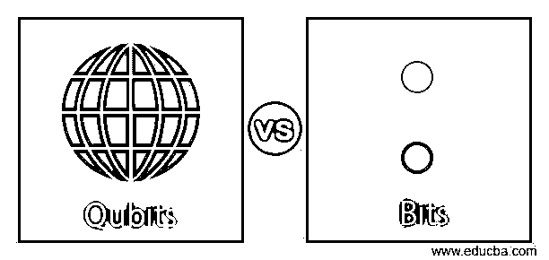
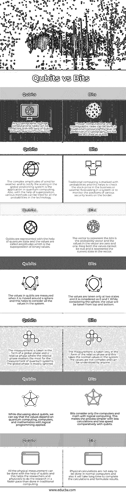

# 量子位与比特

> 原文：<https://www.educba.com/qubits-vs-bits/>

## 量子位与比特的区别

量子位是量子计算中的尺寸度量，其工作方式与普通计算系统中的位完全一样。在两种状态下，通常将是/否或真/假机制作为其值。在量子力学中考虑轨道水平测量，因此在系统中考虑所有值。比特被认为是计算机数据中保存所有信息的最小单位。位也分为是/否或真/假，通常以字节为单位使用。稍多一点的信息只能借助字节来存储。

### 量子比特与比特的面对面比较(信息图)

以下是量子比特与比特之间的 7 大区别:

<small>网页开发、编程语言、软件测试&其他</small>

### 量子位与比特的主要区别

以下是量子位与比特的主要区别:

*   当我们在传统计算技术中考虑 bit 时，bit 仅指 0、1 等二进制值，对于其他值无法考虑。而在量子位中，它代表 0、1 以及这两个值的叠加。这意味着它可以用来表示量子计算中 0 和 1 的组合，这对于通知系统中的所有值非常重要。
*   当比特存储二进制数字的信息时，量子比特存储二进制数字的组合，这有助于量子计算中的量子比特以常规计算机系统的三倍速度工作。存储的信息和传输的数据是巨大的，这有助于更快地传输信息。
*   当问题要在计算机上解决时，bits 就像在试运行中一样处理问题。这是因为一次只考虑一个值，当问题必须解决时，并行处理不会发生。当必须使用量子计算解决相同的问题时，可以通过并行处理来处理，一次支持所有四个值，并以更快的速度解决它。
*   当更多的量子位被添加到量子计算机中时，处理能力以指数速度增长。相比之下，当普通计算机增加比特时，功率不会增加，运算将以一次一个比特的速度进行。在量子计算中，这是由于叠加而发生的。
*   建造量子计算机极其困难，因为它们需要极端的隔离和量子物体的适当温度。这与传统计算机的情况不同，任何有硬件知识的人都可以制造这种计算机，并使它为用户的所有需要的条件而工作。因此，量子计算机的数量非常少，并且它们的使用最近正在增加。
*   传统计算机对比特所要求的存储空间是巨大的，它占据了大量的空间。这对于量子位来说是可以避免的，因为巨大的信息可以存储在一个小面积的系统中。随着系统和设备变得越来越小，量子位有助于重新想象技术世界，非常小的设备可以方便地携带到任何地方。
*   在量子位的帮助下，科学世界可以用不同的眼光来看待，因为它有助于在比普通计算机更短的时间内修改和重新计算物理现象，即使它真的很庞大，并使这个过程对所有人都很容易。

### 量子位与比特对照表

让我们看一下量子位 vs 比特的对照表。

| **量子位** | **位** |
| 任何密码或庞大的计算任务都可以通过量子计算借助量子位来完善。 | 虽然计算和加密任务可以在传统计算中完成，但加密技术的完美程度不会像量子位那样精确。 |
| 风的复振幅用于天气和通知全球定位系统中的缩放是量子计算中的应用。还有，在叠加的帮助下，对于技术中的所有概率，可以尝试各种方法。 | 传统计算以概率为标志。这有助于检查企业中的股票价格或系统中的天气预报，或者监控边界上的各种安全级别。 |
| 量子位借助量子态来表示，数值称为振幅，是二进制值的叠加。 | 表示比特的向量是概率向量，向量中的值是 0 和 1。这里两个值都不能为空，它表示向量中的当前状态。 |
| 量子位的值是在它绕球体移动时测量的，这有助于考虑系统中的所有值。 | 仅在两种状态下取值，并将其视为 0 和 1。在考虑球体时，将从顶部和底部取值。 |
| 测量以全局相位和相对相位的形式进行，其中相对相位对于量子系统的测量最为重要。全球阶段大多被忽略。 | 测量仅以相对相位的形式进行，这采用系统中的正常值。价值观并不复杂，任何人都能理解。 |
| 在讨论量子位时，我们可以说这些值取决于量子计算、计算机和应用了逻辑编程的数学。 | Bits 只考虑计算机和带有逻辑计算的数学。与量子位相比，这使得过程更简单，计算量更少，速度更低。 |
| 所有的物理测量都可以在量子位的帮助下完成，这有助于研究人员和物理学家比传统计算更快地进行研究。 | 物理计算不容易在普通计算机上完成，而且完成计算和得出结果也需要很长时间。 |

虽然两者在工作上有所不同，但还是有一些相似之处。当以比特和量子比特进行测量时，两种测量都会产生当前状态的相同值。一位信息只能从系统中的量子位或位的副本中提取。

### 推荐文章

这是量子比特与比特的指南。在这里，我们还讨论了量子位与比特的关键区别，包括信息图和比较表。您也可以看看以下文章，了解更多信息–

1.  [耦合 vs 内聚](https://www.educba.com/coupling-vs-cohesion/)
2.  [GSM vs CDMA vs LTE](https://www.educba.com/gsm-vs-cdma-vs-lte/)
3.  [GNSS vs GPS](https://www.educba.com/gnss-vs-gps/)
4.  [大口 vs 咕噜](https://www.educba.com/gulp-vs-grunt/)

