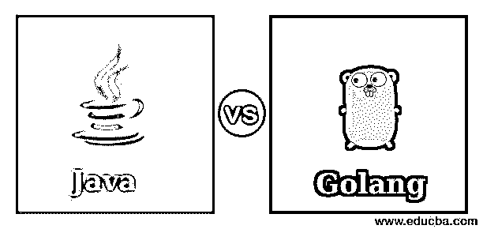
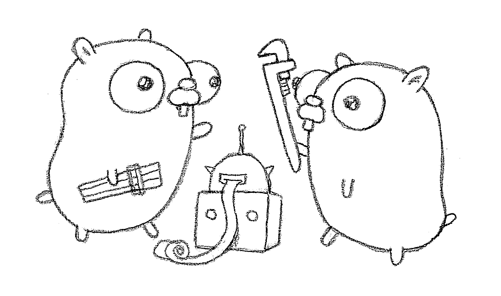

# Java vs Golang

> 原文：<https://www.educba.com/java-vs-golang/>




## Java 和 Golang 的区别

Java vs Golang 编程语言——嘿，伙计们，欢迎来到我的下一个关于编程语言的博客。今天，我们将讨论著名的 Java，以及人们猜测的 Google 的 Go 编程。我们都知道 Java 是什么。让我给那些初学者一个回顾。首先，什么是 Java？Java 是一种高级编程语言，但由于其本质与 C 或 C++有更多的共同点，一些人甚至将其称为低级工具。

简单来说，Java 字节码包括要求程序执行特定任务的指令。但 Golang 或任何其他编程语言也是如此，那么有什么区别呢？重要的是代码的结构、简单性或复杂性、代码的紧凑性、每个字节码的速度或执行一个特定任务需要多少秒；这些是非常重要的事情。例如，如果你用 Java 写一个“hello world”代码，它会占用 3-4 行代码。

<small>网页开发、编程语言、软件测试&其他</small>

同样的事情可以用 python 来完成，比如说，用一行代码就可以完成。惊讶吗？你应该害怕。但是这里的东西也包括效率。如果我用 Java 编写大型程序，执行起来可能会更快，但如果我用 python，就不一样了。Python 更容易编写，但是与 Java 相比，它很慢。

但我不是来这里谈论 python 的，对吗？我在这里说一下 [Golang](https://www.educba.com/software-development/courses/golang-course/) 和 Java。这只是对那些想知道为什么比较编程语言很重要的新手的介绍。让我们来看看这两种语言:Go，和 Java，在桌子底下有什么。

### Java vs Golang 编程语言示例

在我们真正开始计算这两种语言之间的差异之前，让我们先来看看这段带有类似示例的代码。

**Java 中 1 到 10 所有整数的计算:**

```
package calcint;
public class newint {
public static void main(String[] args) {
int intval;
int last_val = 11;
for (intval = 0; intval < last_val; intval++) {
System.out.println(“Loop Value = “ + intval);
}
}
}
```

现在，让我们来看看 Golang 的同一个例子:

```
import “fmt”
func calcint() {
for i := 1; i <= 10; i++ {
fmt.Println(i)
}
```

是的，就是这样。没有那么难，是吗？当我运行这两个程序时，我得到了非常惊人的结果。我在 JVM 中运行 Java，在它的基本解释器中运行 Go，令我震惊的是，Go 实际上比 Java 快。我想在小块代码中，GO 可能比 java 更快，所以我深入研究了一下。

### Golang 到底是什么？

没错。实际上，我应该一开始就告诉你，但是我忍不住要展示两者之间的区别。Go 由 Google 开发人员编写，旨在提供快速响应和开发，更好地支持现代计算技术，以及比其他系统语言(如 C 或 C++)更清晰的人类可见代码。如果你是一个 C 或 C++程序员，你可能会发现 GO 比它的同类好得多。

Go 主要是作为一种系统语言，像 C 或 C++，能够支持前端应用程序的开发。

[

](https://cdn.educba.com/academy/wp-content/uploads/2015/11/11.jpg) 

The Official GO Logo by Google


### 为什么在我们已经有了 Java、C 等系统语言的情况下，还要实际开发 Go？

是啊。这确实是一个好问题。答案大概是这样的。几年前，在 go 被开发出来之前，Google 的开发人员想要一种带有一些高效库的语言来临时支持最新的计算技术，类似于 C++或 Java。但问题是，如果你为已经有这么多的语言编写更多的库，而且没有任何对最新计算技术的内置支持，这根本就行不通。事实上，这看起来完全是个愚蠢的想法。

所以，这些问题开始成为他们的噩梦。然后出现了从零开始构建一种全新语言的想法。Go 的开发者总是太累了，以至于无法从开发的便捷性或代码的执行和编译的效率中做出选择。所以，他们想，为什么他们能创造出某种拥有一切特别的东西？因此，开发 Go 是为了提供更好的快速开发、快速编译以及良好的效率。

此外，如果这还不够，GO 的开发者决定为这种语言保留一个 BSD 风格的许可，从而使它开源。

### 现在不可避免的问题来了。

所以，现在终于到了十年的问题。有 C++或者 Java 为什么还要开发 Go？而这两者到底有什么区别。那么，现在让我们更深入地看看它们的相似之处和不同之处。

Java 和 Go 都有函数的概念，尽管两者比较起来略有不同。在 Java 中，如果有人提到一个函数，他们实际上是指特定的代码体，包括名称、返回类型和参数，而不仅仅是函数本身。同样，如果一个人引用了类内的一个函数，实际上就是引用了这个函数，这个函数是一个成员，甚至是一个方法。

事实是，如果你以前使用过 Java，你可能会发现 GO 更容易，但如果反之亦然；你可能会发现自己在 Java 或 C 语言中很难理解“为什么”和“为什么不”。此外，GO 的语法与 C 或 Java 之类的语言非常不同。如果您习惯于在 Java 中使用数据类型、列表标识符和参数，您可能会发现 GO 非常怪异和不舒服。

就连 GO 的界面也和 Java 有相当大的区别。它允许方法和函数的多个返回值，并且不允许隐式的[类型转换](https://www.educba.com/what-is-type-casting/)。如果你试图强迫这些东西，你最终会得到一个编译错误。您需要明确地让 Golang 知道您何时想要在类型之间切换。

### Golang 是面向对象的吗？

我的朋友，这个问题很难回答。Go 没有很多面向对象的特性，比如完全封装、继承甚至多态。事实上，首先，GO 不支持继承。事实上，Go 实现了接口并允许所谓的“伪继承”。如果不给你看一个问题，我无法解释这是如何工作的。因此，我很可能不得不在我的教程中而不是在这里离开这一部分。

但不是这样。如果您详细研究过 Java，您就会知道类型层次结构会导致很多令人头疼的开销编译和多重继承问题。但是 GO 的开发者们却在这个缝隙中找到了一条捷径。开发人员实际上选择了不添加这些功能。相信我，这很有效。

人们实际上非常喜欢这一点，这为围棋程序员省去了很多麻烦。这里没有指针算法，不像面向对象的语言。如果使用不当，指针算法会导致奇怪的代码集和致命的软件崩溃。因此，即使是这个功能在 GO 中也完全被丢弃了。

### GO v/s Java 中的内存使用

Go 中的内存清理有点类似于这里的 Java。它有自动垃圾收集功能。因此，显式释放内存或删除某些应用程序的麻烦确实避免了。Go 开发者打算撬开垃圾收集的效率。除此之外，他们还让 GO 使用了简单的标记和清除垃圾收集方法，从而提高了效率。

GO 中甚至不支持函数重载。因此，这避免了语言的脆弱性，也不会像在 Java 中那样，在清理内存时造成混乱。

### 结论

Nuf 说我觉得这些差异足以让你知道每种语言的重要性。但是正如我之前所说的，Go 并不完全是面向对象语言的样子，但是你仍然可以用面向对象的方式来编程 GO，尽管它不支持完全封装或多态。

尽管 GO 在很多地方与 JAVA 重叠，但它永远无法取代 Java。它就像一个国王，而围棋是国王的顾问。因此最终结果不是 Java 就是 GO；当情况出现时，它们都是需要的。

第一张图片来源:pixabay.com

### 推荐文章

这是 Java vs Golang 的指南。在这里，我们已经讨论了一个简单的概述，内存使用，为什么当我们有 Java 和 Golang 这样的系统语言时，还要开发 Go。您也可以看看以下文章，了解更多信息–

1.  [Java vs C#](https://www.educba.com/java-vs-c-sharp/)
2.  [Web 服务面试问题](https://www.educba.com/web-services-interview-questions/)
3.  [Java Web 服务面试问题](https://www.educba.com/java-web-services-interview-questions-and-answers/)
4.  [JMeter vs Selenium](https://www.educba.com/jmeter-vs-selenium/)


