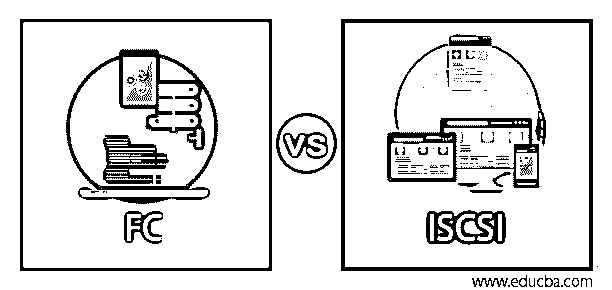
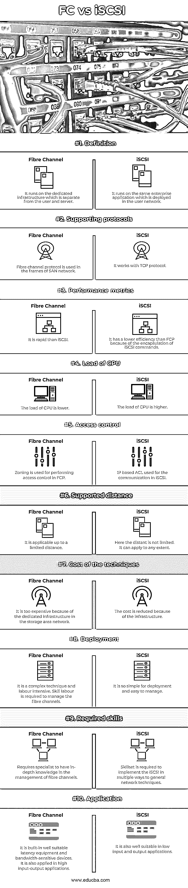

# 足球俱乐部对 iSCSI

> 原文：<https://www.educba.com/fc-vs-iscsi/>

## 光纤通道和 iSCSI 的区别

光纤通道是一种高速运行的数据传输协议，用于无任何损失地传输原始块数据。光纤通道的主要目的是将计算机的数据存储器连接到存储区域网络(SAN)中的服务器。iSCSI 被扩展为因特网小型计算机系统接口，该接口是基于链接标准存储网络的因特网协议。它通过 TCP 将 SCSI 命令传送到具有块级访问的服务器存储系统。在过去的几年中，光纤通道在市场上被高度使用，但是由于它在地理位置上难以支持，它未能提供其效率。当时，中断商业市场的 iSCSI 采取了一个大的仰角爬进组织。在这个话题中，我们将学习 FC 对 iSCSI。

### FC 与 iSCSI 的直接对比(信息图)

以下是足球俱乐部和 iSCSI 之间的主要区别

<small>网页开发、编程语言、软件测试&其他</small>

### 光纤通道和 iSCSI 的主要区别

光纤通道和 iSCSI 之间有许多不同之处，下面列出了其中的一些

#### 1.存储市场

市场对选择光纤通道还是 iSCSI 感到困惑。由于需要绑定存储的大规模供应商投资于光纤通道，而后来的供应商选择了 iSCSI，因为它的成本低，所以它被拆分了。但是，如果人们已经使用光纤通道多年，人们会认为 iSCSI 不可靠，速度慢，如果用户在其上运行关键服务，它会更快损坏。但是，如果用户与 iSCSI 合作多年，那么他会认为 FC 的建立和管理成本太高，极具挑战性。

#### 2.光纤通道和 iSCSI 的开端

光纤通道于 1994 年标准化，并在主机总线适配器和交换机中实施，因此被认为比其他存储网络方法昂贵，而 iSCSI 也是 2004 年部署在 TCP 协议之上的存储网络协议。它受到了高度关注，因为它在同一网络上执行，不需要任何额外的硬件，与光纤通道相比，成本较低。

#### 3.光纤通道和 iSCSI 的性能测量

很难赢得光纤通道的高吞吐量和低延迟，因为它是为处理存储系统中的流量而构建的。产生和推断 FCP 帧所需的处理周期完全转移到低延迟 HBA。它会清空服务器的 CPU 来管理应用程序，而不是处理存储。坦率地说，iSCSI 的表现不符合 FC 的标准。但是，如果 iSCSI 实现正确，这种差异会减少到几毫秒的额外延迟，因为 TCP 协议需要开销来掩盖 SCSI 命令。这对于多个事务性 I/O 负载来说有很大的不同，不适合在企业中使用。

#### 4.FC 和 iSCSI 的交通管理

光纤通道协议经过全面优化，可用于管理存储流量。它在内置机制中包含了流量控制，并检查数据是否完全发送到服务器。但是用户不能在当前市场上获得相同的最小延迟设备。iSCSI 通过使用多个 1Gbps 以太网获得了吞吐量。它还获得了 IP 的好处，因为它用于通过 WAN 链路在最大距离上执行。但是，它仅限于 SAN 到 SAN 的复制，是更容易实施的方法，也是 FC 的唯一替代方法。

#### 5.光纤通道和 iSCSI 的基础设施

光纤通道的重要优势在于它能够使用聚合基础设施，使局域网和存储区域网能够通过相同的硬件链路传递数据，但仍需要一些隔离功能。它们是刀片式服务器的最佳实例，刀片式服务器在单个计算和共享网络、电源、存储设备中嵌入了一系列特殊的服务器。在铜线的帮助下，它支持光纤通道的运行，并使系统管理员能够在出现任何损坏或业务需求时更换局域网线路

### FC 与 iSCSI 对比表

现在让我们在下表中列出 FC 和 iSCSI 之间的比较

| **行为参数** | **光纤通道** | **iSCSI** |
| **定义** | 它运行在独立于用户和服务器的专用基础设施上 | 它运行在部署在用户网络中的同一企业应用程序上 |
| **支持协议** | 光纤通道协议用于 SAN 网络的框架中 | 它与 TCP 协议一起工作 |
| **绩效指标** | 它比 iSCSI 更快 | 由于 iSCSI 命令的封装，它的效率比 FCP 低 |
| **CPU 负载** | CPU 的负载较低 | CPU 的负载更高 |
| **访问控制** | 在 FCP，分区用于执行访问控制 | 基于 IP 的 ACL 用于 iSCSI 的通信 |
| **支持距离** | 它适用于有限的距离 | 这里的遥远并不局限。它可以适用于任何程度 |
| **技术成本** | 因为存储区域网络中的专用基础设施，所以太贵了 | 因为有了基础设施，成本降低了 |
| **部署** | 这是一项复杂的技术和劳动密集型。管理光纤通道需要熟练的劳动力 | 它非常易于部署和管理 |
| **所需技能** | 要求专家在光纤通道管理方面有深入的知识 | 通用网络技术需要多种方式来实施 iSCSI |
| **应用** | 它内置了非常适合延迟设备和带宽敏感设备。它还应用于高输入-输出应用 | 它也非常适合低输入和低输出应用 |

FCP 在存储的互连性方面有局限性。对于最大距离，成本很高，而且将 FC 配置到远程站点极具挑战性。管理 FC 的基础架构需要高级的、训练有素的技术人员。但是 iSCSI 的部署很容易，并且具有用于流量控制、交换和巨型帧的简单结构。但是当在多路径中实现时，会导致性能不足，这在将来应该被克服。

### 推荐文章

这是一个足球俱乐部对 iSCSI 的指南。在这里，我们通过信息图和比较表来讨论 FC 与 iSCSI 的主要区别。您也可以看看以下文章，了解更多信息–

1.  [SAN 与 NAS](https://www.educba.com/san-vs-nas/)
2.  [FCFF vs FCFE](https://www.educba.com/fcff-vs-fcfe/)
3.  [FTP vs TFTP](https://www.educba.com/ftp-vs-tftp/)
4.  [RabbitMQ vs MQTT](https://www.educba.com/rabbitmq-vs-mqtt/)

