# 熊猫合并 vs 加入

> 原文：<https://www.educba.com/pandas-merge-vs-join/>

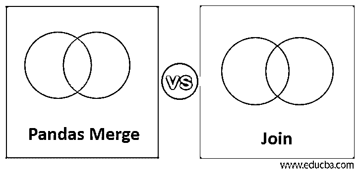

## 熊猫合并与加入的区别

Pandas 是 python 编程中最有效和最广泛使用的库，因为它具有动态功能。在 pandas 中，数据框是一种二维数据类型，其中执行多种操作。它是一种以表格格式排列的数据类型，表格中包含具有索引值的行和列。Merge 和 join 是两种广泛用于执行表合并的操作，通过一个公共键列或索引将新表与所需数据结合起来。df.merge()和 df.join()是用于合并和连接数据框的两个基本代码。还有各种其他类似的操作，如 concat，df.concat()和 append，df.append()也存在于 pandas 中，但这里我们将讨论合并和连接操作。在这个话题中，我们将学习熊猫合并和加入。

### 熊猫合并与加入的面对面比较(信息图)

以下是熊猫合并与加入的主要区别

<small>网页开发、编程语言、软件测试&其他</small>

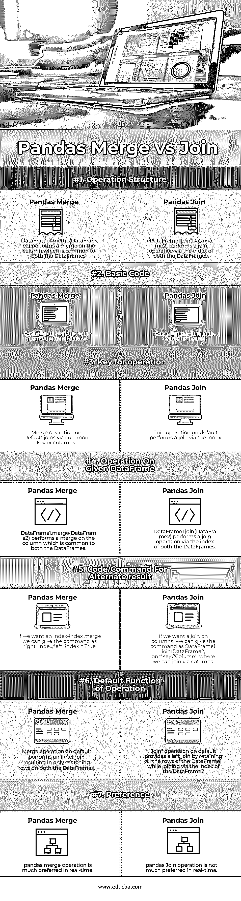

### 合并与联接的主要区别

Pandas 合并和连接操作是一种有效的内存操作，在处理大量数据时性能很好。像 SQL 中的连接操作一样，合并和连接操作有不同种类的连接，如“内”、“外”、“左”、“右”连接。它们在不同的数据框中使用一个公共列或一个键来执行。

panda 合并和连接具有相似的功能和范围，即合并和提取两个或多个数据帧，但是对于 panda 合并和连接，两种操作的执行方式是不同的。让我们来看看两者之间的一些关键区别。

*   merge 和 join 操作之间的基本区别在于这两种操作所使用的键或公共代码。对于 pandas join，每当我们发出一个喜欢 df1.join(df2)的命令时，加入就发生在 df2 的索引级别。索引将是连接数据框的关键。
*   而在 Merge 中，当我们发出 pd.merge(df1，df2)这样的命令时，它会在 df1 和 df2 数据帧中查找公共列，我们可以用一个或多个列来连接它。
*   默认情况下，Pandas join 将通过数据框的索引进行连接，我们可以通过给定

`df1.join(df2, on =Key/column name)`

*   另一方面，pandas 通过一列数据帧的默认连接进行合并，我们可以通过给定

`Pd.merge (df1, df2, right_index=True)`

*   默认情况下，熊猫合并执行“内部连接”
*   熊猫合并默认执行“左连接”

让我们来看一些熊猫合并和加入功能如何工作的例子。

#### 熊猫合并:

熊猫合并命令的基本结构是

`pd.merge(left, right, how='inner', on=None, left_on=None, right_on=None, left_index=False, right_index=False, sort=True)`

**举例:**

`raw_data_1 = {
subject_id': ['1', '2', '3', '4', '5'],
'first_name': ['Alex', 'Amy', 'Allen', 'Alice', 'Ayoung'],
'last_name': ['Anderson', 'Ackerman', 'Ali', 'Aoni', 'Atiches']}
Data1=pd.DataFrame(raw_data_1)
raw_data_2 = {
'subject_id': ['4', '5', '6', '7', '8'],
'first_name': ['Billy', 'Brian', 'Bran', 'Bryce', 'Betty'],
'last_name': ['Bonder', 'Black', 'Balwner', 'Brice', 'Btisan']}
Data2=pd.DataFrame(raw_data_2)
raw_data_3 = {
'subject_id': ['1', '2', '3', '4', '5', '7', '8', '9', '10', '11'],
'test_id': [51, 15, 15, 61, 16, 14, 15, 1, 61, 16]}
Data3=pd.DataFrame(raw_data_3)`

**数据 1**

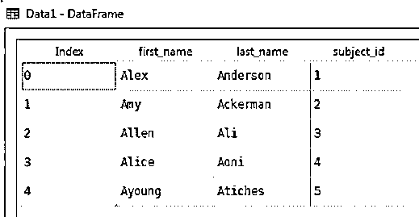

**数据 2**

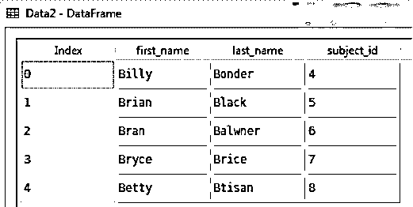

**数据 3**

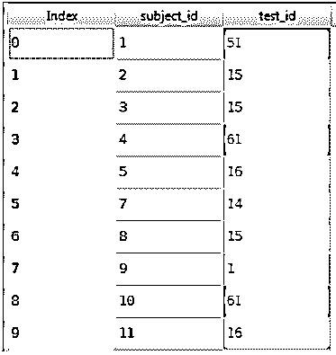

现在让我们对三个数据帧执行不同的合并操作，

`merg_1=pd.merge(Data1,Data3,on='subject_id')`

结果:

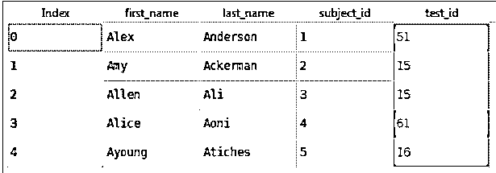

`merg_2=pd.merge(Data2,Data1,how='inner',on='subject_id')`

结果:

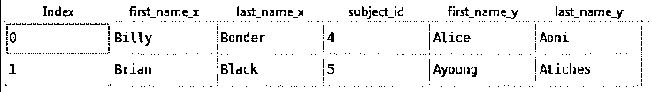

`merg_3=pd.merge(Data3,Data2,how='outer',on='subject_id')`

结果:

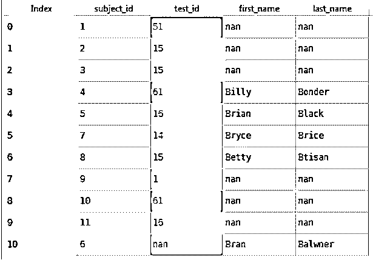

`merg_4=pd.merge(Data3,Data2,how='left',right_on=None, left_index=True, right_index=True)`

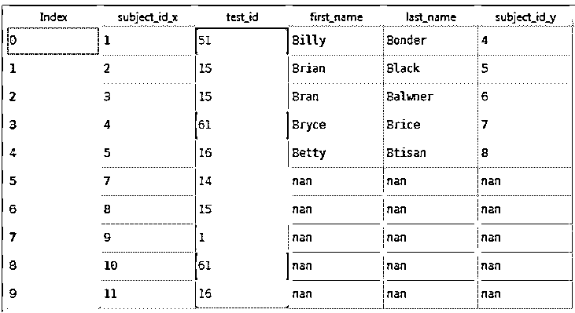

#### 熊猫加入:

熊猫加入的基本命令是

`DataFrame.join(*self*, *other*, *on=None*, *how='left'*, *lsuffix=''*, *rsuffix=''*, *sort=False*)`

**举例:**

**数据 1**

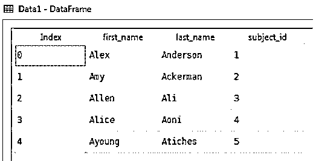

**数据 2**

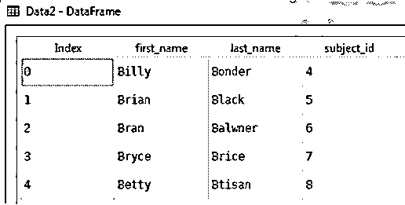

**数据 3**

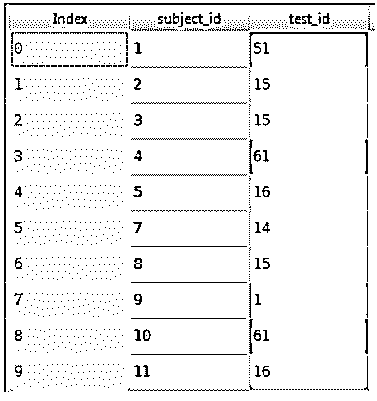

##### 连接类型

**1。索引连接**

`join_1=Data1.join(Data2,lsuffix='caller',rsuffix='other')`

结果

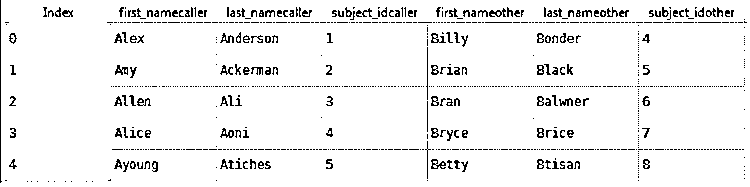

**2。列连接**

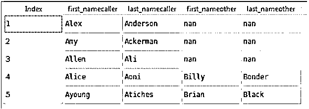

**3。加入时**

`join_2= Data1.join(Data3.set_index('subject_id'), on='subject_id',lsuffix='caller',rsuffix='other')`

结果

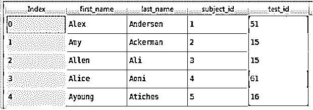

### 熊猫合并与加入对照表

现在让我们在下面的表格中对熊猫合并和加入进行比较

| **比较的基础** | **熊猫合并** | **熊猫加入** |
| 操作结构 | DataFrame1.merge(DataFrame2) performs a merge on the column which is common to both the DataFrames. | DataFrame1.join(DataFrame2) performs a join operation via the index of both the DataFrames. |
| 绝对码 | Basic Pandas Merge codepd.merge(数据 1、数据 2) | Basic Pandas Join code数据 1.join(数据 2) |
| 操作键 | 通过公共键或列对默认联接进行合并操作 | 默认情况下，联接操作通过索引执行联接 |
| Operation在考虑到数据帧 | DataFrame1.merge(DataFrame2) performs a merge on the column which is common to both the DataFrames. | DataFrame1.join(DataFrame2) performs a join operation via the index of both the DataFrames. |
| Code/Command为替代结果 | If we want an index-index merge we can give the command as右索引/左索引=真 | If we want a join on columns, we can give the command as DataFrame1.join(DataFrame2, on=’Key’/’Column’) where we can join via columns. |
| 操作的默认功能 | 默认情况下，Merge 操作执行内部连接，结果是两个数据帧上都只有匹配的行。 | 默认情况下，Join”操作通过保留数据帧 1 的所有行来提供左连接，同时通过数据帧 2 的索引进行连接 |
| 偏爱 | 熊猫合并操作更倾向于实时进行。 | 熊猫实时加入操作不是很可取。 |

### 结论

正如我们所讨论的，操作作为一种动态功能，在处理数据帧数据类型时提供了更简单的操作。数据帧是数据科学领域中使用最广泛的数据类型。这两种操作都提供了更大的价值和高度优化的操作。虽然类似于 SQL 连接操作，熊猫合并和连接操作更快，非常兼容，并处理大数据。总的来说，合并和连接操作在功能上非常相似。

在真实的场景中，pandas merge 操作更适合于连接，因为它具有基本而简单的查询结构，可以直接执行表的列连接。在我们想要排除列的情况下，如果我们想要只在数据帧的索引上连接，我们可以使用合并连接操作，因为它需要键入的代码稍微少一些。

### 推荐文章

这是熊猫合并和加入的指南。这里我们用信息图和比较表来讨论熊猫合并和加入的关键区别。您也可以看看以下文章，了解更多信息–

1.  [内部连接与外部连接](https://www.educba.com/inner-join-vs-outer-join/)
2.  [AMQP vs JMS](https://www.educba.com/amqp-vs-jms/)
3.  [可变与不可变的 Java](https://www.educba.com/mutable-vs-immutable-java/)
4.  [Zabbix vs Nagios](https://www.educba.com/zabbix-vs-nagios/)

