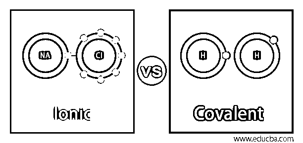
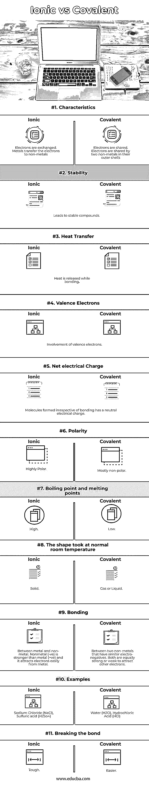

# 离子 vs 共价

> 原文：<https://www.educba.com/ionic-vs-covalent/>

## 离子与共价的区别

离子键和共价键是化学键的主要类型。我们周围的物质借助化学键结合在一起。化学反应打破了这些键，但像原子、离子/分子这样的破裂部分会重新结合在一起成为另一个分子。我们需要能量来创造纽带，也需要能量来打破它。在这个主题中，我们将学习离子和共价。

### 离子键是什么？

当两个具有相反电荷&不同电负性值的键合原子在它们之间交换电子时，即一个原子将一个电子转移到另一个原子，交换的电子与另一个原子在一起，就形成了这种键。给出电子的原子将有更多的质子，它将带正电荷，而获得电子的原子将带负电荷。这些类型的键被称为极性键，在这种化合物中，失去电子的离子被称为阳离子(金属)，获得电子的其他离子被称为阴离子(非金属)，该化合物用阴离子的负增益中和阳离子的正电荷。离子键的一个例子是钠和氯化物之间的化学复合，形成食盐 NaCl。当结合时，具有不同电负性值的钠和氯化物将获得在水中离解成离子的趋势。钠有 11 个电子和 11 个质子，外层只有一个电子，而氯化物有 17 个质子，外层有 17 个电子和 7 个电子。当它们结合时，钠变成 Na+,失去一个电子，变成电负性氯化物，变成 Cl-。化学反应后，在成键结构中，每个钠电子被六个氯电子包围。

<small>网页开发、编程语言、软件测试&其他</small>

### 共价键是什么？

成键原子共享电子，它们的电负性保持相同或接近。共享电子的外层被完全占据。这种电子被平均分配的键被称为非极性键。大多数情况下，共享电子被一个原子吸引，在这种情况下，它被称为极性共价键。这种类型的键的一个例子是由极性共价键形成的水(H2O)。这些键通常是由两个非金属键形成的，这种键产生的化合物会溶于水，但不会分解成离子。共价键也称为分子键，键发生在电负性相同或接近的非金属原子之间。电负性只不过是一种化学性质，它解释了原子吸引共享电子的能力。共价键的一个例子是由两个氢原子形成的氢分子，每个氢原子的外壳都有一个电子。这种键的另一个例子是氯化氢(HCl)，也称为卤化氢。氯外层的 7 个电子和氢外层的 1 个电子是制造稳定分子的完美组合。

### 离子型与共价型的直接对比(信息图)

以下是离子型和共价型之间的主要区别

### 离子型与共价型的主要区别

1.  在有机化学中，共价键比离子键更普遍。
2.  在生物中，通过共价键形成的分子较多，很常见。
3.  电子以共价键共享，电子以离子键交换
4.  共价键中各成分之间的化学反应处于电中性状态，而离子键则处于带电状态。氯化钠溶于水时，其成分处于带电状态。
5.  用共价键形成的化合物比离子键更容易断裂
6.  离子键只能在两种不同的组分之间形成，而在相同的组分之间有可能形成共价键。
7.  离子键在一种金属成分和另一种非金属成分之间形成，但是共价键仅在两种非金属成分之间形成。
8.  共价键的熔点和沸点较低，离子键的熔点和沸点较高。
9.  离子键在正常室温下呈固态，而共价键形成的分子呈气态或液态。

### 离子型与共价型对比表

现在让我们在下表中画出离子键和共价键的比较

| **属性** | **离子键** | **共价键** |
| 特征 | 电子被交换 | 电子是共享的 |
| 金属把电子转移给非金属 | 电子是由外壳层的两种非金属共享的 |
| 稳定性 | 产生稳定的化合物 |
| 传热 | 焊接时会释放热量 |
| 价电子 | 价电子的参与 |
| 净电荷 | 不考虑成键而形成的分子带有中性电荷 |
| 极性 | 高极性 | 大部分是非极性的 |
| 沸点和熔点 | 高的 | 低的 |
| 这个形状是在正常的室温下形成的 | 固体 | 气体或液体 |
| 黏结 | 金属和非金属之间。非金属(-ve)比金属(+ve)强，容易从金属中吸引电子。 | 两种具有相似负电性的非金属之间。两者吸引其他电子的强弱是一样的 |
| 例子 | 氯化钠、硫酸 | 水(H2O)，盐酸(HCl) |
| 打破束缚 | 艰苦的 | 更容易的 |

### 结论

我们已经看到了离子键和共价键之间的区别，也知道盐是离子的，它溶于水，具有良好的导电性，但沙子是共价键，它不溶于水。

### 推荐文章

这是一个离子与共价的指南。这里我们用信息图和对照表讨论离子键和共价键的区别。您也可以看看以下文章，了解更多信息–

1.  [离子 vs 反应原生](https://www.educba.com/ionic-vs-react-native/)
2.  [爱奥尼亚 4 对爱奥尼亚 3](https://www.educba.com/ionic-4-vs-ionic-3/)
3.  [PHPStorm vs WebStorm](https://www.educba.com/phpstorm-vs-webstorm/)
4.  [反应与角度 2](https://www.educba.com/reactjs-vs-angular2/)

