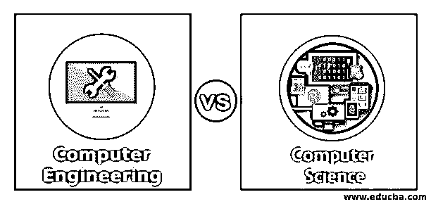
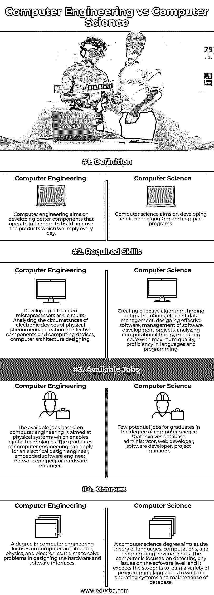

# 计算机工程 vs 计算机科学

> 原文：<https://www.educba.com/computer-engineering-vs-computer-science/>

## 计算机工程与计算机科学的区别

下面的文章提供了计算机工程与计算机科学的概要。计算机科学的目标是计算理论，包括编写代码，将数据、算法、数据结构、统计模型和其他可能的有效技术结合起来。它还强调了如何开发一个算法，有效地用于实现复杂的任务。这些任务使人类的大脑乳化，以确定超级游泳池的合适路线。换句话说，计算机工程是计算机科学和电子工程的结合。计算机工程师分析如何实现从智能手机到集成电路的各种计算组件。

### 计算机工程与计算机科学的直接比较(信息图表)

以下是计算机工程与计算机科学之间的四大区别:

<small>网页开发、编程语言、软件测试&其他</small>

### 计算机工程与计算机科学的主要区别

让我们讨论一下计算机工程和计算机科学之间的一些主要区别:

由于计算机程序中有许多不同的风格，人们很容易混淆。学位课程在一些常见的计算机理论上有大量的重叠。一些学校和学院使用不同的术语。一些机构将这两种理论合并到一个主要部门。在比较不同的研究生项目时，分析各种差异是很重要的。

主要区别在于课程定义、所需技能、可用工作、薪资差异等等。

*   **定义:**计算机科学旨在设计计算理论，并且具有依赖软件而非硬件的计算机的虚拟方面。随着该领域与计算机科学的结合，数学意味着解决实时场景的理论设计。换句话说，计算机工程是计算机科学和电子工程的结合。计算机工程的目标是如何开发设备，它是一个广泛的领域，融合了计算机科学，物理和电子工程。计算机工程的目标集中于硬件而不是软件。它与工程、物理学者密切相关，这些学者希望享受和分析事物的工作，并利用知识开发新的东西，从而推动他们学习计算机工程程序。
*   计算机科学的学位课程包括算法分析、操作系统原理、软件工程和计算机体系结构。所以对数学的兴趣，解谜，解决问题的技巧，这对学生来说很有效。计算机科学学位将包含重要的硬件概念和涉及计算机体系结构的软件主题。计算机工程学位将涵盖广泛的理论，包括计算机网络，物理和计算机工程。计算机工程学位涵盖了软件设计的大部分主题，计算机工程师需要很强的编程技能。
*   作为一名计算机科学家，他将只专注于基于数据结构和数学的计算理论，以执行紧凑的代码。它被解释为一个抽象概念，并对计算机工程中不太需要动手的领域开放。计算机科学中的几个热门职业是网页设计、数据科学、机器学习、软件工程和 UI 或 UX 设计。计算机工程师研究了许多关于如何开发从智能手机到集成电路的各种计算系统的项目。计算机工程师的角色是在物理世界工作，包括更好地理解电子和物理定律，以开发更好的计算组件。比起执行和开发代码，花在实验室工作台上的时间更有可能。计算机工程师的职业选择包括生命科学、航空航天、机器人和移动设备。
*   **课程:**计算机科学中的不同课程是算法的设计和分析，这些课程使用计算理论的概念，如大 O 符号。该课程的学生学习和执行在少数情况下被优化的代码，并能分析代码的功效。接下来是对操作系统的介绍，包括各种操作系统和在软件中运行的代码。它还包括并发编程、线程管理、分布式服务和资源管理。软件工程课程通过开发软件解决方案来解决实际问题。它在测试、设计、工程组件方面是有效的，并且基于团队开发。数据分析为学生提供了处理高维数据集的统计技术，如数据存储、创建、访问、呈现和处理。可供选择的计算机工程课程有力学、磁学和电学、微积分 III、电路、普通物理学、热力学、光学和波动、数字逻辑上的机器设计。

### 计算机工程与计算机科学对照表

让我们来讨论一下计算机工程与计算机科学之间的顶级对比:

| **属性** | **计算机工程** | **计算机科学** |
| **定义** | 计算机工程的目标是开发更好的组件，这些组件协同工作来构建和使用我们每天都在使用的产品。 | 计算机科学旨在开发有效的算法和简洁的程序。 |
| **所需技能** | 开发集成微处理器和电路。分析物理现象的电子设备的环境，创建有效的组件和计算设备，计算机架构设计。 | 创建有效的算法，寻找最佳解决方案，高效的数据管理，设计有效的软件，管理软件开发项目，分析计算理论，以最高质量执行代码，精通语言和编程。 |
| **可用工作** | 基于计算机工程的可用工作是针对支持数字技术的物理系统的。计算机工程专业的毕业生可以报考电气设计工程师、嵌入式软件工程师、网络工程师或者硬件工程师。 | 计算机科学学位的毕业生很少有潜在的工作，包括数据库管理员、网站开发人员、软件开发人员和项目经理。 |
| **课程** | 计算机工程学位的重点是计算机体系结构，物理和电子。它旨在解决硬件和软件接口设计中的问题。 | 计算机科学学位的目标是语言、计算和编程环境的理论。计算机侧重于检测软件层面上的任何问题，它期望学生学习各种编程语言来操作系统和维护数据库。 |

### 结论

这两个学位使学生能够专注于每个学科，如航空航天，网络安全和机器人。这两个令人兴奋的领域经历了巨大的增长，在不同的研究领域之间有大量的重叠。在选择正确的路径时，像计算机工程和计算机科学这两门课程之间的了解是强制性的。

### 推荐文章

这是一本计算机工程与计算机科学的指南。这里我们讨论信息图和比较表的主要区别。您也可以看看以下文章，了解更多信息–

1.  [软件工程师 vs 软件开发人员](https://www.educba.com/software-engineer-vs-software-developer/)
2.  [系统测试 vs 集成测试](https://www.educba.com/system-testing-vs-integration-testing/)
3.  [冒烟测试与健全性测试](https://www.educba.com/smoke-testing-vs-sanity-testing/)
4.  [白盒测试 vs 黑盒测试](https://www.educba.com/white-box-testing-vs-black-box-testing/)

