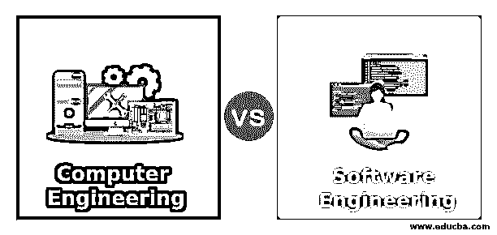
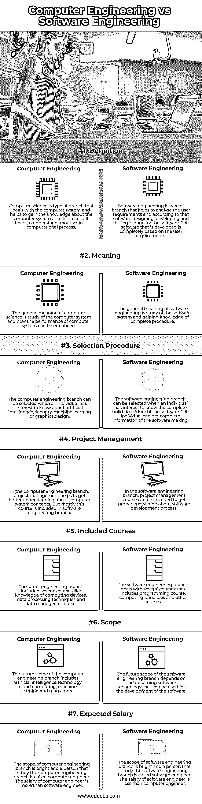

# 计算机工程 vs 软件工程

> 原文：<https://www.educba.com/computer-engineering-vs-software-engineering/>

## 计算机工程和软件工程的区别

下面的文章提供了计算机工程和软件工程的概要。软件工程被定义为测量和分析用户需求的过程，有助于根据之前分析的需求设计、构建和测试软件。软件工程有助于开发新的软件来解决现实生活中的问题。计算机工程是另一个有助于设计计算机系统和理解一些计算过程的分支。计算机科学有助于分析数据、管理数据库和维护网络安全。它有助于研究几个计算过程。

### 计算机工程与软件工程的直接比较(信息图表)

以下是计算机工程与软件工程之间的 7 大区别:

<small>网页开发、编程语言、软件测试&其他</small>

### 计算机工程与软件工程的主要区别

让我们讨论一下计算机工程和软件工程之间的一些主要区别:

*   软件工程和计算机工程的主要区别之一是基于核心教育研究。计算机工程的教育研究包括数据分析，计算过程和软硬件系统的知识。计算机工程有助于获得数据管理过程的知识。软件工程过程涉及软件开发过程、开发过程的各个阶段以及如何提高软件的性能。计算机工程有助于了解计算机系统工作的科学，而另一方面，软件工程处理设计软件和硬件系统的数学原理。
*   两个分支之间的另一个重要区别是职业道路。在计算机工程分支，个人有几个职业道路，因为他可以选择 IT 行业，网站设计，游戏开发，IT 支持等等。另一方面，在软件工程分支中，个人有非常具体的工作角色，因为他们可以选择软件系统的设计。
*   两个工程之间的另一个共同区别是软件和硬件的交互。在计算机工程分支中，包含了软件和硬件交互的概念。从事计算机工程的人需要了解软件如何与硬件系统交互。另一方面，在软件工程分支中，只包括软件的概念。处理软件工程分支的个人需要负责软件创建过程、软件程序的维护和测试。
*   两个工程分支之间的另一个关键区别是软件设计。计算机科学个人可以学习程序如何实际工作的算法和理论，以及如何使用编程语言开发应用程序。另一方面，软件工程师可以利用计算机工程师的信息，根据业务需求开发特定的软件。
*   计算机工程和软件工程的另一个不同点是计算机编码。计算机编码包括在两种类型的工程分支中，有助于学习编程语言及其概念。在软件工程分支中，它更专注于学习编码和开发软件程序。另一方面，计算机工程研究计算机语言的学习以及软件和硬件应用的交互机制。
*   两个工程学分支之间的另一个区别是科学理论。计算机工程分支研究可用于计算计算机操作、数据系统和设计软件程序的完整过程的科学理论。另一方面，软件工程分支处理设计框架、应用程序和软件程序的科学理论。软件工程有助于设计真实场景的计算机应用程序。实时工程概念在软件工程分支中用于开发软件程序。计算机工程分科处理计算机操作。

### 计算机工程与软件工程对照表

让我们来讨论一下计算机工程和软件工程之间的最大区别:

| **因子** | **计算机工程** | **软件工程** |
| **定义** | 计算机科学是研究计算机系统的一个分支，有助于获得关于计算机系统及其过程的知识。这有助于理解各种计算过程。 | 软件工程是一种帮助分析用户需求的分支，并根据这种需求对软件进行设计、开发和测试。开发的软件完全基于用户需求。 |
| **意为** | 计算机科学的一般含义是研究计算机系统以及如何提高计算机系统的性能。 | 软件工程的一般含义是研究软件系统并获得完整过程的知识。 |
| **选择程序** | 当个人有兴趣了解人工智能、安全、机器学习或图形设计时，可以选择计算机工程分支。 | 当个人有兴趣了解软件的完整构建过程时，可以选择软件工程分支。个人可以获得软件制作的完整信息。 |
| **项目管理** | 在计算机工程分支中，项目管理有助于更好地理解计算机系统概念。但大多数情况下，该课程包含在软件工程分支中。 | 在软件工程分支中，可以包括项目管理课程，以获得关于软件开发过程的适当知识。 |
| **包含的课程** | 计算机工程分支包括几门课程，如计算设备知识、数据处理技术和数据管理课程。 | 软件工程分支涉及几门课程，包括编程课程、计算原理和其他课程。 |
| **范围** | 计算机工程分支的未来范围包括人工智能技术、云计算、机器学习等等。 | 软件工程分支的未来范围取决于即将到来的可用于软件开发的软件技术。 |
| **期望薪资** | 计算机工程分支的范围很广，学习计算机工程分支的人被称为计算机工程师。电脑工程师的工资比软件工程师高。 | 软件工程分支的范围很广，研究软件工程分支的人被称为软件工程师。软件工程师的工资比计算机工程师低。 |

### 结论

计算机工程分支和软件工程分支有其自身的重要性，并帮助个人在他们的生活中脱颖而出。这两种类型的课程都为个人提供了学习计算机系统和软件程序以及完整架构的充分机会。

### 推荐文章

这是一本计算机工程与软件工程的指南。这里我们讨论信息图和比较表的主要区别。您也可以看看以下文章，了解更多信息–

1.  [WordPress vs WebFlow](https://www.educba.com/wordpress-vs-webflow/)
2.  [内联网 vs 外联网](https://www.educba.com/intranet-vs-extranet/)
3.  [Asana vs Slack](https://www.educba.com/asana-vs-slack/)
4.  [Alexa vs 谷歌](https://www.educba.com/alexa-vs-google/)

